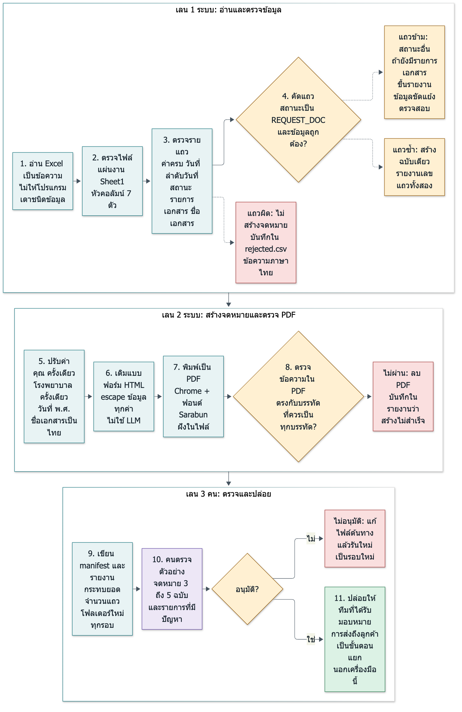
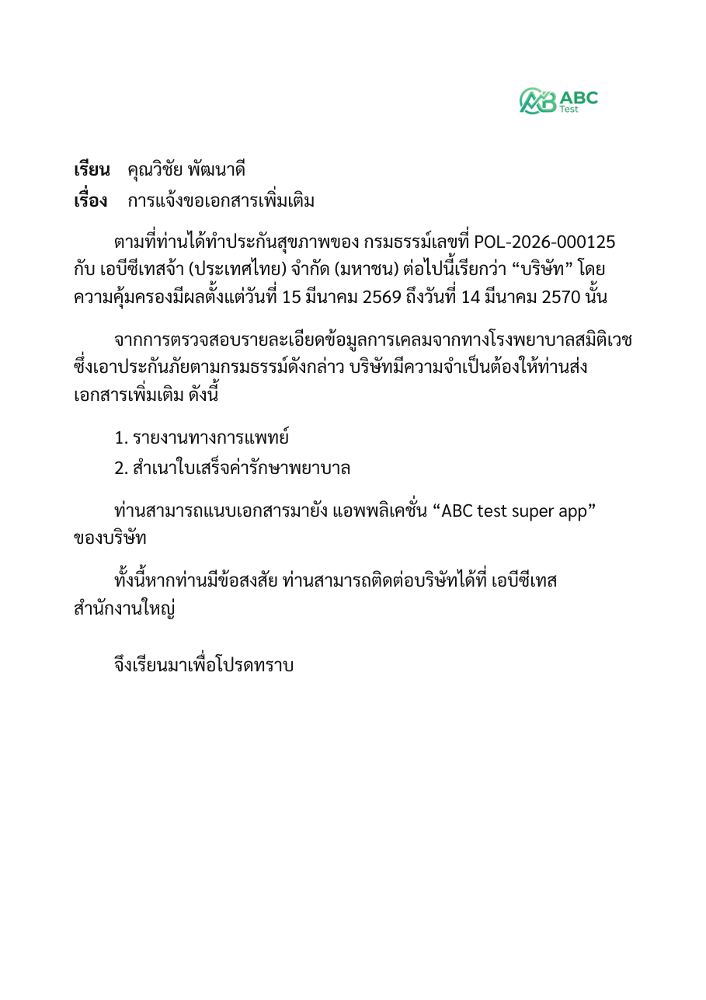
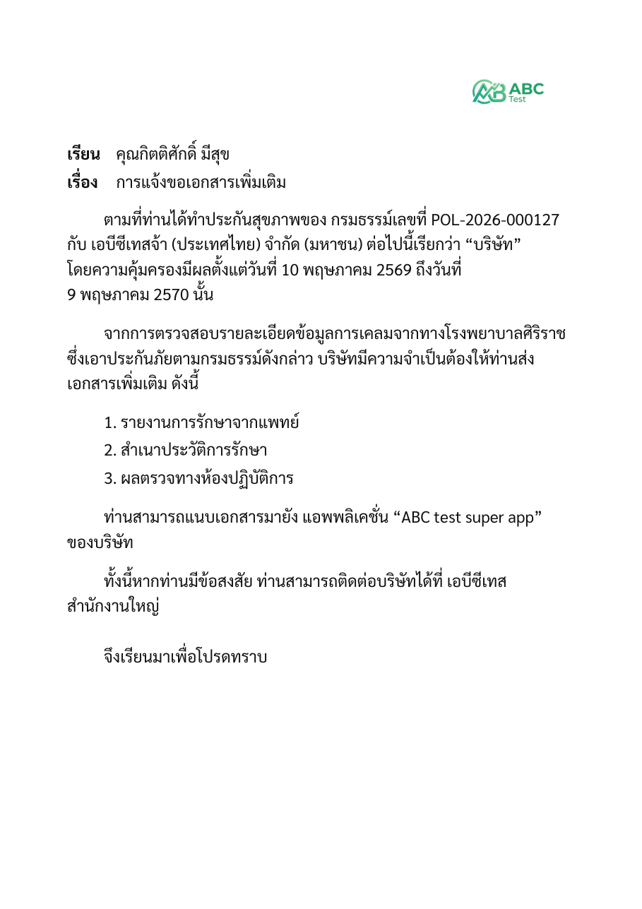

# Assignment 2 — ระบบสร้างจดหมายขอเอกสารเพิ่มเติม

**วันที่:** 2 ตุลาคม 2569 · **ผู้ตอบ:** ณัฐกมล ใจเมธา
**แหล่งข้อมูล:** `data/Example claim table.xlsx`, `data/template_test.pdf` (ไฟล์ที่โจทย์ให้), โค้ดใน `poc/` และผลที่รันจริง
**ป้ายกำกับ:** **[ทำแล้ว]** มีในโค้ดและทดสอบแล้ว · **[ออกแบบ]** ยังไม่ได้สร้าง · **[TO CONFIRM]** ข้อเท็จจริงขององค์กรที่ผมไม่ทราบ (รายการเต็มใน `docs/OPEN_QUESTIONS.md`)

**หลักคิด:** ใช้กติกาที่เขียนชัดและทดสอบได้กับข้อมูลที่รู้แน่ ให้คนตัดสินเรื่องที่กระทบลูกค้า และเก็บหลักฐานทุกรอบ ไม่ใช้ LLM สร้างเนื้อหาจดหมาย

---

## 2.1 ระบบทำงานอย่างไร

*ภาพที่ 1 ขั้นตอนของระบบ (ที่มา `docs/diagrams/a2_flow.mmd`) เส้นประคือทางออกของแถวที่ไม่เป็นจดหมาย ลูกศรระหว่างเลนหมายถึงไปขั้นถัดไปเมื่อผ่าน*

### ขั้นตอนและที่อยู่ของแต่ละขั้นในโค้ด

| ขั้น | ทำอะไร | สถานะ | ไฟล์ |
| --- | --- | --- | --- |
| 1 อ่านเป็นข้อความ | อ่านทุกเซลล์ด้วย openpyxl ไม่ผ่านตัวเดาชนิดข้อมูล เลขกรมธรรม์ที่เป็นตัวเลขแปลงเป็นข้อความ | [ทำแล้ว] | `validation.py` |
| 2 ตรวจไฟล์ | ต้องมีแผ่นงาน `Sheet1` และหัวคอลัมน์ 7 ตัวตรงตามลำดับ ไม่ผ่าน = หยุดทั้งไฟล์ ไม่สร้างโฟลเดอร์ผลลัพธ์ | [ทำแล้ว] | `validation.py` |
| 3 ตรวจรายแถว | ค่าที่จำเป็นต้องไม่ว่าง วันที่อ่านได้ ลำดับวันที่ สถานะอยู่ในรายการ รายการเอกสารเป็นลิสต์ ชื่อเอกสารอยู่ในรายการที่อนุมัติ | [ทำแล้ว] | `validation.py`, `config/document_names.yml` |
| 4 คัดแถว | สร้างจดหมายเฉพาะ `REQUEST_DOC` ที่ถูกต้อง แถวอื่นข้าม (ถ้ายังมีรายการเอกสารจะขึ้น "ข้อมูลขัดแย้ง ตรวจสอบ") แถวซ้ำสร้างฉบับเดียว | [ทำแล้ว] | `validation.py` |
| 5 ปรับค่า | "คุณ" ครั้งเดียว "โรงพยาบาล" ครั้งเดียว วันที่ พ.ศ. ชื่อเอกสารเป็นคำไทยที่อนุมัติ | [ทำแล้ว] | `normalize.py` |
| 6 เติมแบบฟอร์ม | ถ้อยคำจาก template ของโจทย์ เติมข้อมูลลง HTML โดย escape ทุกค่า | [ทำแล้ว] | `letter.py`, `config/letter.yml`, `templates/`, `renderer.py` |
| 7 พิมพ์ PDF | Chrome แบบไม่มีหน้าจอ ฟอนต์ Sarabun ที่แพ็กมา (ฝังใน PDF) | [ทำแล้ว] | `renderer.py`, `assets/fonts/` |
| 8 ตรวจข้อความใน PDF | เทียบกับบรรทัดที่ควรเป็นทุกบรรทัด ไม่ใช่แค่ "ค่าอยู่ในข้อความ" PDF ที่ไม่ผ่านถูกลบและบันทึกว่าสร้างไม่สำเร็จ | [ทำแล้ว] | `verify.py` |
| 9 รายงาน | `manifest.json` (จำนวน เหตุผล เวอร์ชัน การกระทบยอด) `rejected.csv` `validation_report.csv` ในโฟลเดอร์ใหม่ทุกรอบ | [ทำแล้ว] | `generate_letters.py` |
| 10 คนตรวจ | ดูตัวอย่าง 3 ถึง 5 ฉบับกับรายการที่มีปัญหา แล้วอนุมัติ | [ออกแบบ] ไม่มีหน้าจออนุมัติใน POC | – |
| 11 ปล่อย | ทีมที่ได้รับมอบหมายส่งถึงลูกค้า เครื่องมือนี้ไม่ส่งเอง | [ออกแบบ] | – |

### ข้อตกลงข้อมูล (Data contract)

| คอลัมน์ | ชนิด | กติกา | รหัสเมื่อผิด |
| --- | --- | --- | --- |
| `customer_name` | ข้อความ | ต้องไม่ว่าง ถ้ามีตัวเลขหรืออักขระพิเศษ คงตามต้นฉบับและแจ้งเตือน | `REQUIRED`, `NAME_FORMAT` (เตือน) |
| `policy_number` | ข้อความ | ต้องไม่ว่าง | `REQUIRED` |
| `coverage_start_date` `coverage_end_date` | วันที่ | อ่านได้จากวันที่ใน Excel, ข้อความ ISO, dd/mm/yyyy หรือเลข serial ของ Excel ปีต้องอยู่ในช่วง ค.ศ. 1990 ถึง 2200 วันสิ้นสุดต้องไม่ก่อนวันเริ่ม | `INVALID_DATE`, `DATE_ORDER` |
| `hospital_name` | ข้อความ | ต้องไม่ว่าง | `REQUIRED` |
| `claim_status` | `REQUEST_DOC` / `APPROVED` / `REJECTED` | ค่าอื่นถูกปฏิเสธ | `UNKNOWN_STATUS` |
| `document_request` | รายการในวงเล็บเหลี่ยม เช่น `["ใบรับรองแพทย์"]` | เป็นรายการข้อความ แถว `REQUEST_DOC` ต้องมีอย่างน้อย 1 รายการ และทุกชื่อต้องอยู่ใน `config/document_names.yml` | `INVALID_LIST`, `REQUIRED_FOR_REQUEST`, `UNKNOWN_DOCUMENT` |

ผลของแต่ละแถวมีได้อย่างเดียวใน 4 แบบ: **ต้องแก้ไข** (ไม่สร้างจดหมาย อยู่ใน `rejected.csv`) · **ข้าม** (สถานะไม่ใช่ `REQUEST_DOC`) · **ซ้ำ** (เลขกรมธรรม์และรายการเอกสารชุดเดียวกัน สร้างเฉพาะแถวแรก และรายงานเลขแถวทั้งสอง) · **สร้างจดหมาย** สูตรกระทบยอดที่ตรวจทุกรอบ: ทั้งหมด = ต้องแก้ไข + ข้าม + ซ้ำ + พร้อมสร้าง และ พร้อมสร้าง = สร้างสำเร็จ + ไม่สำเร็จ

### ไม่ใช้ LLM สร้างเนื้อหาจดหมาย

จดหมายเป็นเอกสารทางการถึงลูกค้า ต้องได้ผลเหมือนเดิมทุกครั้งและตรวจย้อนหลังได้ว่าทำไมลูกค้าคนนี้ได้ข้อความนี้ ข้อความทั้งหมดมาจากแบบฟอร์มที่ตกลงกัน (`config/letter.yml`) กับข้อมูลใน Excel เท่านั้น ใน POC **ไม่มีการเรียก LLM หรือบริการภายนอกใด ๆ** LLM ใช้ได้เฉพาะงานช่วยตอนเริ่มใช้ คือแนะนำการจับคู่หัวคอลัมน์หรือคำแปลชื่อเอกสาร โดยคนต้องตรวจและยืนยันก่อนบันทึกเป็นไฟล์ตั้งค่า **[ออกแบบ ยังไม่ได้สร้าง]** และไม่ใช้ตอนสร้างจดหมายจริง

### ตัวอย่างจดหมายที่สร้างจริง

ภาพจากการรัน `python generate_letters.py "../data/Example claim table.xlsx"` ผมเปิดดูจดหมายทั้ง 5 ฉบับจากโค้ดฉบับสุดท้าย และซูมดู 1 ฉบับ (แถว 8 ที่ 220 dpi) รายละเอียดและสิ่งที่ตรวจไม่ได้ ดูหัวข้อ "สิ่งที่ยังไม่ได้ทำ"

*ภาพที่ 2 แถว 4 ข้อมูลต้นทางเขียน `["Medical Report","สำเนาใบเสร็จค่ารักษาพยาบาล"]` จดหมายพิมพ์เป็น "รายงานทางการแพทย์" ชื่อ "คุณวิชัย พัฒนาดี" ในไฟล์ขึ้นต้นด้วย "คุณ" อยู่แล้ว จดหมายมี "คุณ" ครั้งเดียว*

*ภาพที่ 3 แถว 6 มีเอกสาร 3 รายการ รายการเรียงเลขตามจำนวนจริง วันที่เป็น พ.ศ.*

ผลกับไฟล์ตัวอย่างของโจทย์ (10 แถว): สร้างจดหมาย 5 ฉบับ (แถว 2, 4, 6, 8, 10) ข้าม 5 แถว (สถานะ `APPROVED` 3 และ `REJECTED` 2) ต้องแก้ไข 0 ซ้ำ 0 ไม่สำเร็จ 0 และกระทบยอดผ่าน ตัวเลขนี้เป็นผลของไฟล์ตัวอย่าง ไม่ใช่ประสิทธิภาพในการใช้งานจริง

### ตัวอย่างรายงานตรวจ

จากไฟล์ทดสอบที่ผมสร้างให้มีปัญหาครบหลายแบบ (`docs/examples/messy_example.xlsx` ข้อมูลสมมติ 9 แถว) ได้ผล: สร้างจดหมาย 3 ฉบับ ข้าม 2 (ขัดแย้ง 1) ต้องแก้ไข 3 ซ้ำ 1 ไฟล์เต็มที่ `docs/examples/validation_report_example.csv`

| แถว | ระดับ | รหัส | ข้อความ |
| --- | --- | --- | --- |
| 2 | info | `DUPLICATE_ROW` | แถวที่ 2 มีแถวซ้ำ: แถวที่ 3 |
| 3 | warning | `DUPLICATE_ROW` | แถวที่ 3 ซ้ำกับแถวที่ 2 (เลขกรมธรรม์และรายการเอกสารเหมือนกัน) สร้างจดหมายเพียงฉบับเดียวจากแถวที่ 2 |
| 4 | warning | `CONFLICTING_ROW` | ข้อมูลขัดแย้ง ตรวจสอบ: สถานะเป็น APPROVED แต่มีรายการเอกสาร 1 รายการ ระบบข้ามแถวนี้และไม่สร้างจดหมาย |
| 5 | **error** | `UNKNOWN_DOCUMENT` | ไม่พบชื่อเอกสาร 'Discharge Summary' ในรายการชื่อที่อนุมัติ (config/document_names.yml) กรุณาให้เจ้าของแบบฟอร์มกำหนดคำภาษาไทย ระบบไม่พิมพ์ชื่อที่ไม่รู้จักลงในจดหมาย |
| 6 | **error** | `DATE_ORDER` | วันสิ้นสุดความคุ้มครองอยู่ก่อนวันเริ่มความคุ้มครอง (เริ่ม 1 เมษายน 2570 สิ้นสุด 31 มีนาคม 2569) |
| 8 | warning | `NAME_FORMAT` | รูปแบบชื่อไม่ตรงรูปแบบที่ระบบรู้จัก (มีตัวเลขหรืออักขระพิเศษ) ระบบคงชื่อตามต้นฉบับ ไม่เติมคำนำหน้า กรุณาตรวจสอบ |
| 10 | **error** | `INVALID_LIST` | รูปแบบรายการเอกสารไม่ถูกต้อง ต้องเป็นรายการในวงเล็บเหลี่ยม เช่น ["ใบรับรองแพทย์","ผลตรวจเลือด"] |

### ข้อมูลส่วนบุคคลและความปลอดภัย

ชื่อเอกสารที่ขอและชื่อสถานพยาบาลบ่งบอกข้อมูลสุขภาพ ซึ่งเป็นข้อมูลส่วนบุคคลที่อ่อนไหวตามกฎหมายคุ้มครองข้อมูลส่วนบุคคลของไทย **[TO CONFIRM with legal: section reference]** ผมไม่อ้างเลขมาตราจากความจำ แนวทางที่ใช้และเสนอ:

- **ไม่ส่งข้อมูลออกนอกเครื่อง:** POC ไม่เรียก API ภายนอก ทั้งการแปลงเป็น PDF และการตรวจทำในเครื่อง **[ทำแล้ว]**
- **ชื่อไฟล์ไม่มีชื่อลูกค้า:** `row_<เลขแถว>_<แฮชเลขกรมธรรม์ 12 ตัว>.pdf` ชื่อโฟลเดอร์และ manifest ไม่มีชื่อลูกค้า (แต่ `validation_report.csv` มีข้อความที่อาจอ้างชื่อเอกสาร และ PDF มีข้อมูลลูกค้าเต็ม) **[ทำแล้ว]**
- **ที่เก็บส่วนตัวและควบคุมสิทธิ์:** เก็บ Excel และ PDF ในพื้นที่ส่วนตัว จำกัดสิทธิ์ตามบทบาท (ผู้ใช้ ผู้อนุมัติ ทีมส่ง) เข้ารหัส และบันทึกการดาวน์โหลด **[ออกแบบ ยังไม่ได้สร้าง]** ตอนนี้ผลลัพธ์อยู่ในโฟลเดอร์ `output/` ของเครื่องที่รัน
- **ระยะเวลาเก็บ:** **[TO CONFIRM with owner]** ผมไม่กำหนดตัวเลข
- **ข้อมูลทดสอบ:** ข้อมูลตัวอย่างและไฟล์ทดสอบเป็นข้อมูลสมมติ ไม่มีข้อมูลลูกค้าจริง (ไฟล์ `data/` เป็นเอกสารโจทย์ที่เป็นความลับ ห้ามเผยแพร่)

ไม่ควรกล่าวว่าระบบนี้ "ผ่าน PDPA" จากการออกแบบเท่านั้น ต้องให้ฝ่ายกฎหมายและ DPO ประเมิน

---

## 2.2 ทำงานทุก 2 สัปดาห์ร่วมกับผู้ใช้

หลักคิด: ตั้งเวลารันอย่างเดียวไม่ใช่คำตอบ เพราะข้อมูลทุกรอบต่างกันและต้องมีคนรับผิดชอบก่อนส่ง ต้องออกแบบกระบวนการร่วมกับคนที่ใช้จริง รายละเอียดในหัวข้อนี้เป็น **ข้อเสนอ [ออกแบบ]** POC ที่ทำแล้วคือเครื่องมือบรรทัดคำสั่ง ตรวจ สร้าง และรายงาน ส่วนที่เหลือยังไม่ได้สร้าง ข้อเท็จจริงขององค์กรทุกข้อติด **[TO CONFIRM]**

### ก่อนเริ่มใช้ (ทำครั้งเดียว)

1. **ข้อตกลงข้อมูล 1 หน้า** (ตารางในหัวข้อ 2.1) ให้เจ้าของไฟล์ Claims อ่านและลงนามรับรอง ระบุคอลัมน์ รูปแบบวันที่ ค่าสถานะที่อนุญาต และชื่อเอกสารที่อนุมัติ
2. **ไฟล์ Excel แม่แบบ** ที่ล็อกหัวคอลัมน์ ใส่ลิสต์ให้เลือก (dropdown) ในช่อง `claim_status` และช่องชื่อเอกสาร (ดึงจาก `config/document_names.yml`) และตรวจรูปแบบวันที่ เพื่อกันการพิมพ์ผิด **[ออกแบบ ยังไม่ได้สร้างไฟล์แม่แบบนี้]**
3. **ที่วางไฟล์และชื่อไฟล์:** โฟลเดอร์ร่วม (shared drive หรือ SharePoint) ตั้งชื่อ `claims_request_YYYYMMDD.xlsx` **[TO CONFIRM: ที่เก็บ ชื่อไฟล์ เวลาตัดรอบ]**
4. **รันคู่ขนาน 2 รอบแรก:** ให้ทีมทำแบบเดิมและให้ระบบทำพร้อมกัน เทียบจดหมายทีละฉบับ จดเวลาที่ใช้และข้อผิดพลาดของวิธีเดิม จึงจะบอกได้ว่าระบบช่วยได้เท่าไร ไม่อ้างตัวเลขที่ยังไม่ได้วัด

### วงจรทุก 2 สัปดาห์ (ตัวอย่างลำดับเวลา)

| วัน | ใคร | ทำอะไร |
| --- | --- | --- |
| วันที่ 1 ก่อนเวลาตัดรอบ | เจ้าของไฟล์ | ส่งออกไฟล์ ตรวจเบื้องต้น วางในโฟลเดอร์ร่วม |
| วันที่ 1 | ระบบ (รันตามเวลา หรือเจ้าของกดรันเอง) | ตรวจและสร้างรายงาน ส่งสรุป: พร้อมสร้าง ข้าม ต้องแก้ไข ซ้ำ |
| วันที่ 1 ถึง 2 | เจ้าของไฟล์ | แก้ไฟล์ตามรายงาน (ตารางด้านล่าง) แล้ววางใหม่ ระบบสร้างรอบใหม่ ไม่เขียนทับรอบเดิม |
| วันที่ 2 | ผู้อนุมัติ | ดูตัวอย่างจดหมาย 3 ถึง 5 ฉบับ **[TO CONFIRM: จำนวน]** และทุกแถวที่มีปัญหา |
| วันที่ 2 | ผู้อนุมัติ | อนุมัติทั้งชุด หรือไม่อนุมัติพร้อมเหตุผล |
| วันที่ 2 ถึง 3 | ทีมส่ง | ส่งถึงลูกค้าตามช่องทางที่ตกลง (นอกเครื่องมือนี้) |
| หลังส่ง | ระบบ/เจ้าของ | เก็บ manifest และรายงานตามนโยบายเก็บข้อมูล ส่งอีเมลสรุปผล |

### การเริ่มรัน (trigger)

ทั้งแบบตั้งเวลา (เตือนและรันที่เวลาตัดรอบ) และแบบสั่งรันเอง (เมื่อเจ้าของวางไฟล์ใหม่หรือแก้ไฟล์) การตั้งเวลา **ไม่อนุมัติและไม่ส่ง** แทนคน ใน POC มีเฉพาะการสั่งรันเองด้วยคำสั่ง **[ทำแล้ว]** ตัวตั้งเวลา **[ออกแบบ]**

### ผู้รับผิดชอบ (RACI) **[TO CONFIRM: ชื่อและตำแหน่งจริง]**

| งาน | เจ้าของไฟล์ Claims | เจ้าของแบบฟอร์ม | ผู้อนุมัติ | ทีมส่ง | วิศวกร |
| --- | --- | --- | --- | --- | --- |
| ส่งออกและตรวจไฟล์ Excel | **R/A** | – | I | – | – |
| แก้ข้อมูลตามรายงาน | **R/A** | – | I | – | C |
| อนุมัติถ้อยคำและตารางชื่อเอกสาร | C | **R/A** | I | – | C |
| อนุมัติปล่อยชุดจดหมาย | I | – | **R/A** | I | – |
| ส่งถึงลูกค้า | – | – | I | **R/A** | – |
| แก้ระบบเมื่อพัง | I | – | I | I | **R/A** |
| **ผู้สำรอง** | ต้องระบุ | ต้องระบุ | ต้องระบุ | ต้องระบุ | ต้องระบุ |

R = ทำ, A = รับผิดชอบสุดท้าย, C = ถูกปรึกษา, I = รับแจ้ง ทุกบทบาทต้องมีผู้สำรอง

### การเปลี่ยนแปลงแบบฟอร์ม (change management) และ UAT

- แบบฟอร์มมีเวอร์ชัน `template_version` อยู่ใน `config/letter.yml` และถูกบันทึกในทุก manifest **[ทำแล้ว]**
- แก้ถ้อยคำ ชื่อบริษัท ฟอนต์ หรือเปลี่ยนเวอร์ชัน Chrome = ออกเวอร์ชันใหม่ **[ออกแบบ]**
- ก่อนใช้จริง ทำ UAT: รันไฟล์ตัวอย่าง เปิดดูภาพจดหมาย (ตรวจวรรณยุกต์ การตัดบรรทัด) ให้เจ้าของแบบฟอร์มลงนามรับรองเวอร์ชันนั้น
- เก็บเวอร์ชันเก่าไว้ เพื่อตอบได้ว่าจดหมายรอบเก่าใช้เวอร์ชันใด

### การเฝ้าระวังและแจ้งเตือน **[ออกแบบ]**

แจ้งเมื่อ (1) ถึงเวลาตัดรอบแล้วยังไม่มีไฟล์ (2) งานตั้งเวลาไม่เริ่ม (ตรวจแบบ heartbeat) (3) มีจดหมาย "ไม่สำเร็จ" มากกว่า 0 (4) สัดส่วนแถวที่ต้องแก้ไขสูงเกินเกณฑ์ **[TO CONFIRM: เกณฑ์]** ช่องทางแจ้ง **[TO CONFIRM]** ปัจจุบัน POC ให้เฉพาะรหัสที่คืนค่า (0 ถึง 3) และ `manifest.json` ที่ระบบเฝ้าระวังอ่านได้

### เมื่อรายงานบอกว่ามีข้อผิดพลาด ผู้ใช้ทำอะไร

| รหัส | ความหมาย | ผู้ใช้ทำ |
| --- | --- | --- |
| `REQUIRED` | ช่องที่จำเป็นว่าง | กรอกในไฟล์ต้นทาง แล้ววางไฟล์ใหม่ |
| `INVALID_DATE`, `DATE_ORDER` | วันที่อ่านไม่ได้ หรือวันสิ้นสุดก่อนวันเริ่ม | ตรวจสองช่องวันที่ แก้ในไฟล์ |
| `UNKNOWN_STATUS` | สถานะไม่ใช่ 3 ค่าที่รู้จัก | ใช้ค่าจากรายการ ถ้าเป็นสถานะใหม่ให้แจ้งเจ้าของงาน |
| `INVALID_LIST`, `REQUIRED_FOR_REQUEST` | รายการเอกสารผิดรูปแบบหรือว่างทั้งที่ขอเอกสาร | แก้เป็น `["ชื่อเอกสาร"]` |
| `UNKNOWN_DOCUMENT` | ชื่อเอกสารไม่อยู่ในรายการที่อนุมัติ | ให้เจ้าของแบบฟอร์มกำหนดคำภาษาไทยและเพิ่มในไฟล์ตั้งค่า แล้ววางไฟล์ใหม่ |
| `CONFLICTING_ROW` (เตือน) | สถานะไม่ขอเอกสารแต่มีรายการเอกสาร | ตรวจว่าสถานะหรือรายการอันไหนถูก |
| `DUPLICATE_ROW` (เตือน) | แถวซ้ำ ระบบสร้างฉบับเดียว | ตรวจว่าซ้ำจริงหรือไม่ ถ้าไม่ซ้ำให้แก้ข้อมูลให้ต่างกัน |
| `NAME_FORMAT` (เตือน) | รูปแบบชื่อไม่รู้จัก ระบบไม่เติม "คุณ" | ตรวจชื่อในจดหมายตัวอย่าง |

### กันการส่งซ้ำ

ไฟล์ตัวอย่าง **ไม่มีรหัสเคลมหรือรหัสคำขอ** `policy_number` อย่างเดียวจึงบอกไม่ได้ว่าเป็นคำขอใหม่หรือคำขอเดิม (กรมธรรม์หนึ่งอาจมีหลายคำขอ) POC ตรวจแถวซ้ำ **ภายในไฟล์เดียว** (เลขกรมธรรม์ + ชุดเอกสารเดียวกัน) และไม่เขียนทับรอบเก่า แต่ **ยังไม่จำข้ามรอบหรือข้ามไฟล์** การกันส่งซ้ำระดับธุรกิจต้องมีรหัสคำขอที่ไม่ซ้ำจากระบบต้นทาง **[TO CONFIRM]** และการบันทึกสถานะการส่ง **[ออกแบบ]**

---

## 2.3 ระบบพังได้ไหม

พังได้ และอันตรายที่สุดคือระบบที่ไม่พังแต่ผิดเงียบ ๆ (จดหมายดูปกติแต่ผิดคนหรือผิดเนื้อหา) ตารางเรียงตามความเสียหายต่อลูกค้า **สูงไปต่ำ** คอลัมน์ "สถานะ" บอกว่าแต่ละข้อทำใน POC แล้วหรือเป็นการออกแบบ

| # | ความล้มเหลว | ผลต่อลูกค้า | ป้องกัน | ตรวจจับ | แก้ไข/กู้คืน | สถานะ |
| --- | --- | --- | --- | --- | --- | --- |
| 1 | **จดหมายถูกส่งไปผิดคน** (ข้อมูลสุขภาพรั่ว) | ผู้ไม่เกี่ยวข้องเห็นข้อมูลเคลม ผลทางกฎหมายและความเชื่อมั่น | สร้างทีละแถวแยกกัน ชื่อไฟล์ผูกกับเลขแถวและแฮชเลขกรมธรรม์ ตรวจว่า PDF ตรงกับแถวที่สร้าง แยกขั้น "สร้าง" ออกจาก "ส่ง" ผู้อนุมัติสุ่มเทียบชื่อกับเลขกรมธรรม์ สิทธิ์เข้าถึงจำกัด | กระทบยอดจำนวนใน manifest ผู้อนุมัติสุ่มตรวจ ข้อร้องเรียน | หยุดส่งทันที ใช้ manifest หารายชื่อผู้ได้รับผลกระทบ แจ้ง DPO/ฝ่ายกฎหมาย ทำตามขั้นตอนเหตุข้อมูลรั่วของบริษัท การแจ้งหน่วยงานกำกับมีกรอบเวลาตามกฎหมาย **[TO CONFIRM with legal]** ผมไม่ระบุตัวเลข | ทำแล้ว: สร้างแยกแถว ชื่อไฟล์ ตรวจ PDF กับแถว กระทบยอด · ออกแบบ: ผู้อนุมัติ แยกขั้นส่ง สิทธิ์ |
| 2 | ขอเอกสารผิดหรือตกหล่น | ลูกค้าส่งเอกสารผิด เคลมช้า | ตารางชื่อเอกสารที่อนุมัติ ปฏิเสธชื่อไม่รู้จัก ข้อตกลงข้อมูลที่เจ้าของลงนาม ผู้อนุมัติดูตัวอย่าง | `UNKNOWN_DOCUMENT` ผลต่างตอนรันคู่ขนาน ข้อร้องเรียน | หยุดปล่อย แก้ตารางหรือข้อมูล สร้างรอบใหม่ ประเมินจดหมายที่ส่งไปแล้ว | ทำแล้ว: ตารางชื่อ ปฏิเสธชื่อไม่รู้จัก · ออกแบบ: ผู้อนุมัติ รันคู่ขนาน |
| 3 | ส่งซ้ำ | ลูกค้าได้รับจดหมายซ้ำ สับสน | รหัสคำขอจากต้นทาง **[TO CONFIRM]** บันทึกสถานะการส่ง ต้องมีเหตุผลเมื่อสั่งซ้ำ | แถวซ้ำในไฟล์ (`DUPLICATE_ROW`) | แจ้งลูกค้าที่ได้รับซ้ำ | ทำแล้ว: ซ้ำภายในไฟล์ ไม่เขียนทับรอบเก่า · ออกแบบ: ซ้ำข้ามรอบ สถานะส่ง |
| 4 | หัวคอลัมน์หรือโครงสร้างไฟล์เปลี่ยน | ไม่มี (ระบบหยุด) หรือถ้าไม่ตรวจ ข้อมูลผิดช่อง | แจกไฟล์แม่แบบ ตรวจหัวคอลัมน์ทุกตัวตามลำดับ | `HEADERS_MISMATCH` `SHEET_MISSING` `FILE_UNREADABLE` | ปฏิเสธทั้งไฟล์ ไม่สร้างโฟลเดอร์ผลลัพธ์ ให้ส่งออกไฟล์ใหม่ | ทำแล้ว (ไฟล์แม่แบบ: ออกแบบ) |
| 5 | วันที่ผิดความหมาย (เช่น ความคุ้มครองยังไม่เริ่มหรือหมดแล้วตอนขอเอกสาร) | ลูกค้าเข้าใจช่วงความคุ้มครองผิด | ตรวจลำดับวันที่และช่วงปี ตกลงกติกากับ Claims | `DATE_ORDER` `INVALID_DATE` ผู้อนุมัติ | แก้ข้อมูล รันใหม่ | ทำแล้ว: ลำดับและช่วงปี · ออกแบบ: เทียบวันที่ขอกับช่วงคุ้มครอง (ต้องมีกติกาจาก SME) |
| 6 | ชื่อเอกสารไม่รู้จัก | ภาษาอังกฤษหลุดในจดหมายไทย ลูกค้าไม่เข้าใจ | ไม่พิมพ์ชื่อที่ไม่รู้จัก กันทั้งแถวพร้อมข้อความไทย | `UNKNOWN_DOCUMENT` | เจ้าของแบบฟอร์มกำหนดคำไทย เพิ่มในไฟล์ตั้งค่า | ทำแล้ว |
| 7 | การแสดงผลผิด (วรรณยุกต์ ตัดคำ ฟอนต์หาย ข้อความซ้ำ โลโก้เพี้ยน) | จดหมายอ่านยากหรือดูไม่เป็นทางการ | ฟอนต์ฝังในไฟล์ ข้อมูลถูก escape ห้ามตัดบรรทัดในชื่อ/เลข/วันที่ ตรวจข้อความเทียบบรรทัดที่ควรเป็น **ดูภาพด้วยตา** | `verify.py` ตรวจข้อความ · ภาพต้องให้คนดู (ตรวจตำแหน่งวรรณยุกต์ด้วยข้อความไม่ได้) | PDF ที่ไม่ผ่านถูกลบ รายงานว่าไม่สำเร็จ แก้แล้วรันใหม่ | ทำแล้ว: ข้อความ · ภาพเทียบอัตโนมัติ: ยังไม่มี |
| 8 | ระบบล้มกลางชุด | จดหมายบางส่วนไม่ออก | จัดการข้อผิดพลาดต่อแถว (แถวเดียวพังไม่ล้มทั้งชุด) เขียนไฟล์แบบอะตอมมิก | manifest นับ "ไม่สำเร็จ" รหัสที่คืนค่า 1 | รันใหม่เป็นรอบใหม่ (ไม่เขียนทับ) **ยังไม่มีการทำต่อจากจุดที่ค้าง (resume)** | ทำแล้ว: แยกแถว อะตอมมิก · ออกแบบ: resume |
| 9 | ตัวตั้งเวลาไม่ทำงาน หรือไม่มีใครวางไฟล์ | จดหมายถึงลูกค้าช้าโดยไม่มีใครรู้ | แจ้งเตือนก่อนตัดรอบ ผู้สำรอง | แจ้งเมื่อเลยเวลาตัดรอบแล้วไม่มีไฟล์หรือไม่มีรอบ | ผู้สำรองสั่งรันเอง | ออกแบบ (POC ไม่มีตัวตั้งเวลา) |
| 10 | สลับเวอร์ชันแบบฟอร์มหรือเวอร์ชันเครื่องมือ | ถ้อยคำผิดชุด | แบบฟอร์มมีเวอร์ชัน UAT ก่อนใช้ ล็อกเวอร์ชัน Chrome และฟอนต์ | manifest บันทึก `template_version` เวอร์ชัน Chrome แฮชฟอนต์ | ตรวจย้อนว่ารอบไหนใช้เวอร์ชันใด ปล่อยใหม่เมื่อผิด | ทำแล้ว: บันทึกเวอร์ชัน · ออกแบบ: ขั้นตอน UAT |

---

## สิ่งที่ยังไม่ได้ทำ / ข้อจำกัด

- **ยังไม่ได้ทดสอบบน Linux** ทดสอบเฉพาะ macOS (Python 3.13.9, Chrome 154) โค้ดไม่มี path ของระบบปฏิบัติการตายตัว ตัวสร้าง PDF ต้องมี Chrome/Chromium และเปิดใหม่ต่อจดหมายหนึ่งฉบับ (ราว 1 วินาทีต่อฉบับ) ยังไม่ได้ปรับให้เหมาะกับปริมาณมาก
- **ตรวจภาพวรรณยุกต์ด้วยตา ไม่ใช่ด้วยโปรแกรม** ผมเปิดดูภาพจดหมายทั้ง 5 ฉบับจากโค้ดฉบับสุดท้าย และซูมดู 1 ฉบับ (แถว 8) ที่ 220 dpi การดูภาพครั้งแรกพบข้อบกพร่อง 2 อย่างที่ test ข้อความมองไม่เห็น (โลโก้เป็นกล่องดำ ชื่อโรงพยาบาลถูกตัดกลางคำ) แก้แล้วและมี test กันซ้ำ ตรวจข้อความใน PDF ด้วยโปรแกรมได้แต่เห็นตำแหน่งวรรณยุกต์ไม่ได้ จึงยังไม่มีภาพอ้างอิงสำหรับเทียบอัตโนมัติ ควรเก็บภาพอ้างอิงไว้เทียบเมื่อเปลี่ยน Chrome หรือฟอนต์ ผมทดสอบกับไฟล์ตัวอย่างของโจทย์และไฟล์ทดสอบของผมเท่านั้น ไม่ได้ทดสอบไฟล์ใหญ่ ไฟล์ `.xls` หรือ `.csv`
- **ส่วนที่ยังเป็นการออกแบบ:** หน้าจออนุมัติ การควบคุมสิทธิ์ บันทึกตรวจสอบ ที่เก็บส่วนตัว ตัวตั้งเวลาและการแจ้งเตือน ไฟล์ Excel แม่แบบพร้อม dropdown การกันส่งซ้ำข้ามรอบ และการทำต่อจากจุดที่ค้าง
- **ข้อเท็จจริงขององค์กรที่ยังไม่ยืนยัน:** ถ้อยคำและชื่อบริษัทใน template (ซึ่งผมแก้ "ท่าสามารถ" เป็น "ท่านสามารถ") รูปแบบวันที่ พ.ศ. คำแปลชื่อเอกสาร (คำว่า "รายงานทางการแพทย์" ผมเลือกเอง) กติกาคำนำหน้าชื่อ ช่องทางติดต่อ ระยะเวลาเก็บ และข้อกำหนดตามกฎหมาย รายการเต็ม 30 ข้อใน `docs/OPEN_QUESTIONS.md` ผมไม่ได้ตรวจไฟล์ template ต้นฉบับ (.docx) เพราะไม่มีในมือ มีเฉพาะ `template_test.pdf` จึงเทียบ layout ได้ในระดับภาพรวม
- **ไลเซนส์:** ตัวตรวจข้อความใช้ PyMuPDF (AGPL) ต้องให้ฝ่ายที่เกี่ยวข้องพิจารณา ผมลอง pdfplumber, pypdf และ pdfium แล้ว ตัวที่ดึงข้อความไทยจาก PDF ได้ถูกต้องมีเพียง PyMuPDF (รายละเอียดใน `docs/A2_CHANGELOG.md`)

หลักฐานการแก้ไขและรายการทดสอบ: `docs/A2_CHANGELOG.md` · วิธีรัน: `poc/README.md`
