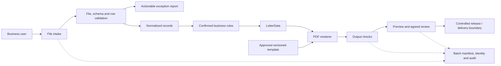

# Assignment 2 — Architecture

**POC:** local synchronous file processing and manifest. **Proposed production:** authenticated intake, private storage, durable row states, template registry, bounded retries, monitoring, and a delivery integration only when specified. Add a queue only if observed scale or processing time warrants it.
