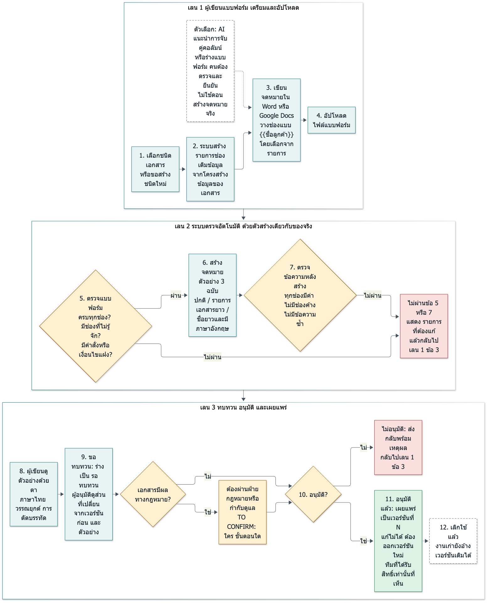
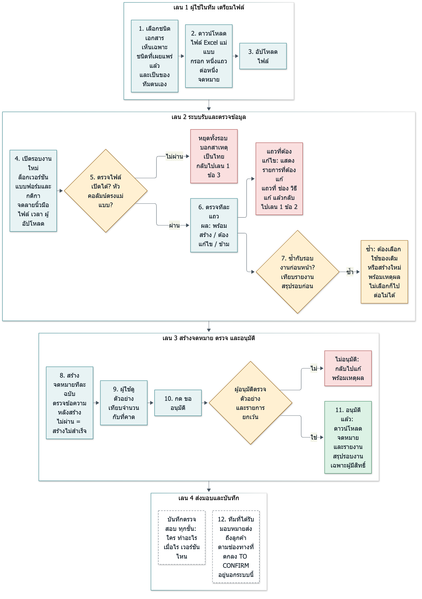

# Assignment 3 แพลตฟอร์มกลางสร้างเอกสาร PDF จากไฟล์ Excel (ข้อเสนอ)

**วันที่เขียน:** 2 ตุลาคม 2569 (2026-10-02)
**สถานะ:** เอกสารออกแบบ แพลตฟอร์มที่เสนอ **ยังไม่มีอยู่จริง** ทุกอย่างในเอกสารนี้เป็นข้อเสนอ ยกเว้นชิ้นส่วนที่มี path ของ `as2/` กำกับ ซึ่งมีอยู่ในโค้ด A2 จริง

## ป้ายกำกับที่ใช้

| ป้าย | ความหมาย |
| --- | --- |
| **[A2 มีจริง: path:บรรทัด]** | มีอยู่ในโค้ดหรือเอกสารของ A2 ตรวจแล้วว่าบรรทัดนั้นมีเนื้อหาตามที่อ้าง (`scripts/check_a2_a3.py` ผล C01) |
| **[A2 ยังไม่มี]** | A2 ไม่มี หรือ A2 เขียนไว้ในเอกสารแต่โค้ดไม่ได้ทำ |
| **[ข้อเสนอ]** | ออกแบบใหม่สำหรับ A3 ยังไม่มีโค้ด |
| **[ทดสอบแล้ว]** | รันจริงเมื่อ 2 ต.ค. 2569 พร้อมเวอร์ชันเครื่องมือ |
| **[วางแผน ยังไม่ได้ทดสอบ]** | มีแผนทดสอบ แต่ยังไม่ได้รัน ไม่มีผลลัพธ์ให้อ้าง |
| **[TO CONFIRM]** | ข้อเท็จจริงขององค์กรที่ยังไม่ทราบ ห้ามเดา |

## สถานะของ A2 ที่ A3 นี้อ้างอิง (อ่านก่อน)

A3 นี้ตรวจกับ **A2 ฉบับที่แก้แล้ว** (`as2/` ณ 2 ต.ค. 2569 บันทึกการแก้ไว้ใน `as2/docs/A2_CHANGELOG.md` แก้เป็น commit แยก) ผมรันเองแล้ว: ชุดทดสอบของ A2 **162 รายการผ่าน** ใน venv ของ A2 เอง และ pipeline กับไฟล์ตัวอย่างของ Sunday ได้จดหมาย 5 ฉบับ ข้าม 5 แถว ไม่มีคำนำหน้าซ้ำ วันที่เป็น พ.ศ. ฝังฟอนต์ Sarabun (ผลตรวจ P10 ถึง P15) A3 ฉบับก่อนหน้าเขียนตอนที่ A2 ยังไม่ได้แก้ ข้อความที่อ้างข้อบกพร่องเดิมของ A2 (คำนำหน้าซ้ำ ไม่ escape วันที่ ค.ศ. ฟอนต์ macOS ไม่มีรายการแพ็กเกจ รันซ้ำเขียนทับ ฯลฯ) **ถูกถอดออกแล้ว** ส่วนที่ **ยังไม่มีใน A2** ยังเป็นจริงและอยู่ในตาราง 3.1 ค. A2 เปลี่ยนเครื่องสร้าง PDF เป็น HTML → Chrome (ดู 3.2.2) สคริปต์ `as3/scripts/check_a2_a3.py` รันโค้ด A2 จริงทุกครั้งที่เรียกใช้ รายละเอียดการพิสูจน์ข้ออ้างทุกข้อเกี่ยวกับ A2 อยู่ใน `as3/docs/A2_A3_CONSISTENCY.md` ถ้า A2 ถูกแก้อีก ให้รันสคริปต์ซ้ำเพื่อดูข้อความใน A3 ที่ต้องปรับ

---

## 3.1 ทำได้ไหม

**คำตอบ: ทำได้ แต่เป็น self-service ภายในกรอบ ไม่ใช่ free-style ทุกรูปแบบ**

ทำได้เมื่องานของแต่ละทีมมีรูปแบบเดียวกันคือ "ไฟล์ Excel เข้า ตรวจข้อมูล สร้าง PDF ให้คนตรวจ อนุมัติ แล้วปล่อย" ทีมสามารถเพิ่มเอกสารชนิดใหม่ได้เอง (เขียนแบบฟอร์มใน Word หรือ Google Docs และระบุชุดกติกาจากรายการที่กำหนด) โดยไม่ต้องเขียนโปรแกรม แต่ต้องอยู่ในกรอบที่แพลตฟอร์มรองรับ และต้องผ่านการอนุมัติก่อนใช้ ไม่ใช่ทำได้ทุกหน้าตาของเอกสาร และไม่ใช่ให้ใครเขียนกติกาหรือโค้ดอะไรก็ได้

### ตาราง ใช้ซ้ำจาก A2 / ต้องรื้อ / ยังไม่มี

หลักฐานทุกแถวคือโค้ดใน `as2/poc/` ฉบับที่แก้แล้ว ถ้าไม่มี path แปลว่าไม่มีไฟล์ให้อ้าง

**ก. ใช้ซ้ำได้ (ของที่มีจริงใน A2 ฉบับที่แก้แล้ว)**

| ส่วน | หลักฐาน | ใช้ซ้ำอย่างไร และข้อควรระวัง |
| --- | --- | --- |
| ตรวจไฟล์และตรวจรายแถว มีรหัสข้อผิดพลาด ระดับ (error/warning/info) และข้อความภาษาไทยที่บอกช่อง | **[A2 มีจริง: `as2/poc/validation.py:114-176`, `:204-313`, `as2/poc/models.py:26`]** | ใช้ซ้ำเป็นแกน ต้องเปลี่ยนให้อ่านกติกาจาก Definition แทนค่าตายตัว (ดูตาราง ข.) |
| ผลของแต่ละแถวมี 4 แบบ: ต้องแก้ไข / ข้าม (มีคำเตือนถ้าข้อมูลขัดแย้ง) / ซ้ำในไฟล์ / สร้างจดหมาย | **[A2 มีจริง: `as2/poc/validation.py:226-286`, `as2/poc/models.py:37-50`]** | ใช้ซ้ำ กุญแจของแถวซ้ำต้องมาจาก Definition |
| รายงานแถวที่ต้องแก้ (`rejected.csv`) และรายงานการตรวจทุกข้อ (`validation_report.csv`) | **[A2 มีจริง: `as2/poc/generate_letters.py:63-70`, `:128-129`]** | ใช้ซ้ำ |
| manifest ของรอบงานและการกระทบยอด (populated = rejected + skipped + duplicates + eligible, eligible = generated + failed) พร้อมเวอร์ชันเครื่องสร้างและแฮชฟอนต์ | **[A2 มีจริง: `as2/poc/generate_letters.py:132-161`, `as2/poc/validation.py:82-91`]** | ใช้ซ้ำ เพิ่มผู้ใช้ เวอร์ชัน Definition เลขรอบงานจากระบบ ผู้อนุมัติ |
| หนึ่งรอบหนึ่งโฟลเดอร์ใหม่ `run_<เวลา UTC>_<แฮชไฟล์ 8 ตัว>` ไม่เขียนทับรอบเก่า และแฮช SHA-256 ของไฟล์ | **[A2 มีจริง: `as2/poc/generate_letters.py:39-45`, `:73-86`]** | ใช้ซ้ำแนวคิด แพลตฟอร์มออกเลขรอบเองและเก็บในฐานข้อมูล |
| เขียนไฟล์แบบอะตอมมิก (ไฟล์ชั่วคราวแล้วเปลี่ยนชื่อ) ทั้ง PDF manifest และรายงาน | **[A2 มีจริง: `as2/poc/generate_letters.py:53-56`, `as2/poc/renderer.py:165`, `:171-171`]** | ใช้ซ้ำ |
| แยกความล้มเหลวต่อแถว และลบ PDF ที่ตรวจไม่ผ่านทิ้ง | **[A2 มีจริง: `as2/poc/generate_letters.py:89-102`]** | ใช้ซ้ำ |
| ตั้งชื่อไฟล์ผลลัพธ์โดยไม่ใช้ข้อมูลลูกค้า | **[A2 มีจริง: `as2/poc/generate_letters.py:47-50`]** | ใช้ซ้ำ |
| ตรวจ PDF หลังสร้างโดยเทียบทุกบรรทัดที่ควรเป็น ตรวจคำซ้ำ รูปแบบวันที่ จำนวนข้อ และฟอนต์ที่ฝัง | **[A2 มีจริง: `as2/poc/verify.py:56-86`, `:99-106`]** | ใช้ซ้ำ ข้อจำกัด: ตรวจข้อความ ไม่ตรวจภาพ ตำแหน่งวรรณยุกต์ต้องดูด้วยตา (A2 ระบุเอง) ใช้ PyMuPDF ซึ่งไลเซนส์ AGPL ต้องให้ฝ่ายที่เกี่ยวข้องพิจารณา (`as2/docs/OPEN_QUESTIONS.md` ข้อ 21) |
| ปรับข้อมูลก่อนพิมพ์: คำนำหน้า "คุณ" ครั้งเดียว ชื่อสถานพยาบาลไม่ซ้ำคำ วันที่ พ.ศ. อ่านวันที่หลายรูปแบบ ตารางชื่อเอกสารที่อนุมัติ | **[A2 มีจริง: `as2/poc/normalize.py:53-94`, `:114-166`, `:184-198`]** | ใช้ซ้ำ ค่าเริ่มต้นเป็นสมมติฐานที่ยังต้องยืนยัน (`as2/docs/OPEN_QUESTIONS.md` ข้อ 8-12) |
| สร้าง PDF จาก HTML ด้วย Chrome ฟอนต์ Sarabun แพ็กมา (OFL) escape ข้อมูล ไม่ตัดบรรทัดกลางชื่อหรือเลข | **[A2 มีจริง: `as2/poc/renderer.py:27-29`, `:75-96`, `:151-171`]** | ใช้ซ้ำ เป็นเส้นทางที่ทดสอบแล้ว (3.2.2) ข้อจำกัดดูตาราง ข. |
| ชุดทดสอบอัตโนมัติและไฟล์แพ็กเกจที่ปักเวอร์ชัน | **[A2 มีจริง: `as2/poc/tests/` (13 ไฟล์), `as2/poc/requirements.txt`]** | ใช้เป็นต้นแบบ **[ทดสอบแล้ว]** รันใน venv ของ A2 เอง 162 ผ่านเมื่อ 2 ต.ค. 2569 (P22) |

**ข. ต้องรื้อหรือทำให้ทั่วไป**

| ส่วน | หลักฐาน | ปัญหา |
| --- | --- | --- |
| หัวคอลัมน์ ชื่อชีต และค่าสถานะเขียนตายตัวในโค้ด | **[A2 มีจริง: `as2/poc/validation.py:33-44`]** | ผูกกับจดหมายขอเอกสารชนิดเดียว ต้องย้ายไปอยู่ใน Definition |
| กติกาแถวซ้ำ แถวขัดแย้ง และชื่อเอกสารมาตรฐานเป็นของจดหมายนี้ | **[A2 มีจริง: `as2/poc/validation.py:154-164`, `:226-286`]** | ต้องเป็นกติกาปิดที่ตั้งค่าได้ (3.2.3) |
| แบบฟอร์มมีชนิดเดียว เป็น HTML กับไฟล์ตั้งค่าที่วิศวกรแก้ ไม่ใช่ Word หรือ Google Docs | **[A2 มีจริง: `as2/poc/renderer.py:27`, `as2/poc/letter.py:46-60`, `as2/poc/config/letter.yml:11`]** | ผู้ใช้ทีมอื่นแก้เองไม่ได้ ต้องมีเส้นทางผู้เขียนแบบฟอร์ม (3.2.1) และตัวแปลง (ยังไม่ได้ทดสอบ) |
| เปิด Chrome ใหม่ต่อจดหมายหนึ่งฉบับ และทดสอบเฉพาะ macOS กับ Chrome 154 | **[A2 มีจริง: `as2/poc/renderer.py:49-67`, `:151-171`]** | ผู้เขียน A2 ระบุเองว่ายังไม่ทดสอบ Linux (`as2/docs/OPEN_QUESTIONS.md` ข้อ 28-29) ต้องวัดความเร็วและทดสอบบนเครื่องที่จะใช้จริง |
| ไม่มีภาพอ้างอิงเปรียบเทียบอัตโนมัติ ตำแหน่งวรรณยุกต์ตรวจด้วยตา | `as2/docs/A2_CHANGELOG.md` ส่วน "ไม่ได้ตรวจ", `as2/docs/OPEN_QUESTIONS.md` ข้อ 30 | แพลตฟอร์มควรมีขั้นตรวจภาพเมื่อเปลี่ยนเวอร์ชัน Chrome หรือฟอนต์ **[วางแผน]** |
| เป็นเครื่องมือบรรทัดคำสั่งเดียว ผลลัพธ์อยู่ในโฟลเดอร์ `output/` ของเครื่องที่รัน | **[A2 มีจริง: `as2/poc/generate_letters.py:165-191`]** | ไม่มีหน้าอัปโหลด ต้องมีบริการเว็บ |

**ค. ยังไม่มีใน A2**

| ส่วน | สถานะใน A2 | หลักฐาน |
| --- | --- | --- |
| บันทึกตรวจสอบ (audit log) | **[A2 ยังไม่มี]** | ไม่มีคำเกี่ยวกับ audit สิทธิ์ หรือการอนุมัติในโค้ด A2 (P08) A3 ฉบับแรกเขียนว่า A2 มี "แกนตรวจสอบ" ซึ่งไม่จริง ข้อความนั้นถูกถอดออกแล้ว |
| ขั้นตอนอนุมัติ | **[A2 ยังไม่มี]** | A2 ระบุเองว่าหน้าจออนุมัติและสิทธิ์เป็น "ส่วนที่ยังเป็นการออกแบบ" (`as2/ANSWER.md:187`) |
| การควบคุมสิทธิ์ ผู้ใช้ ทีม | **[A2 ยังไม่มี]** | P08 |
| ทะเบียนแบบฟอร์มและเวอร์ชัน | **[A2 ยังไม่มี]** | มีเพียงค่าตั้งค่า `template_version` (`as2/poc/config/letter.yml:11`) ที่ถูกบันทึกลง manifest |
| หน้าอัปโหลด ดูตัวอย่าง ดาวน์โหลด | **[A2 ยังไม่มี]** | P09 มีเพียงโหมด `--preview` ในบรรทัดคำสั่ง |
| เทียบแถวกับรอบก่อนหน้า (ข้ามรอบ) | **[A2 ยังไม่มี]** | **[ทดสอบแล้ว]** A2 ตรวจแถวซ้ำภายในไฟล์เดียว (P19) แต่รันไฟล์เดียวกันซ้ำสองรอบ สองรอบสร้างจดหมายครบโดยไม่เตือน (P21) manifest ไม่มีฟิลด์อ้างถึงรอบก่อน (P17) A2 เขียนไว้เองใน `as2/ANSWER.md:158-160` |
| ที่เก็บไฟล์ส่วนตัวและการลบตามระยะเวลาเก็บ | **[A2 ยังไม่มี]** | `as2/docs/OPEN_QUESTIONS.md` ข้อ 18-19 |
| ตัวตั้งเวลา การแจ้งเตือน การทำต่อจากรอบที่ค้าง | **[A2 ยังไม่มี]** | A2 ระบุเป็นการออกแบบ (`as2/ANSWER.md:187`) |

### เฟส 1 รองรับอะไร และยังไม่รองรับอะไร **[ข้อเสนอ]**

| รองรับในเฟส 1 | ยังไม่รองรับ (ต้องใช้ความสามารถเพิ่มหรือทำนอกแพลตฟอร์ม) |
| --- | --- |
| ไฟล์ Excel หนึ่งไฟล์ อ่านจากแผ่นงานชื่อ Sheet1 แผ่นเดียว (ตรงกับ A2 `as2/poc/validation.py:42`) | **ไฟล์หลายแผ่นงาน** ที่ข้อมูลแยกกันหลายชีต |
| หนึ่งแถว = หนึ่งเอกสาร | **หนึ่งเอกสารมีหลายรายการจากหลายแถว** เช่น ใบแจ้งต่ออายุที่มีหลายความคุ้มครอง (ต้องรวมแถว ตารางที่ขยายตามจำนวนรายการ ยอดรวมที่คำนวณด้วยโค้ด) |
| ชนิดช่อง: ข้อความ วันที่ ตัวเลือก (enum) รายการข้อความ | **ย่อหน้าตามเงื่อนไข** (ถ้า…ให้แสดงข้อความนี้) |
| ชุดกติกาปิด: จำเป็นต้องกรอก วันที่ถูกต้อง ลำดับวันที่ ค่าที่อนุญาต รูปแบบรายการ จำเป็นเมื่อสถานะเป็น… ไม่ซ้ำในไฟล์ | **ลายเซ็น** (รูปลายเซ็นหรือช่องเซ็น) |
| เลือกแถวที่จะสร้างด้วยเงื่อนไขเท่ากับค่าหนึ่ง (เช่นสถานะ = REQUEST_DOC) | **เอกสารแนบ** (รวมไฟล์อื่นเข้าไปใน PDF) |
| จดหมายแบบฟอร์ม DOCX ข้อความหนึ่งหรือหลายหน้า มีโลโก้และหัวกระดาษที่เป็นภาพคงที่ รายการเรียงเลขหนึ่งรายการ | **แผนภูมิหรือกราฟ**, **ลายเซ็นอิเล็กทรอนิกส์ (e-signature)**, ภาพหรือรหัสบาร์โค้ด/QR ที่เปลี่ยนตามแถว |
| อนุมัติก่อนปล่อย ตามบทบาท | การส่งจดหมายถึงลูกค้าโดยตรง (A2 ก็ไม่ส่งเอง: ส่งเป็นกระบวนการแยก) |

ทุกชนิดเอกสารที่ไม่รองรับในเฟส 1 มีตัวอย่างร่างใน `as3/examples/definitions/renewal_notice.v1.sketch.yaml` พร้อมรายการสิ่งที่ต้องเพิ่ม (หัวข้อ 3.2.3)

---

## 3.2 การออกแบบ

### 3.2.1 เส้นทางสร้างแบบฟอร์มสำหรับผู้ที่ไม่ใช่สายเทคนิค **[ข้อเสนอ]**



*ที่มาของภาพ: `docs/diagrams/1_template_author_flow.mmd` วาดด้วย Mermaid ลูกศรระหว่างเลนหมายถึงไปขั้นถัดไปเมื่อผ่าน*

หลักการ: ผู้เขียนแบบฟอร์มทำงานในเครื่องมือที่คุ้นเคย ไม่ต้องรู้โครงสร้างข้อมูล

1. ระบบสร้าง **รายการช่องเติมข้อมูล** จากโครงสร้างข้อมูลของเอกสาร (เช่น ชื่อลูกค้า เลขกรมธรรม์ รายการเอกสาร) เป็นภาษาไทย
2. ผู้เขียนเขียนจดหมายใน Word หรือ Google Docs และวางช่องในรูปแบบ `{{ชื่อลูกค้า}}` โดยคัดลอกจากรายการ ไม่พิมพ์เอง ระบบแจกไฟล์เริ่มต้นที่มีช่องทั้งหมดวางไว้แล้วให้ด้วย
3. ผู้เขียนอัปโหลดไฟล์ Word (ถ้าใช้ Google Docs ให้ดาวน์โหลดเป็น Word ก่อน ความเพี้ยนของหน้าตาจากการแปลงนี้เป็นความเสี่ยงที่ต้องทดสอบ ดู 3.2.2)
4. **ระบบตรวจแบบฟอร์มเอง** ไม่พึ่งการตรวจของไลบรารีเติมช่อง:
   - ทุกช่องที่จำเป็นของเอกสารปรากฏอย่างน้อยหนึ่งครั้ง
   - **ไม่มีช่องที่ระบบไม่รู้จัก** (กันการสะกดผิด)
   - ไม่มีคำสั่งหรือเงื่อนไขแฝงในแบบฟอร์ม
   - ชื่อช่องใช้ตัวอักษรที่อนุญาตเท่านั้น (ไม่มีเว้นวรรค)
   - ฟอนต์ที่ใช้อยู่ในรายการฟอนต์ที่อนุญาตและติดตั้งบนเครื่องสร้าง PDF **[TO CONFIRM: รายการฟอนต์ที่มีสิทธิ์ใช้]**
5. ระบบสร้างจดหมายตัวอย่าง 3 ฉบับด้วย **ตัวสร้างเดียวกับของจริง** จากข้อมูลทดสอบ (ปกติ รายการเอกสารยาว ชื่อยาวและมีภาษาอังกฤษ) แล้วตรวจข้อความหลังสร้าง
6. ผู้เขียนดูตัวอย่างด้วยตา แล้วส่งขอทบทวน

**ผลทดสอบจริงที่ทำให้ต้องตรวจช่องเอง [ทดสอบแล้ว]** (`docs/rendering-test/docx_field_test.py`, docxtpl 0.20.2, Jinja2 3.1.6, python-docx 1.2.0, Python 3.13.9):

| กรณี | ผลที่ได้ | ความหมายต่อการออกแบบ |
| --- | --- | --- |
| ชื่อช่องภาษาไทย `{{ชื่อลูกค้า}}` ในข้อความต่อเนื่อง | แทนค่าได้ถูกต้อง | ใช้ชื่อช่องภาษาไทยได้ |
| ช่องที่ถูกแบ่งเป็นหลายส่วนของข้อความเหมือนที่ Word มักทำ (2 รูปแบบ) | แทนค่าได้ถูกต้องทั้งสองรูปแบบ | รูปแบบที่ทดสอบไม่ใช่ปัญหา (ยังไม่ได้ทดสอบกับไฟล์จาก Word หรือ Google Docs จริง) |
| **สะกดชื่อช่องผิด** `{{ชื่อลูกค้าา}}` | **ช่องกลายเป็นข้อความว่างเงียบ ๆ** ผลคือ "เรียน " | ถ้าไม่ตรวจเอง จะได้จดหมายที่ขาดข้อมูลโดยไม่มีข้อผิดพลาด |
| ชื่อช่องมีเว้นวรรค `{{ชื่อ ลูกค้า}}` | เกิดข้อผิดพลาดของไลบรารี (`TemplateSyntaxError`) ผู้เขียนอ่านไม่รู้เรื่อง | ต้องตรวจก่อนและแปลเป็นข้อความที่แก้ได้ |
| คำสั่งเงื่อนไข `` | **ถูกรันจริง** | ไลบรารีให้ผู้เขียนใส่ตรรกะได้ ต้องบล็อก เพื่อไม่ให้แบบฟอร์มกลายเป็นโปรแกรม |

ข้อสรุป: ใช้ตัวสแกนช่องของแพลตฟอร์มเอง (ตรวจรูปแบบ `{{…}}` ก่อน แล้วเติมค่าด้วยกลไกที่จำกัดเฉพาะการแทนค่า) ไม่ปล่อยให้ไลบรารีทั่วไปตีความแบบฟอร์มที่ผู้ใช้อัปโหลดโดยตรง

### 3.2.2 เลือกเครื่องสร้าง PDF (ภาษาไทย)

**ความเสี่ยงของภาษาไทยที่ต้องทดสอบ:** (1) การตัดบรรทัดกลางคำ เพราะภาษาไทยไม่มีช่องว่างระหว่างคำ (2) วรรณยุกต์และสระซ้อนอยู่ผิดตำแหน่งหรือลอย (3) ฟอนต์ไม่ถูกฝังหรือถูกแทนด้วยฟอนต์อื่น ทำให้หน้าตาเพี้ยนเมื่อเปลี่ยนเครื่อง (4) ชั้นข้อความใน PDF เพี้ยน แม้ภาพดูถูก ซึ่งกระทบการตรวจหลังสร้าง การค้นหา และการคัดลอกข้อความ

**เปรียบเทียบเส้นทาง**

| เส้นทาง | เหมาะกับการเขียนแบบฟอร์มใน Word/Google Docs | สถานะการทดสอบภาษาไทย |
| --- | --- | --- |
| **DOCX → PDF** (LibreOffice แบบไม่มีหน้าจอ + ตัวเติมช่อง) | ตรงที่สุดกับผู้เขียน ไม่ต้องแปลงรูปแบบ | **[วางแผน ยังไม่ได้ทดสอบ]** ไม่มี LibreOffice ในเครื่องที่ใช้ทดสอบ จึงไม่มีผลให้อ้าง ทดสอบได้เพียงขั้นเติมช่องใน DOCX (3.2.1) |
| **HTML → PDF** ด้วย Chromium (Chrome แบบไม่มีหน้าจอ) | ต้องแปลง Word/Google Docs เป็น HTML ก่อน ความเพี้ยนของการแปลงยังไม่ได้ทดสอบ | **[ทดสอบแล้ว]** ภาพถูกต้อง ข้อความใน PDF ถูกต้อง ฝังฟอนต์ **A2 ฉบับที่แก้แล้วใช้เส้นทางนี้** |
| **HTML → PDF** ด้วย WeasyPrint | เช่นเดียวกัน | **[ทดสอบแล้ว]** ภาพถูกต้อง แต่ **ข้อความใน PDF เพี้ยน** |

**ผลทดสอบจริง [ทดสอบแล้ว]**
สภาพแวดล้อม: macOS เครื่องพัฒนาเครื่องเดียว, Chrome 154.0.8037.92, WeasyPrint 68.1, PyMuPDF 1.28.2 (ใช้ดึงข้อความ), ฟอนต์ Sarabun (ไลเซนส์ OFL ดาวน์โหลดจาก google/fonts บน GitHub) และ Tahoma (ฟอนต์ระบบของ macOS ซึ่งเป็นฟอนต์ที่ A2 ฉบับก่อนแก้ใช้ ตอนนี้ A2 เปลี่ยนมาใช้ Sarabun แล้ว) แผ่นทดสอบ 1 หน้า 6 กรณี (วรรณยุกต์และสระซ้อน ย่อหน้าจากจดหมายแบบไม่มีช่องว่าง คอลัมน์แคบ 5 ซม. ไทยปนอังกฤษและตัวเลข คำนำหน้ากับชื่อโรงพยาบาลยาว รายการเรียงเลข) สคริปต์: `docs/rendering-test/run_thai_render_test.py` ผลดิบ: `docs/rendering-test/results.json`

| ชุดทดสอบ | หน้าตาของภาพ (ผมดูภาพเอง) | ข้อความที่ดึงจาก PDF ตรงกับต้นฉบับ (6 กรณี) | ฟอนต์ถูกฝัง |
| --- | --- | --- | --- |
| Sarabun + Chrome | ถูกต้อง | **ตรงทั้ง 6** | ใช่ |
| Tahoma + Chrome | ถูกต้อง | **ตรงทั้ง 6** | ใช่ |
| Sarabun + WeasyPrint | ถูกต้อง | **ไม่ตรงทั้ง 6** | ใช่ |
| Tahoma + WeasyPrint | ถูกต้อง | **ไม่ตรงทั้ง 6** | ใช่ |

สิ่งที่เห็นจากภาพ (ทั้ง 4 ชุด): ตัดบรรทัดในคอลัมน์ 5 ซม. ตามขอบเขตคำ ไม่ตัดกลางคำ วรรณยุกต์และสระซ้อนอยู่ตำแหน่งถูก ภาพของ Chrome กับ WeasyPrint ดูเหมือนกัน ภาพอยู่ที่ `docs/rendering-test/out/` (`Sarabun_chrome.png`, `Sarabun_weasyprint.png`, `Tahoma_chrome.png`, `Tahoma_weasyprint.png`)

สิ่งที่พบจากข้อความ: ในไฟล์ของ WeasyPrint คำว่า "จากการตรวจสอบ" ถูกดึงออกมาเป็น "จ้ำกก้ำรตรวจสอบ" และ "คอลัมน์แคบ" เป็น "Ƴอลัมน์แƳบ" แม้ภาพดูถูก ผลคือการตรวจข้อความหลังสร้างแบบที่ A2 ใช้ตอนนี้ (`as2/poc/verify.py:56-86` ดึงข้อความด้วย PyMuPDF) จะ **ตัดสินว่าจดหมายที่ถูกต้องสร้างไม่สำเร็จ** และข้อความในไฟล์ค้นหาหรือคัดลอกไม่ได้ถูกต้อง

**ข้อจำกัดของผลทดสอบนี้ (ห้ามอ่านเกินจริง):** เครื่องเดียว macOS เวอร์ชันเดียวของแต่ละเครื่องมือ ฟอนต์สองตัว หน้าเดียว ไม่ได้ทดสอบบน Linux ที่เป็นเครื่องสร้างจริง ไม่ได้ทดสอบ DOCX → PDF และไม่ได้ทดสอบความเร็วหรือจดหมายหลายร้อยฉบับ ผลของ WeasyPrint เป็นผลของเวอร์ชันและการตั้งค่านี้ ผมไม่ได้สืบสาเหตุ จึงไม่สรุปว่าเป็นข้อบกพร่องของเครื่องมือโดยทั่วไป ไม่ได้ตรวจสิทธิ์การใช้ฟอนต์ Tahoma

**ตัดสินใจเบื้องต้น (ยังไม่เด็ดขาด)**

- เครื่องสร้างของแพลตฟอร์มเฟส 1: **HTML → PDF ด้วย Chromium** เพราะเป็นเส้นทางเดียวที่มีหลักฐานทดสอบ (แผ่นทดสอบของ A3 ข้างต้น และชุดทดสอบ 162 รายการของ A2 ที่เรียก Chrome จริง) และ **A2 ฉบับที่แก้แล้วใช้เส้นทางนี้อยู่** (`as2/poc/renderer.py:151-171` ฟอนต์ Sarabun แพ็กมาด้วย) ผู้เขียน A2 นำผลทดสอบของ A3 มาตัดสินใจเลือก Chrome และไม่เลือก WeasyPrint (`as2/docs/A2_CHANGELOG.md` ตาราง "ทางเลือกที่ลองและไม่เลือก")
- **ไม่เลือก WeasyPrint** ตามผลทดสอบข้างต้น
- ผู้เขียนแบบฟอร์มทำงานใน Word/Google Docs แล้วระบบแปลงเป็นแบบฟอร์มที่เครื่องสร้างใช้ (DOCX → HTML ที่รองรับเฉพาะส่วนย่อย เช่น ย่อหน้า ตัวหนา รายการ ตาราง) **ตัวแปลงนี้ยังไม่มีทั้งใน A2 และใน A3 ไม่ได้ทดสอบ [วางแผน ยังไม่ได้ทดสอบ]** และเป็นความเสี่ยงหลักของเส้นทางนี้
- ทางเลือกถ้าตัวแปลงเพี้ยนเกินเกณฑ์: DOCX → PDF ด้วย LibreOffice (ยังไม่ได้ทดสอบ ไม่มี LibreOffice ในเครื่องทดสอบ) หรือให้ผู้เขียนแก้ข้อความผ่านฟอร์มบนเว็บแทน Word
- ตัดสินใจเด็ดขาดหลังแผนทดสอบด้านล่างผ่าน

**แผนทดสอบ [วางแผน ยังไม่ได้ทดสอบ]**

| รายการ | วิธี | เกณฑ์ผ่าน |
| --- | --- | --- |
| แผ่นทดสอบภาษาไทย | ใช้แผ่นเดิม (`run_thai_render_test.py`) ขยายเป็น DOCX จริงที่สร้างใน Word และ Google Docs เพิ่ม: ข้อความจัดชิดสองข้าง ตัวเลขไทย ข้อความยาว 60 ตัวอักษรไม่มีช่องว่าง ตัวหนา/เอียง หัวกระดาษมีโลโก้ รายการข้ามหน้า | ภาพ: ไม่ตัดกลางคำ วรรณยุกต์ไม่ลอย ไม่มีกล่องว่าง (tofu) ข้อความ: ดึงจาก PDF ตรงกับต้นฉบับทุกกรณี |
| เครื่อง | macOS (เครื่องพัฒนา) และคอนเทนเนอร์ Linux ที่จะใช้จริง **[TO CONFIRM: ระบบปฏิบัติการที่ใช้]** | ผลบน Linux เท่านั้นที่ใช้ตัดสิน |
| ฟอนต์ | ทุกฟอนต์ที่อยู่ในรายการอนุญาต ทดสอบกรณีฟอนต์ในแบบฟอร์มไม่ได้ติดตั้งบนเครื่องสร้าง | ระบบต้องปฏิเสธแบบฟอร์ม ไม่แทนฟอนต์เงียบ ๆ และฟอนต์ถูกฝังใน PDF |
| ความเพี้ยนจาก Word และ Google Docs | สร้างจดหมายเดียวกันจาก Word และ Google Docs เทียบจำนวนหน้าและตำแหน่งตัดบรรทัดกับที่ผู้เขียนเห็น | จำนวนหน้าเท่ากัน ตัดบรรทัดต่างกันได้เฉพาะที่ผู้เขียนยอมรับ **[TO CONFIRM: เกณฑ์]** |
| ความซ้ำได้ | สร้างฉบับเดียวกันสองครั้งต่างเครื่อง | ข้อความเท่ากัน หน้าเท่ากัน ตำแหน่งตัดบรรทัดเท่ากัน |
| ปริมาณและเวลา | สร้าง 100 ฉบับ จับเวลา | **[TO CONFIRM: ปริมาณและเวลาที่ต้องการ]** |
| ล็อกเวอร์ชัน | บันทึกเวอร์ชันเครื่องสร้าง ในรายงานสรุปรอบงาน | เปลี่ยนเวอร์ชันแล้วต้องรันแผ่นทดสอบใหม่ก่อนใช้ |

### 3.2.3 Document Definition **[ข้อเสนอ]**

Document Definition คือไฟล์ตั้งค่าหนึ่งไฟล์ต่อหนึ่งชนิดเอกสาร ใช้อธิบายทุกอย่างที่ต่างกันระหว่างชนิดเอกสาร ในขณะที่เครื่องกลางเหมือนกันทุกชนิด มีเวอร์ชัน เผยแพร่แล้วแก้ไม่ได้ ไม่มีโค้ดที่รันได้ ตัวอย่างจริงหนึ่งไฟล์: **`as3/examples/definitions/request_documents.v1.yaml`** (จดหมายขอเอกสารเพิ่มเติม ผมแยกวิเคราะห์ด้วย PyYAML ได้ และตรวจแล้วว่าหัวคอลัมน์ ลำดับ และค่าสถานะตรงกับโค้ด A2 ทุกตัว ผลตรวจ C10)

ส่วนประกอบ (ตัดมาจากไฟล์จริง ฉบับเต็มดูที่ไฟล์):

```yaml
definition_id: request_documents
definition_version: 1
lifecycle_status: draft            # draft -> review -> approved -> retired
source:
  sheet: Sheet1                    # a2: as2/poc/validation.py:42
  columns: {customer_name: customer_name, policy_number: policy_number,
            coverage_start_date: coverage_start_date, coverage_end_date: coverage_end_date,
            hospital_name: hospital_name, claim_status: claim_status, document_request: document_request}
fields:
  - {id: claim_status, label_th: สถานะ, type: enum, values: [REQUEST_DOC, APPROVED, REJECTED]}
  - {id: document_request, label_th: รายการเอกสาร, type: list_of_text, input_format: bracket_list}
rules:
  - {id: R3, type: date_order, start: coverage_start_date, end: coverage_end_date,
     message: DATE_ORDER, a2: "as2/poc/validation.py:132-138"}
  - {id: R6, type: required_if, field: document_request, when: {claim_status: REQUEST_DOC}, min_items: 1,
     message: REQUIRED_FOR_REQUEST, a2: "as2/poc/validation.py:151-153"}
  - {id: R8, type: unique_in_file, key: [policy_number, document_request],
     message: DUPLICATE_ROW, a2: "as2/poc/validation.py:249-286"}
selection: {generate_when: {claim_status: REQUEST_DOC}}      # a2: as2/poc/validation.py:43
template: {id: request_letter_th, version: 1, format: docx, date_format: "[TO CONFIRM]"}
approval: {required: true, approver_role: "[TO CONFIRM]", legal_review_required: false}
retention: {uploaded_excel: "[TO CONFIRM]", generated_pdf: "[TO CONFIRM]"}
```

**ชุดกติกาปิด (closed set):** `required`, `date_valid`, `date_order`, `enum`, `list_of_text`, `required_if`, `unique_in_file` (เฟส 1) ผู้ใช้เลือกใช้และกำหนดพารามิเตอร์ได้ แต่เพิ่มชนิดกติกาใหม่ไม่ได้ ต้องให้ทีมวิศวกรรมเพิ่มและทดสอบ แต่ละกติกาผูกกับรหัสข้อความใน `docs/message-catalog.json` เพื่อให้ผู้ใช้เห็นข้อความภาษาไทยเดียวกันทุกที่

**อะไรมีใน A2 แล้ว และอะไรเพิ่งเสนอ**

| กติกา | ใน A2 |
| --- | --- |
| required, date_valid, date_order, enum, list_of_text, required_if | **[A2 มีจริง: `as2/poc/validation.py:122-153`]** |
| `conflict_if` (สถานะไม่ขอเอกสารแต่มีรายการเอกสาร) | **[A2 มีจริง: `as2/poc/validation.py:233-246`]** รหัส `CONFLICTING_ROW` เป็นคำเตือน ข้ามแถว |
| `unique_in_file` (แถวซ้ำภายในไฟล์) | **[A2 มีจริง: `as2/poc/validation.py:249-286`]** รหัส `DUPLICATE_ROW` |
| `vocabulary` (ชื่อเอกสารมาตรฐาน) และ `normalize` (คำนำหน้าครั้งเดียว ชื่อสถานพยาบาลไม่ซ้ำคำ วันที่ พ.ศ.) | **[A2 มีจริง: `as2/poc/validation.py:154-164`, `as2/poc/normalize.py:53-94`, `:114-166`, `:184-198`]** ค่าเริ่มต้นเป็นสมมติฐานของผู้เขียน A2 ยังไม่ได้ยืนยัน (`as2/docs/OPEN_QUESTIONS.md` ข้อ 8-12) |
| การเลือกแถวที่สร้าง (`generate_when`) | **[A2 มีจริง: `as2/poc/validation.py:43`, `:231-234`]** |
| `duplicates` (เทียบรอบก่อนหน้า) | **[A2 ยังไม่มี]** เป็นข้อเสนอ ซึ่งตรงกับช่องว่างที่ A2 ระบุเอง (`as2/ANSWER.md:158-160`) |

**ตัวอย่างที่สอง: ใบแจ้งต่ออายุที่มีหลายความคุ้มครอง** (`as3/examples/definitions/renewal_notice.v1.sketch.yaml`) นี่เป็นร่างความคิด **ไม่ใช่ข้อมูลหรือกติกาของ Sunday** ช่องทั้งหมดสมมติ **[TO CONFIRM]** เอกสารชนิดนี้ต้องการสิ่งที่เฟส 1 **ยังไม่รองรับ** ตรง ๆ ได้แก่

1. การรวมหลายแถวเป็นเอกสารเดียว (`group_by`) ในขณะที่เฟส 1 คือหนึ่งแถวหนึ่งเอกสาร
2. ตารางในแบบฟอร์มที่ขยายตามจำนวนรายการ
3. ช่องที่คำนวณด้วยโค้ด (เช่นเบี้ยรวม) ต้องไม่ให้คนพิมพ์และไม่ให้ AI คำนวณ
4. กติกาข้ามแถว (ค่าที่ต้องเหมือนกันในกลุ่ม ผลรวมต้องเท่ากับยอดที่ระบุ)
5. ชนิดตัวเลขและการจัดรูปแบบจำนวนเงิน
6. ย่อหน้าตามเงื่อนไข
7. การระบุข้อผิดพลาดระดับเอกสาร (ถ้ารายการหนึ่งผิด ทั้งกรมธรรม์ต้องถูกกัก และรายงานต้องบอกทุกแถวที่เกี่ยวข้อง)

ดังนั้นใบแจ้งต่ออายุแบบนี้ถูกจัดไว้เฟส 2 ถ้าไม่มีความต้องการจริงจากทีม ก็ไม่ต้องสร้าง

### 3.2.4 บทบาทและการอนุมัติ **[ข้อเสนอ]**

| บทบาท | ทำได้ | ทำไม่ได้ |
| --- | --- | --- |
| **ผู้เขียนแบบฟอร์ม** | สร้างและแก้ร่างแบบฟอร์มของทีมตน ดูตัวอย่างด้วยข้อมูลทดสอบ ส่งขอทบทวน | อนุมัติแบบฟอร์มของตัวเอง เห็นข้อมูลลูกค้าจริง |
| **ผู้ใช้ทีม** | เริ่มรอบงาน อัปโหลด ดูตัวอย่าง ขออนุมัติรอบงาน ดาวน์โหลดหลังอนุมัติ | แก้แบบฟอร์มหรือกติกา เห็นรอบงานของทีมอื่น |
| **ผู้อนุมัติ** (สองงาน) | (ก) อนุมัติแบบฟอร์ม โดยดูส่วนที่เปลี่ยนจากเวอร์ชันก่อนและตัวอย่าง (ข) อนุมัติรอบงานก่อนปล่อยจดหมาย | อนุมัติสิ่งที่ตนเป็นผู้เขียนหรือผู้ขอ **[TO CONFIRM]** |
| **ฝ่ายกฎหมายหรือกำกับดูแล** | อนุมัติแบบฟอร์มที่มีผลทางกฎหมาย เช่น หนังสือเตือน จดหมายยืนยันโรคที่มีอยู่ก่อน | – |
| **เจ้าของแพลตฟอร์มและซัพพอร์ต** | ดูแลระบบ เวอร์ชันของเครื่องสร้าง ฟอนต์ แก้ปัญหา เห็นเมตาข้อมูลของรอบงาน | อนุมัติเนื้อหาทางธุรกิจ เปิดดูเนื้อหาจดหมายหรือข้อมูลลูกค้าโดยไม่มีบันทึก |

**การแยกทีม:** ทุกแบบฟอร์ม รอบงาน และไฟล์ผูกกับทีมที่เป็นเจ้าของ และกรองที่ชั้นข้อมูล ไม่ใช่แค่ซ่อนในหน้าจอ ผู้ใช้ทีมหนึ่งเห็นเฉพาะของทีมตนเอง **[TO CONFIRM]**: โมเดลบทบาทละเอียด การยืนยันตัวตน (ใช้ระบบขององค์กรหรือไม่) เอกสารชนิดใดต้องผ่านฝ่ายกฎหมาย ผู้ขอกับผู้อนุมัติเป็นคนเดียวกันได้หรือไม่ รายชื่อผู้อนุมัติและผู้สำรอง ทั้งหมดนี้ยังไม่ทราบ ไม่ได้เดา

### 3.2.5 วงจรชีวิตของแบบฟอร์ม **[ข้อเสนอ]**

`ร่าง → รอทบทวน → อนุมัติแล้ว → เลิกใช้` ดูไดอะแกรมภาพที่ 1 (เลน 3)

- **เวอร์ชันที่อนุมัติแล้วแก้ไม่ได้** (immutable) ถ้าจะแก้ต้องออกเวอร์ชันใหม่ ซึ่งเริ่มจากร่างและผ่านการอนุมัติใหม่
- **ทุกรอบงานล็อกเวอร์ชัน** ของ Definition และแบบฟอร์มตอนอัปโหลด การเผยแพร่เวอร์ชันใหม่ไม่เปลี่ยนรอบงานที่เปิดอยู่ และรอบงานเก่ายังตรวจย้อนได้ว่าใช้เวอร์ชันใด
- **ผู้อนุมัติเห็นส่วนที่เปลี่ยนจากเวอร์ชันก่อน** ผ่านสามอย่าง: ข้อความที่เปลี่ยน (เทียบข้อความที่ดึงจากสองเวอร์ชัน) รายการช่องที่เพิ่มหรือลด และตัวอย่างจดหมายจากข้อมูลทดสอบชุดเดียวกันของสองเวอร์ชันเคียงกัน พร้อมข้อมูลฟอนต์และจำนวนหน้า
- **เลิกใช้:** ไม่ปรากฏในรายการสำหรับรอบงานใหม่ แต่รอบงานเก่ายังอ้างอิงได้

### 3.2.6 บันทึกตรวจสอบ การเก็บรักษา และสิทธิ์ดาวน์โหลด **[ข้อเสนอ]**

**ฟิลด์ของบันทึกตรวจสอบ (audit log)**

| ฟิลด์ | ตัวอย่าง |
| --- | --- |
| `event_id`, `timestamp_utc` | รหัสเหตุการณ์และเวลา |
| `actor_id`, `actor_role`, `team_id` | ใคร อยู่บทบาทไหน ทีมไหน |
| `event_type` | แบบฟอร์ม: สร้าง ส่งทบทวน อนุมัติ ไม่อนุมัติ เลิกใช้ / รอบงาน: เปิด ตรวจไฟล์ ตัดสินใจกรณีซ้ำ ส่งขออนุมัติ อนุมัติ ไม่อนุมัติ ยกเลิก / ดาวน์โหลด / ถูกปฏิเสธสิทธิ์ |
| `run_id`, `definition_id+version`, `template_id+version` | อ้างถึงรอบงานและเวอร์ชันที่ใช้ |
| `file_sha256` | ลายนิ้วมือไฟล์ที่อัปโหลด |
| `counts` | จำนวนพร้อมสร้าง ต้องแก้ไข ข้าม ซ้ำในไฟล์ สร้างแล้ว สร้างไม่สำเร็จ |
| `row_refs` | เลขแถวที่เกี่ยวข้อง (ไม่เก็บเนื้อหา) |
| `reason` | เหตุผลที่ผู้ใช้เขียน เช่นตอนเลือกสร้างซ้ำ หรือไม่อนุมัติ |
| `outcome` | สำเร็จหรือไม่ |

หลักการ: **บันทึกไม่เก็บชื่อลูกค้าหรือเนื้อหาจดหมาย** เก็บเพียงตัวอ้างอิง (เลขแถว ลายนิ้วมือ) เพื่อให้บันทึกเก็บได้นานกว่าไฟล์ข้อมูลลูกค้า เสริมความไม่แก้ไขได้ (เช่นเขียนต่อท้ายอย่างเดียว) **[TO CONFIRM: ข้อกำหนดขององค์กร]**

**การเก็บรักษา [TO CONFIRM ทุกค่า]:** ไฟล์ Excel ที่อัปโหลดและ PDF ที่สร้าง บ่งบอกข้อมูลสุขภาพ (ชื่อเอกสารที่ขอ ชื่อโรงพยาบาล) จึงควรเก็บเท่าที่จำเป็นและลบอัตโนมัติตามระยะเวลาที่ฝ่ายกฎหมาย/DPO กำหนด ยังไม่ทราบระยะเวลา จึงไม่ระบุตัวเลข

**ใครดาวน์โหลดได้ (ข้อเสนอ):** PDF และรายงานสรุปรอบงานดาวน์โหลดได้ **หลังอนุมัติเท่านั้น** โดยผู้ใช้ที่เริ่มรอบงาน ผู้อนุมัติของทีม และทีมส่งที่ได้รับมอบหมายของทีมนั้น ทุกการดาวน์โหลดถูกบันทึก ผู้ดูแลระบบไม่ดาวน์โหลดเนื้อหา **[TO CONFIRM]**

### 3.2.7 อัปโหลดซ้ำในรอบเดียวกัน **[ข้อเสนอ]**



*ที่มาของภาพ: `docs/diagrams/2_user_run_flow.mmd` ลูกศรระหว่างเลนหมายถึงไปขั้นถัดไปเมื่อผ่าน*

1. **ทุกการอัปโหลดเปิดรอบงานใหม่** มีเลขรอบงานใหม่ ไม่เขียนทับรอบเก่า ส่วนนี้ A2 ทำแล้ว: แต่ละรอบเปิดโฟลเดอร์ใหม่ชื่อ `run_<เวลา UTC>_<แฮชไฟล์ 8 ตัว>` **[A2 มีจริง: `as2/poc/generate_letters.py:73-86`]** **[ทดสอบแล้ว]** รันไฟล์เดิมสองครั้งได้สองโฟลเดอร์และโฟลเดอร์แรกไม่ถูกแก้ (P16)
2. **ภายในไฟล์เดียวกัน** ใช้พฤติกรรมของ A2: สร้างจดหมายฉบับเดียวจากแถวแรก และรายงานทั้งสองแถว (เลขกรมธรรม์ + ชุดชื่อเอกสารเหมือนกัน ไม่สนลำดับ) **[A2 มีจริง: `as2/poc/validation.py:249-286`]** (P19) **ข้ามรอบ** ระบบ **เทียบแต่ละแถวกับ manifest ของรอบก่อนหน้า** ด้วยคีย์ที่กำหนดใน Definition (เช่นเลขกรมธรรม์ + รายการเอกสาร หรือรหัสคำขอจากระบบต้นทางถ้ามี **[TO CONFIRM]**) และเทียบลายนิ้วมือไฟล์ **[A2 ยังไม่มี]** (P17, P21)
3. ถ้าพบแถวซ้ำกับรอบก่อน แถวนั้นขึ้นป้าย **ซ้ำ รอเลือก** และผู้ใช้ **ต้องเลือก** "ใช้ของเดิม" หรือ "สร้างใหม่ พร้อมเขียนเหตุผล" จึงไปต่อได้ การเลือกและเหตุผลถูกบันทึกในบันทึกตรวจสอบ
4. ระบบไม่ลบรอบเก่าและไม่ส่งจดหมายถึงลูกค้าเอง

**ความสอดคล้องกับ A2:** A2 ฉบับที่แก้แล้วทำส่วนแรก (ไม่เขียนทับรอบเก่า) และการตรวจแถวซ้ำภายในไฟล์ ส่วนการเทียบข้ามรอบและการให้ผู้ใช้เลือก **ยังไม่มีใน A2** **[ทดสอบแล้ว]** รันไฟล์ที่มีแถวไม่ซ้ำสองรอบ ทั้งสองรอบสร้างจดหมายครบโดยไม่เตือน (P21) ข้อความของ A2 เอง หัวข้อ "กันการส่งซ้ำ" (`as2/ANSWER.md:158-160`) ระบุว่า POC ตรวจซ้ำภายในไฟล์เดียวและยังไม่จำข้ามรอบ ข้อเสนอนี้จึงสอดคล้องกับข้อความของ A2 และส่วนข้ามรอบเป็นสิ่งที่ต้องสร้างเพิ่ม

### 3.2.8 การใช้ LLM **[ข้อเสนอ]**

ใช้ได้ **เพียงสองงาน และไม่ใช้ตอนสร้างจดหมายจริงเด็ดขาด**

1. **แนะนำการจับคู่หัวคอลัมน์กับช่อง** ตอนเริ่มตั้งค่าเอกสารชนิดใหม่
2. **ร่างแบบฟอร์ม** ให้คนตรวจและแก้

ข้อกำหนด: คนยืนยันก่อนทุกครั้ง ผลจาก AI ผ่านตัวตรวจแบบฟอร์มและกติกาชุดเดียวกับที่คนเขียน (3.2.1) ส่งไปยัง LLM เฉพาะหัวคอลัมน์และ **ข้อมูลตัวอย่างสมมติ** ไม่ส่งข้อมูลลูกค้าจริง ผู้ให้บริการและการใช้งานต้องได้รับอนุมัติจากฝ่ายกฎหมาย/ความปลอดภัย **[TO CONFIRM]** ข้อความจดหมายและตัวเลขทั้งหมดที่ลูกค้าเห็นมาจากแบบฟอร์มที่อนุมัติแล้วกับข้อมูลใน Excel เท่านั้น ตัวเลขที่คำนวณ (ถ้ามีในเฟส 2) คำนวณด้วยโค้ด

### 3.2.9 สถาปัตยกรรมที่เหมาะสมกับขนาด **[ข้อเสนอ]**

| ส่วน | ที่เสนอ |
| --- | --- |
| บริการหลัก | บริการเดียว (หน้าเว็บ + ตรวจไฟล์ + จัดการรอบงาน) เทคโนโลยีเลือกตามมาตรฐานองค์กร **[TO CONFIRM]** |
| เครื่องสร้าง PDF | โปรเซสแยก Chrome แบบไม่มีหน้าจอ เหมือนที่ A2 ใช้ (`as2/poc/renderer.py:151-171`) ล็อกเวอร์ชัน รับงานทีละฉบับ ถ้า DOCX → PDF ด้วย LibreOffice ผ่านแผนทดสอบจึงพิจารณาเพิ่มเป็นทางเลือก |
| คิวงาน | **ไม่บังคับ** เพิ่มเมื่อวัดแล้วว่าเวลาหรือปริมาณต้องการ (A2 ทำเป็นลูปเดียว `as2/poc/generate_letters.py:122-127` เปิด Chrome ใหม่ต่อฉบับ ผู้เขียน A2 ระบุราว 1 วินาทีต่อฉบับบนเครื่องทดสอบ ผมไม่ได้วัดเอง) |
| พื้นที่เก็บไฟล์ | object storage หรือที่เก็บไฟล์ส่วนตัวที่เข้ารหัส สำหรับแบบฟอร์ม ไฟล์อัปโหลด และ PDF |
| ฐานข้อมูล | หนึ่งฐาน สำหรับทะเบียน Definition/แบบฟอร์ม รอบงาน และบันทึกตรวจสอบ |
| **ไม่ใช้** | Kubernetes, Kafka, การแยกเป็น microservices หลายตัว ไม่จำเป็นกับปริมาณที่ยังไม่ทราบ และเพิ่มภาระดูแล |
| ที่ติดตั้ง | **[TO CONFIRM]** โครงสร้างพื้นฐานของ Sunday ไม่ทราบ ไม่เดา |

### 3.2.10 แผนทยอยใช้ พร้อมเกณฑ์เริ่มและเกณฑ์ผ่าน **[ข้อเสนอ]**

| เฟส | งาน | เกณฑ์เริ่ม | เกณฑ์ผ่าน |
| --- | --- | --- | --- |
| **0 เตรียมความพร้อม** | การแก้ข้อบกพร่องของ A2 ที่พบในผลตรวจเข้มเสร็จแล้ว (2 ต.ค. 2569 ดู `as2/docs/A2_CHANGELOG.md`) งานที่เหลือ: ทดสอบเครื่องสร้าง PDF บน Linux ที่จะใช้จริง **[TO CONFIRM]** ตัดสินเรื่องปริมาณ (A2 เปิด Chrome ใหม่ต่อฉบับ) ให้ฝ่ายที่เกี่ยวข้องตัดสินสิทธิ์ฟอนต์ Sarabun/โลโก้และไลเซนส์ PyMuPDF (AGPL) เลือก 2 ทีมนำร่อง ตอบข้อ [TO CONFIRM] ที่เป็นเงื่อนไข | ได้รับอนุมัติให้ทำการนำร่อง | `check_a2_a3.py` ผ่านทุกข้อกับ A2 ณ วันเริ่มเฟส (ถ้า A2 เปลี่ยน ต้องรันซ้ำ) แผนทดสอบเรนเดอร์ผ่านบน Linux มีคำตอบข้อ [TO CONFIRM] ที่เป็นเงื่อนไข (ฟอนต์ที่มีสิทธิ์ ที่เก็บ ผู้อนุมัติ) |
| **1 สร้างแกนกลางกับชนิดเดียว** | ทะเบียน + อัปโหลด + ตรวจจาก Definition + สร้าง PDF + อนุมัติ + บันทึกตรวจสอบ ใช้ชนิด "ขอเอกสารเพิ่มเติม" กับทีมเดิมของ A2 รันคู่ขนานกับวิธีเดิม | เฟส 0 ผ่าน | หลายรอบติดต่อกัน **[TO CONFIRM: กี่รอบ]** ไม่มีจดหมายผิดถึงลูกค้า ผลเทียบกับวิธีเดิมตรงทุกฉบับ |
| **2 นำร่อง 2 ทีม** | เพิ่มทีมที่สองและชนิดเอกสารที่สอง (ชนิดที่เข้ากรอบเฟส 1 เท่านั้น) วัดตัวชี้วัด | เฟส 1 ผ่าน และมี baseline ที่วัดก่อนเริ่ม | ตัวชี้วัดถึงเกณฑ์ที่ตกลงล่วงหน้า (ด้านล่าง) |
| **3 ขยาย** | เพิ่มทีมและชนิดเอกสาร พิจารณาความสามารถเฟส 2 (รวมแถว ตารางขยายได้ ฯลฯ) เฉพาะเมื่อมีความต้องการจริงที่วัดได้ | เฟส 2 ผ่าน | ทบทวนตามความต้องการ |

**ตัวชี้วัดความสำเร็จของการนำร่อง** (ตัวเลขเป้า **[TO CONFIRM]** ต้องวัด baseline ก่อน ผมไม่ตั้งตัวเลขเอง เพราะไม่มีข้อมูล)

| ตัวชี้วัด | วัดอย่างไร |
| --- | --- |
| ข้อผิดพลาดต่อรอบงาน | สัดส่วนแถวที่ขึ้น "ต้องแก้ไข" ในการอัปโหลดครั้งแรก ต่อ 100 แถว และจำนวนครั้งอัปโหลดก่อนผ่าน |
| จดหมายที่สร้างไม่สำเร็จหรือถูกพบว่าผิดหลังผ่านระบบ | จำนวน "สร้างไม่สำเร็จ" ต่อ 100 ฉบับ และจดหมายที่ผู้อนุมัติหรือลูกค้าพบว่าผิด |
| เวลาตั้งค่าชนิดเอกสารใหม่ | ชั่วโมงทำงานจากคำขอถึงแบบฟอร์มที่อนุมัติ |
| เวลาต่อรอบงาน | จากอัปโหลดถึงดาวน์โหลด เทียบกับ baseline ของวิธีเดิม |
| รอบงานที่ถูกส่งกลับครั้งแรก | สัดส่วนรอบงานที่ผู้อนุมัติไม่อนุมัติในครั้งแรก |
| เวลาที่แบบฟอร์มรอการอนุมัติ | มัธยฐานจาก "รอทบทวน" ถึง "อนุมัติแล้ว" |

---

## 3.3 ข้อดีและข้อเสีย

### ข้อดีเฉพาะของการออกแบบนี้

| ข้อดี | เหตุผลจากการออกแบบ |
| --- | --- |
| จุดอ่อนที่แก้ที่เดียวแล้วดีกับทุกทีม | ตัวตรวจข้อความหลังสร้าง (`as2/poc/verify.py`) การ escape และการตรวจแถวซ้ำ ที่ A2 แก้แล้ว อยู่ในเครื่องกลาง ไม่ต้องแก้ในสคริปต์ของแต่ละทีม |
| ผู้ไม่ใช่สายเทคนิคเขียนแบบฟอร์มในเครื่องมือที่คุ้นเคย | ใช้ Word/Google Docs และช่องที่เลือกจากรายการ |
| ตรวจย้อนหลังได้ | ทุกรอบงานผูกกับเวอร์ชันแบบฟอร์ม Definition และบันทึกตรวจสอบ |
| ความผิดพลาดถูกขวางก่อนถึงลูกค้า | ตรวจแบบฟอร์ม ตรวจแถว ตรวจหลังสร้าง และมีผู้อนุมัติ ตามลำดับ |

### ข้อเสียเฉพาะของการออกแบบนี้ พร้อมวิธีรับมือและวิธีวัด

| ข้อเสีย | วิธีรับมือที่ชัดเจน | วัดอย่างไร |
| --- | --- | --- |
| **หน้าตาภาษาไทยเพี้ยนเมื่อแปลงแบบฟอร์มจาก Word/Google Docs ไปเป็นไฟล์ที่เครื่องสร้าง PDF ใช้** (ตัดบรรทัด ฟอนต์ถูกแทน จำนวนหน้าเปลี่ยน) A2 ไม่มีตัวแปลงนี้ ตัวแปลงเป็นส่วนที่ยังไม่ได้ทดสอบ | รายการฟอนต์ที่อนุญาต ตัวอย่างจากเครื่องสร้างจริงก่อนอนุมัติทุกครั้ง แผ่นทดสอบภาษาไทยประจำแบบฟอร์ม ล็อกเวอร์ชันเครื่องสร้างและ Chrome | สัดส่วนแบบฟอร์มที่ไม่ผ่านแผ่นทดสอบตั้งแต่อัปโหลดครั้งแรก จำนวนครั้งที่ผู้เขียนแจ้งว่าตัวอย่างไม่ตรงกับที่เห็นใน Word |
| **ผู้เขียนสะกดชื่อช่องผิด** (ทดสอบแล้วว่าไลบรารีทำให้ช่องหายเงียบ ๆ) | เลือกช่องจากรายการ ตัวสแกนช่องของระบบเอง ปฏิเสธช่องที่ไม่รู้จักพร้อมบอกตำแหน่ง | จำนวนการอัปโหลดแบบฟอร์มที่ถูกปฏิเสธเพราะช่องไม่ครบ/ไม่รู้จัก ต่อแบบฟอร์ม และเวลาถึงอัปโหลดครั้งแรกที่ผ่าน |
| **การอนุมัติแบบฟอร์มกลายเป็นคอขวด** | ทบทวนแบบแบ่งระดับความเสี่ยง (แก้เฉพาะข้อความ vs เอกสารมีผลทางกฎหมาย) ตกลงเวลาตอบกลับและผู้สำรอง **[TO CONFIRM]** แสดงส่วนที่เปลี่ยนให้ผู้อนุมัติเพื่อลดเวลาตรวจ | มัธยฐานเวลาจาก "รอทบทวน" ถึง "อนุมัติแล้ว" และจำนวนแบบฟอร์มที่รอ |
| **เครื่องสร้าง PDF เป็นจุดล้มเหลวจุดเดียว** | เครื่องสร้างไม่เก็บสถานะและเริ่มใหม่ได้ ตรวจสุขภาพระบบ ลองใหม่เป็นรายฉบับ ล็อกเวอร์ชัน มีขั้นตอนทำต่อจากที่ค้างโดยไม่ส่งซ้ำ | อัตราสร้างไม่สำเร็จ เวลาต่อรอบงาน จำนวนครั้งที่ระบบหยุด |
| **เงื่อนไขในแบบฟอร์มทำให้แบบฟอร์มสับสน** | เฟส 1 ไม่รองรับย่อหน้าตามเงื่อนไข ใช้แบบฟอร์มแยกตามกรณี ตัดสินใจรองรับเมื่อมีหลักฐาน | จำนวนคำขอเงื่อนไขในแบบฟอร์ม และจำนวนแบบฟอร์มที่แทบเหมือนกัน (ซ้ำซ้อน) |
| **ต้นทุนดูแลทะเบียนและ Definition** | ชุดกติกาปิดและเล็ก Definition เป็นไฟล์ที่มีเวอร์ชันและมีการทดสอบ มีเจ้าของทุกชนิด เลิกใช้ชนิดที่ไม่ได้ใช้ | ชั่วโมงวิศวกรต่อเดือนที่ใช้กับแพลตฟอร์ม เทียบกับจำนวนชนิดที่เพิ่ม และจำนวน Definition ที่ไม่มีรอบงานเกินช่วงเวลาที่กำหนด **[TO CONFIRM]** |
| **เครื่องสร้างและกติกากลางที่ผิดกระทบหลายทีมพร้อมกัน** | ปล่อยแบบทยอย ทดสอบถดถอยกับตัวอย่างของทุกแบบฟอร์มก่อนเปลี่ยนเวอร์ชัน | จำนวนรอบงานของทีมอื่นที่กระทบจากการเปลี่ยนเวอร์ชัน |

### ทางเลือกที่พิจารณาแล้วไม่เลือก

| ทางเลือก | เหตุผลที่ไม่เลือก |
| --- | --- |
| **บริการสร้างเอกสารสำเร็จรูป (SaaS)** | ข้อมูลสุขภาพของลูกค้าต้องส่งออกนอกองค์กร ซึ่งต้องได้รับอนุมัติ **[TO CONFIRM: นโยบาย]** ยังไม่ได้ทดสอบการแสดงผลภาษาไทยของบริการใด ๆ และต้องสร้างการตรวจแถว การอนุมัติ และบันทึกตรวจสอบเพิ่มเองอยู่ดี ราคา **[TO CONFIRM]** ไม่ทราบ |
| **Mail Merge ใน Word/Google Docs** | เหมาะกับงานเล็กที่ทำเองครั้งเดียว แต่ไม่มีการตรวจข้อมูลรายแถว ไม่มีผู้อนุมัติและบันทึกว่าใครทำอะไร ผลขึ้นอยู่กับคนทำทุกครั้ง และสร้างทีละไฟล์ด้วยมือ |
| **Apps Script ต่อทีม** | เท่ากับเขียนโค้ดแยกต่อทีม ซ้ำซ้อน ตรวจทานยาก ผูกกับบัญชีผู้เขียน และไม่มีจุดกลางสำหรับแก้ข้อบกพร่องร่วม |
| **สคริปต์แยกต่อทีม (แบบ A2 ที่คัดลอก)** | ข้อบกพร่องที่ A2 พบและแก้แล้ว (คำนำหน้าซ้ำ ไม่ escape แถวซ้ำ) ยังคงอยู่ในสำเนาที่ทีมอื่นคัดลอกไปก่อนการแก้ และสำเนาแต่ละที่จะแยกจากกันต่อไป ต้องแก้ทีละที่ทุกครั้งที่พบจุดอ่อนใหม่ |

---

## 3.4 คู่มือผู้ใช้

คู่มือฉบับเต็มสำหรับพนักงานอายุราว 35 ถึง 40 ปีที่คุ้นเคย Microsoft Office, Google Workspace และอีเมล เขียนแยกเป็นไฟล์ (เพราะมีภาพประกอบและตารางยาว):

| ไฟล์ | ใช้ทำอะไร |
| --- | --- |
| `as3/USER_GUIDE.md` | คู่มือผู้ใช้ (ภาษาไทย) |
| `as3/USER_GUIDE.pdf`, `as3/USER_GUIDE_print.html` | เวอร์ชันพร้อมพิมพ์ |
| `as3/mockup/` | หน้าจอตัวอย่างที่คลิกเดินไปมาได้ (HTML) ใช้ถ่ายภาพประกอบ |
| `as3/docs/guide-images/` | ภาพหน้าจอตัวอย่าง (mockup) ที่ใช้ในคู่มือ |
| `as3/examples/` | ไฟล์ Excel ตัวอย่าง 3 ไฟล์ (แม่แบบ ตัวอย่างถูกต้อง ไฟล์ฝึกแก้ไข) ข้อมูลสมมติ |
| `as3/docs/message-catalog.json` | แหล่งความจริงเดียวของป้ายสถานะและข้อความ ใช้สร้างทั้ง mockup และตารางในคู่มือ |
| `as3/docs/usability-test-plan.md` | แผนทดสอบการใช้งานกับผู้ใช้จริง |
| `as3/scripts/check_guide_words.py` | ตรวจว่าคู่มือไม่มีคำต้องห้าม |

สิ่งที่ตรวจแล้วเกี่ยวกับคู่มือ (ผล C07 ถึง C09): ไฟล์ Excel ตัวอย่างอ่านด้วยตัวตรวจจริงของ A2 ได้ผลตรงกับที่คู่มือบอก (ไฟล์ตัวอย่าง: จดหมาย 3 ข้าม 2 ไม่มีปัญหา, ไฟล์ฝึก: ต้องแก้แถวที่ 4, 6, 7) ตารางข้อความในคู่มือมีครบทุกข้อความใน catalog ซึ่งครอบคลุมทุกข้อความผิดพลาดที่โค้ด A2 สร้างได้ (C04) และคู่มือไม่มีคำต้องห้าม (ตัวตรวจทดสอบแล้วว่าล้มเมื่อใส่คำต้องห้าม)

**ยังไม่ได้ทำ:** ทดสอบการใช้งานกับคนจริง ภาพในคู่มือเป็นภาพตัวอย่างหน้าจอ (mockup) เพราะระบบยังเป็นข้อเสนอ ไม่มีผลทดสอบการใช้งานให้อ้าง มีแต่แผนใน `docs/usability-test-plan.md`

---

## สิ่งที่ยังไม่ทราบ [TO CONFIRM]

1. ผู้อนุมัติแต่ละทีม การอนุมัติด้วยตัวเองได้หรือไม่ ผู้สำรอง
2. เอกสารชนิดใดมีผลทางกฎหมายและต้องผ่านฝ่ายกฎหมาย/กำกับดูแล และขั้นตอนนั้น
3. ระยะเวลาเก็บไฟล์ Excel, PDF, บันทึกตรวจสอบ และผู้ที่ดาวน์โหลดได้
4. รูปแบบวันที่ (พ.ศ. หรือ ค.ศ.) รายการชื่อเอกสารมาตรฐาน ฟอนต์ที่มีสิทธิ์ใช้งาน
5. รหัสคำขอหรือรหัสเคลมที่ไม่ซ้ำจากระบบต้นทาง
6. โครงสร้างพื้นฐาน ระบบปฏิบัติการของเครื่องสร้าง การยืนยันตัวตน ผู้ให้บริการ LLM ที่อนุญาต
7. ปริมาณงาน เวลาที่ต้องการต่อรอบ จำนวนทีมและชนิดเอกสารที่จะนำร่อง
8. ช่องทางส่งจดหมายถึงลูกค้า ช่องทางและผู้ติดต่อฝ่ายสนับสนุน
9. ตัวเลขเป้าของตัวชี้วัดการนำร่อง (ต้องวัด baseline ก่อน)

## สรุปสิ่งที่ตรวจแล้วและยังไม่ได้ตรวจ

**ตรวจแล้ว (รันจริง 2 ต.ค. 2569):** ชุดทดสอบของ A2 ที่แก้แล้ว 162 รายการผ่านใน venv ของ A2 เอง (P22) pipeline ของ A2 กับไฟล์ตัวอย่างของ Sunday (จดหมาย 5 ข้าม 5 ไม่มีคำนำหน้าซ้ำ วันที่ พ.ศ. ฝังฟอนต์ Sarabun) สถานะโค้ด A2 และข้อตรวจความสอดคล้องของ A3 ทั้งหมดด้วย `scripts/check_a2_a3.py` (ผลสรุปอยู่ท้าย `docs/A2_A3_CONSISTENCY.md`) การเรนเดอร์ภาษาไทยด้วย HTML → PDF สองเครื่องมือ สองฟอนต์ การเติมช่องใน DOCX 6 กรณี ไดอะแกรม 2 ภาพ (ดูภาพแล้ว) mockup 10 หน้าจอ ไฟล์ Excel ตัวอย่าง 3 ไฟล์ (ผ่านตัวตรวจ A2) ไฟล์ Definition ตัวอย่าง 2 ไฟล์ (อ่านด้วย PyYAML ได้ ตรงกับ A2)

**ยังไม่ได้ตรวจ:** DOCX → PDF ด้วย LibreOffice (ไม่ได้ติดตั้ง) ตัวแปลง DOCX → HTML การเรนเดอร์บน Linux และ Chrome เวอร์ชันอื่น ภาพอ้างอิงเปรียบเทียบอัตโนมัติ (A2 ยังไม่มี) การเปิดไฟล์แบบฟอร์มที่สร้างจาก Word หรือ Google Docs จริง ความเร็วและปริมาณ (เปิด Chrome ต่อฉบับ) การทดสอบการใช้งานกับผู้ใช้จริง สิทธิ์การใช้ฟอนต์ Sarabun/โลโก้กับลูกค้าจริงและไลเซนส์ PyMuPDF (AGPL) ที่ A2 ใช้ตรวจข้อความ ความถูกต้องของข้อกำหนดทางกฎหมายและ PDPA (ไม่ได้อ้างอิง) ข้อเท็จจริงขององค์กร Sunday ทุกข้อใน [TO CONFIRM]

รายละเอียดการพิสูจน์ทุกข้ออ้างที่เกี่ยวกับ A2: `as3/docs/A2_A3_CONSISTENCY.md`
