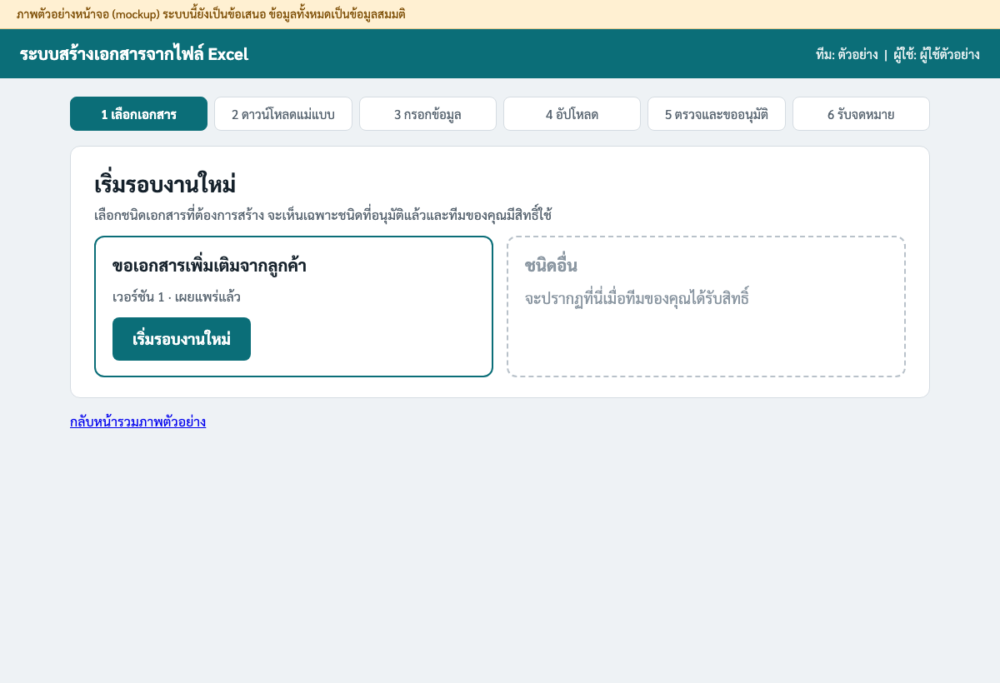
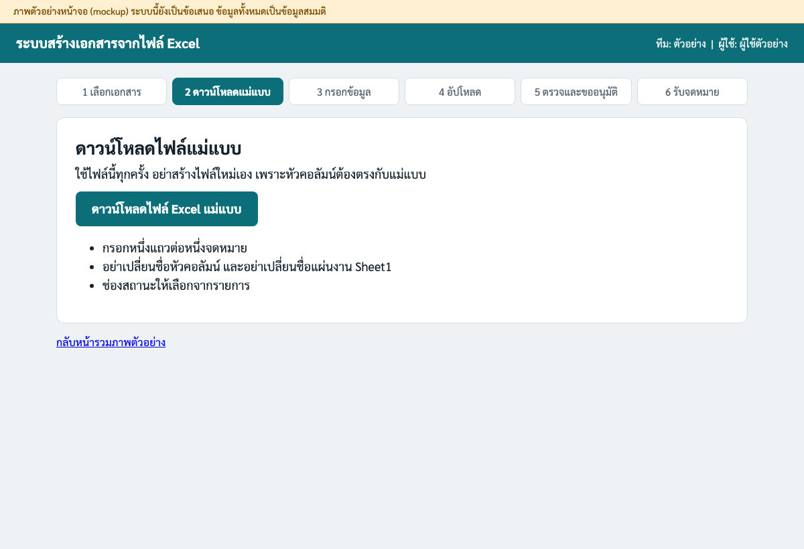
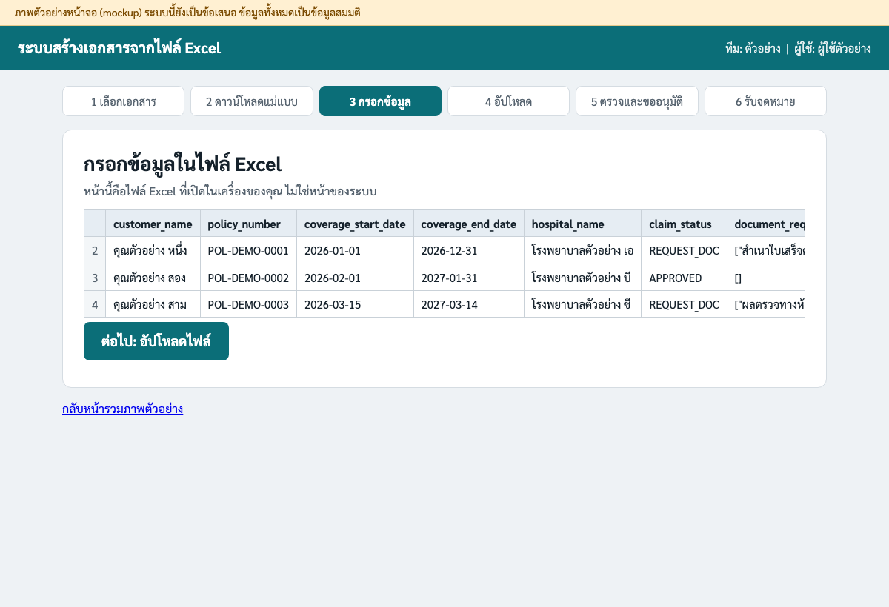
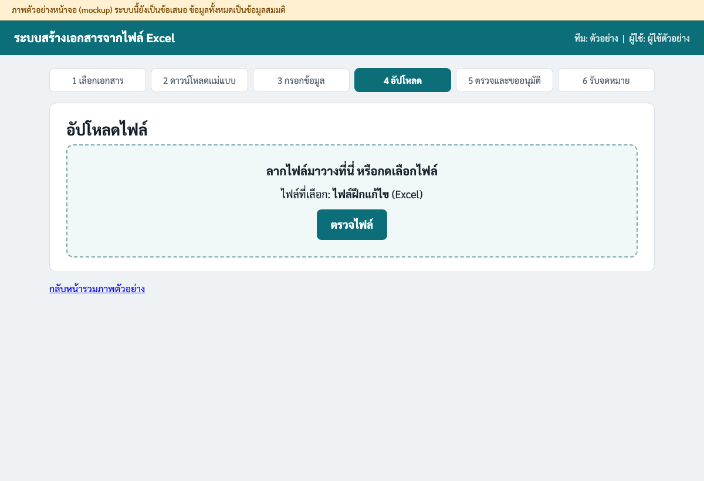
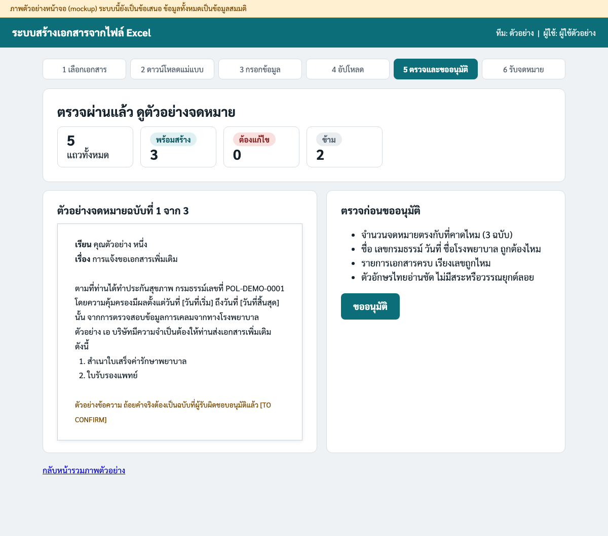
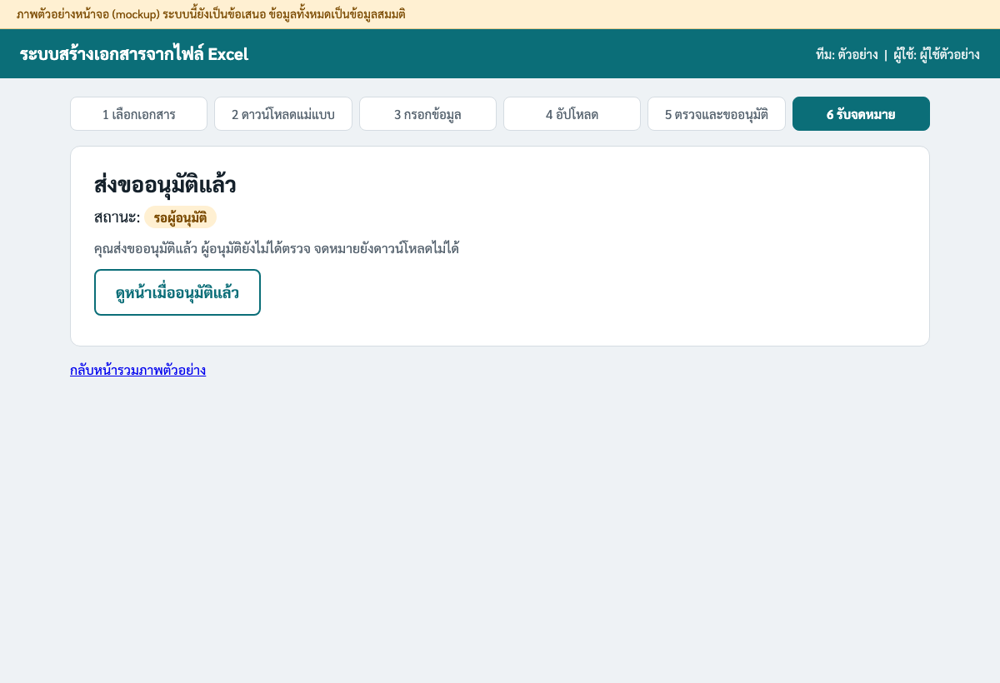
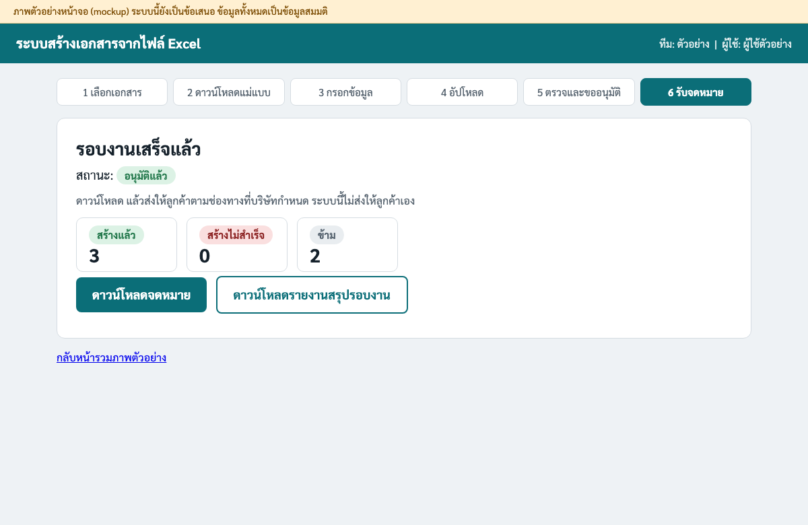
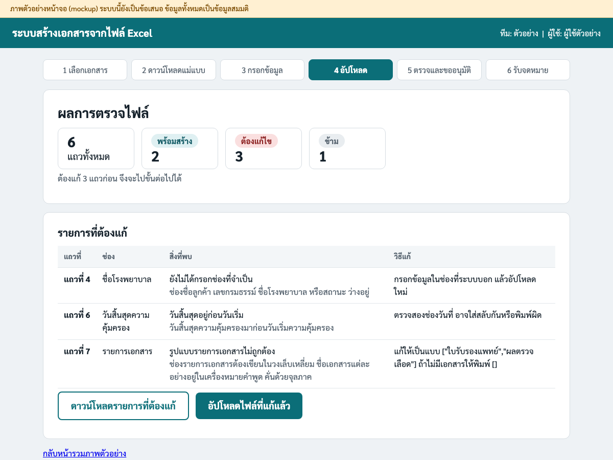

# คู่มือผู้ใช้ สร้างจดหมายจากไฟล์ Excel

> **ภาพหน้าจอในคู่มือนี้เป็นภาพตัวอย่าง (mockup)** ระบบนี้ยังเป็นข้อเสนอ ยังไม่ได้สร้างจริง ข้อมูลลูกค้าในภาพทั้งหมดเป็นข้อมูลสมมติ
> ข้อความ **[TO CONFIRM]** คือสิ่งที่บริษัทต้องตัดสินใจก่อนเปิดใช้งานจริง

คู่มือนี้เขียนสำหรับคนที่ใช้ Microsoft Office, Google Workspace และอีเมลเป็นประจำ ไม่ต้องมีความรู้ด้านโปรแกรมมิ่ง

## ระบบนี้ทำอะไร

คุณกรอกรายชื่อลูกค้าในไฟล์ Excel หนึ่งไฟล์ ระบบจะตรวจข้อมูลให้ แล้วสร้างจดหมาย PDF ทีละฉบับ
จดหมายจะส่งให้ลูกค้าได้หลังผู้อนุมัติตรวจแล้วเท่านั้น และระบบนี้ไม่ส่งจดหมายให้ลูกค้าเอง

**ถ้าเคยใช้ Mail Merge ใน Word:** ระบบนี้คล้ายกันตรงที่มีจดหมายต้นแบบหนึ่งฉบับ กับตารางข้อมูลหนึ่งตาราง แล้วได้จดหมายหลายฉบับ
ที่ต่างกันคือ ระบบตรวจข้อมูลให้ก่อนสร้าง บอกว่าแถวไหนผิดและต้องแก้อย่างไร มีผู้อนุมัติก่อนปล่อย และจดไว้ว่าใครทำอะไรเมื่อไร

## เริ่มใช้ใน 5 ขั้น

### ขั้นที่ 1 กด "เริ่มรอบงานใหม่"

เลือกชนิดเอกสารที่ต้องการ แล้วกดปุ่ม **เริ่มรอบงานใหม่**

### ขั้นที่ 2 กดดาวน์โหลดไฟล์แม่แบบ

กดปุ่ม **ดาวน์โหลดไฟล์ Excel แม่แบบ** ใช้ไฟล์นี้ทุกครั้ง อย่าสร้างไฟล์ใหม่เอง

### ขั้นที่ 3 กรอกข้อมูลลงไฟล์ที่ดาวน์โหลดมา

เปิดไฟล์ด้วย Excel แล้วกรอกหนึ่งแถวต่อหนึ่งจดหมาย เริ่มจากแถวที่ 2 ตรงใต้หัวคอลัมน์ ดูวิธีกรอกแต่ละช่องในหัวข้อ "รู้ก่อนกรอก" ด้านล่าง

### ขั้นที่ 4 อัปโหลดไฟล์

ลากไฟล์มาวาง หรือกดเลือกไฟล์ แล้วกด **ตรวจไฟล์** ระบบจะบอกผลทันที ถ้ามี **รายการที่ต้องแก้** ให้ไปดูหัวข้อ "ถ้าระบบบอกว่ามีรายการที่ต้องแก้" ด้านล่าง

### ขั้นที่ 5 ดูตัวอย่างจดหมาย แล้วกด "ขออนุมัติ"

ตรวจตัวอย่างตามรายการด้านขวาของหน้าจอ ถ้าถูกต้องให้กดปุ่ม **ขออนุมัติ**

หลังจากนี้ผู้อนุมัติจะตรวจ ระหว่างรอ สถานะจะเป็น **รอผู้อนุมัติ** เมื่อเป็น **อนุมัติแล้ว** ให้ดาวน์โหลดจดหมายและรายงานสรุปรอบงาน

## ถ้าระบบบอกว่ามีรายการที่ต้องแก้

ระบบจะแสดงตารางบอก **แถวที่** ใน Excel ช่องที่มีปัญหา สิ่งที่พบ และวิธีแก้ แก้ในไฟล์ Excel แล้วอัปโหลดใหม่ อย่าแก้ไฟล์จดหมายที่สร้างแล้วด้วยมือ

เลขแถวที่ระบบบอก คือเลขแถวที่เห็นทางซ้ายมือของ Excel โดยแถวหัวคอลัมน์เป็นแถวที่ 1

## ไฟล์ตัวอย่างให้ดาวน์โหลด

ที่เก็บไฟล์ตัวอย่าง **[TO CONFIRM: ที่เก็บไฟล์ตัวอย่างของบริษัท]** ข้อมูลในไฟล์เป็นข้อมูลสมมติทั้งหมด

| ชื่อไฟล์ | ใช้ทำอะไร | ผลที่ควรได้เมื่ออัปโหลด |
| --- | --- | --- |
| แม่แบบขอเอกสารเพิ่มเติม | ไฟล์เปล่า มีหัวคอลัมน์ครบ และมีแผ่นงาน คำอธิบาย | ใช้กรอกข้อมูลจริง |
| ตัวอย่างขอเอกสารเพิ่มเติม | ตัวอย่างที่กรอกถูกต้อง 5 แถว | พร้อมสร้าง 3 แถว ข้าม 2 แถว ไม่มีรายการที่ต้องแก้ |
| ไฟล์ฝึกแก้ไข | ฝึกแก้ไขข้อมูล มีข้อผิดพลาดตั้งใจ 3 จุด | ต้องแก้ไข 3 แถว คือ แถวที่ 4, 6 และ 7 |

ลองอัปโหลด **ไฟล์ฝึกแก้ไข** ก่อน เพื่อดูว่าระบบบอกอะไร แล้วลองแก้ตามคำแนะนำ

## รู้ก่อนกรอก

อย่าเปลี่ยนชื่อหัวคอลัมน์ในแถวแรก และอย่าเปลี่ยนชื่อแผ่นงานแรกที่ชื่อ Sheet1 ระบบอ่านเฉพาะแผ่นงานนี้

| หัวคอลัมน์ | ใส่อะไร | ตัวอย่าง |
| --- | --- | --- |
| customer_name | ชื่อลูกค้า | คุณตัวอย่าง หนึ่ง |
| policy_number | เลขกรมธรรม์ | POL-DEMO-0001 |
| coverage_start_date | วันเริ่มความคุ้มครอง ต้องเป็นวันที่ใน Excel | 2026-01-01 |
| coverage_end_date | วันสิ้นสุดความคุ้มครอง ต้องไม่ก่อนวันเริ่ม | 2026-12-31 |
| hospital_name | ชื่อโรงพยาบาล | โรงพยาบาลตัวอย่าง เอ |
| claim_status | เลือกจากรายการ REQUEST_DOC คือต้องขอเอกสารเพิ่ม APPROVED คืออนุมัติแล้ว REJECTED คือไม่อนุมัติ | REQUEST_DOC |
| document_request | รายการเอกสารที่ขอ เขียนในวงเล็บเหลี่ยม ชื่อแต่ละอย่างอยู่ในเครื่องหมายคำพูด คั่นด้วยจุลภาค ถ้าไม่ขอให้พิมพ์ [] | ["ใบรับรองแพทย์","ผลตรวจเลือด"] |

จะได้จดหมายเฉพาะแถวที่สถานะเป็น REQUEST_DOC เท่านั้น แถวที่เป็น APPROVED หรือ REJECTED จะขึ้นว่า **ข้าม** ซึ่งปกติ ไม่ใช่ข้อผิดพลาด

## ก่อนส่งจดหมายให้ลูกค้า ให้ตรวจรายการนี้

- [ ] สถานะรอบงานเป็น **อนุมัติแล้ว**
- [ ] จำนวนจดหมาย บวกจำนวนแถวที่ขึ้นว่า **ซ้ำในไฟล์** เท่ากับจำนวนแถวที่สถานะเป็น REQUEST_DOC ในไฟล์ของคุณ (ไม่นับแถวที่ต้องแก้ไข)
- [ ] ถ้ามีแถวที่ขึ้นว่า **ข้อมูลขัดแย้ง ตรวจสอบ** ถามเจ้าของงานแล้วว่าสถานะหรือรายการเอกสารถูกต้อง
- [ ] ไม่มีแถวที่ขึ้นว่า **สร้างไม่สำเร็จ** ค้างอยู่
- [ ] เปิดดูอย่างน้อย 3 ฉบับ และดูให้ครบ: ชื่อลูกค้า เลขกรมธรรม์ วันที่ ชื่อโรงพยาบาล และรายการเอกสาร
- [ ] คำว่า "คุณ" หน้าชื่อลูกค้า และคำว่า "โรงพยาบาล" หน้าชื่อโรงพยาบาล ปรากฏแค่ครั้งเดียว ไม่ซ้ำ
- [ ] ไม่มีช่องว่างที่ยังไม่ถูกเติมข้อมูล และไม่มีข้อความแปลก ๆ
- [ ] ตัวอักษรไทยอ่านชัด สระและวรรณยุกต์ไม่ลอย ไม่ซ้อนกัน
- [ ] ถ้าเคยเจอแถวที่ขึ้นว่า **ซ้ำ รอเลือก** ให้แน่ใจว่าเลือกวิธีจัดการถูกต้องแล้ว
- [ ] ส่งผ่านช่องทางที่บริษัทกำหนดเท่านั้น **[TO CONFIRM: ช่องทางส่งจดหมายถึงลูกค้า]**

ถ้ามีข้อใดไม่แน่ใจ **ห้ามส่ง** ให้ปรึกษาผู้อนุมัติหรือหัวหน้าทีมก่อน

## ข้อความที่เห็น หมายความว่าอะไร และต้องทำอะไร

### ป้ายสถานะที่เห็นบนหน้าจอ

<!-- TABLE:CHIPS:START -->
| ป้ายที่เห็น | หมายความว่า | ต้องทำอะไร |
| --- | --- | --- |
| **พร้อมสร้าง** | แถวนี้ผ่านการตรวจ และจะถูกสร้างเป็นจดหมาย | ไม่ต้องทำอะไร |
| **ต้องแก้ไข** | แถวนี้มีปัญหา จึงยังสร้างจดหมายไม่ได้ | ดูในรายการที่ต้องแก้ แล้วแก้ในไฟล์ Excel และอัปโหลดใหม่ |
| **ข้าม** | แถวนี้ไม่ต้องส่งจดหมายขอเอกสาร ไม่ใช่ข้อผิดพลาด | ไม่ต้องทำอะไร ถ้าควรได้จดหมายให้ตรวจช่องสถานะ |
| **ซ้ำในไฟล์** | แถวนี้เหมือนแถวก่อนหน้าในไฟล์เดียวกัน ระบบสร้างจดหมายเพียงฉบับเดียวจากแถวแรก | ตรวจว่าซ้ำจริง ไม่ต้องสร้างเพิ่ม |
| **สร้างแล้ว** | สร้างจดหมายของแถวนี้สำเร็จ | ตรวจตัวอย่างก่อนขออนุมัติ |
| **สร้างไม่สำเร็จ** | ระบบสร้างจดหมายของแถวนี้ไม่ได้ ห้ามส่งแถวนี้ | ดูข้อความ สร้างไม่สำเร็จ ในตารางด้านล่าง |
| **ซ้ำ รอเลือก** | แถวนี้ซ้ำกับรอบงานก่อนหน้า (การเทียบข้ามรอบเป็นข้อเสนอ ยังไม่มีใน A2) | เลือกวิธีจัดการตามที่ระบบถาม |
| **หยุดทั้งรอบ** | ระบบอ่านหรือตรวจไฟล์ไม่ได้ จึงหยุดทั้งรอบ | ดูข้อความด้านล่าง แก้ไฟล์ แล้วอัปโหลดใหม่ |
| **รอผู้อนุมัติ** | ส่งขออนุมัติแล้ว รอผู้อนุมัติตรวจ | รอผลการอนุมัติ |
| **อนุมัติแล้ว** | ผู้อนุมัติอนุมัติรอบงานนี้แล้ว | ดาวน์โหลดจดหมายได้ |
| **ไม่อนุมัติ** | ผู้อนุมัติส่งกลับพร้อมเหตุผล | อ่านเหตุผล แก้ไฟล์ แล้วเริ่มรอบงานใหม่ |
<!-- TABLE:CHIPS:END -->

### ข้อความที่ระบบแสดง

<!-- TABLE:MESSAGES:START -->
| เกิดเมื่อ | ข้อความที่เห็น | หมายความว่า | ต้องทำอะไร |
| --- | --- | --- | --- |
| ไฟล์ | **เปิดไฟล์ไม่ได้** | ไฟล์อาจเสีย หรือไม่ใช่ไฟล์ Excel ที่ถูกต้อง | เปิดไฟล์ด้วย Excel หรือ Google Sheets ดูว่าเปิดได้ไหม ถ้าไม่ได้ให้ดาวน์โหลดไฟล์แม่แบบใหม่แล้วคัดลอกข้อมูลไปใส่ |
| ไฟล์ | **ไม่พบแผ่นงานชื่อ Sheet1** | ระบบอ่านข้อมูลจากแผ่นงานที่ชื่อ Sheet1 เท่านั้น แผ่นงานอื่นในไฟล์จะไม่ถูกอ่าน | ตรวจชื่อแผ่นงานแรกให้เป็น Sheet1 ตามแม่แบบ อย่าเปลี่ยนชื่อ |
| ไฟล์ | **ไฟล์ไม่มีข้อมูล** | ไม่พบแม้แต่แถวหัวคอลัมน์ | ใช้ไฟล์แม่แบบที่ดาวน์โหลดจากระบบ แล้วกรอกข้อมูลลงไป |
| ไฟล์ | **หัวคอลัมน์ไม่ตรงกับแม่แบบ** | ชื่อหัวคอลัมน์ในแถวแรกขาด เกิน สลับลำดับ หรือสะกดต่างจากแม่แบบ | เปรียบเทียบแถวแรกกับไฟล์แม่แบบ แล้วแก้ให้เหมือนทุกตัวอักษร |
| แถว | **ยังไม่ได้กรอกช่องที่จำเป็น** | ช่องชื่อลูกค้า เลขกรมธรรม์ ชื่อโรงพยาบาล หรือสถานะ ว่างอยู่ | กรอกข้อมูลในช่องที่ระบบบอก แล้วอัปโหลดใหม่ |
| แถว | **วันที่ไม่ถูกต้อง** | ช่องวันที่ไม่ได้เป็นวันที่ใน Excel เช่น พิมพ์เป็นข้อความ | คลิกช่อง เลือกรูปแบบเป็นวันที่ แล้วพิมพ์ใหม่ เช่น 2026-01-31 |
| แถว | **วันสิ้นสุดอยู่ก่อนวันเริ่ม** | วันสิ้นสุดความคุ้มครองมาก่อนวันเริ่มความคุ้มครอง | ตรวจสองช่องวันที่ อาจใส่สลับกันหรือพิมพ์ผิด |
| แถว | **ไม่รู้จักค่าในช่องสถานะ** | ช่องสถานะต้องเป็น REQUEST_DOC, APPROVED หรือ REJECTED เท่านั้น | เลือกค่าจากรายการในช่อง ถ้าต้องการสถานะใหม่ให้แจ้งเจ้าของงาน อย่าพิมพ์เอง |
| แถว | **รูปแบบรายการเอกสารไม่ถูกต้อง** | ช่องรายการเอกสารต้องเขียนในวงเล็บเหลี่ยม ชื่อเอกสารแต่ละอย่างอยู่ในเครื่องหมายคำพูด คั่นด้วยจุลภาค | แก้ให้เป็นแบบ ["ใบรับรองแพทย์","ผลตรวจเลือด"] ถ้าไม่มีเอกสารให้พิมพ์ [] |
| แถว | **ขอเอกสารแต่ไม่มีรายการเอกสาร** | สถานะเป็น REQUEST_DOC แต่ช่องรายการเอกสารเป็น [] | ใส่ชื่อเอกสารอย่างน้อยหนึ่งอย่าง หรือเปลี่ยนสถานะถ้าไม่ต้องขอเอกสาร |
| แถว | **ชื่อเอกสารไม่อยู่ในรายการที่อนุมัติ** | ชื่อเอกสารที่ขอไม่อยู่ในรายการชื่อที่อนุมัติ ระบบไม่พิมพ์ชื่อที่ไม่รู้จักลงในจดหมาย | แจ้งเจ้าของแบบฟอร์มให้เพิ่มชื่อภาษาไทย อย่าแก้ชื่อเองให้ต่างจากรายการ |
| แถว | **ข้อมูลขัดแย้ง ตรวจสอบ** | สถานะไม่ใช่ขอเอกสาร แต่ยังมีรายการเอกสารอยู่ ระบบข้ามแถวนี้และไม่สร้างจดหมาย | ถามเจ้าของงานว่าสถานะหรือรายการเอกสารถูกต้องหรือไม่ ถ้าต้องส่งจดหมายให้แก้ไฟล์แล้วอัปโหลดใหม่ |
| ซ้ำ | **แถวซ้ำในไฟล์เดียวกัน** | เลขกรมธรรม์และรายการเอกสารเหมือนกับแถวก่อนหน้า ระบบสร้างจดหมายเพียงฉบับเดียวจากแถวแรก | ตรวจว่าซ้ำจริงหรือไม่ ถ้าไม่ซ้ำให้แก้ข้อมูลให้ต่างกันแล้วอัปโหลดใหม่ |
| แถว | **รูปแบบชื่อไม่ตรงที่ระบบรู้จัก** | ชื่อมีตัวเลขหรืออักขระพิเศษ ระบบคงชื่อตามเดิม ไม่เติมคำนำหน้า (เป็นคำเตือน จดหมายยังถูกสร้าง) | ดูชื่อในตัวอย่างจดหมายว่าถูกต้องหรือไม่ |
| แถว | **ข้าม** | สถานะของแถวนี้คือ APPROVED หรือ REJECTED จึงไม่ต้องส่งจดหมายขอเอกสาร ไม่ใช่ข้อผิดพลาด | ไม่ต้องทำอะไร ถ้าแถวนี้ควรได้จดหมาย ให้ตรวจช่องสถานะ |
| สร้างจดหมาย | **สร้างไม่สำเร็จ: ไฟล์จดหมายว่างเปล่า** | ระบบสร้างไฟล์ได้แต่ไม่มีหน้าใดเลย | ลองสร้างแถวนั้นใหม่ ถ้ายังเป็นอีกให้แจ้งผู้ดูแลระบบพร้อมเลขแถว |
| สร้างจดหมาย | **สร้างไม่สำเร็จ: พบข้อความที่ไม่ควรมีในจดหมาย** | ระบบพบข้อความซ้ำซ้อนหรือข้อความที่ไม่ควรอยู่ในจดหมาย เช่น คำว่า คุณ หรือ โรงพยาบาล ซ้ำ ระบบลบไฟล์ของแถวนี้ให้ | ห้ามส่งแถวนี้ แจ้งทีมดูแลระบบพร้อมรหัสรอบงานและแถวที่ |
| สร้างจดหมาย | **สร้างไม่สำเร็จ: จำนวนข้อเอกสารในจดหมายไม่ตรง** | เลขข้อในจดหมายไม่ตรงกับจำนวนเอกสารที่ขอ | ห้ามส่งแถวนี้ แจ้งทีมดูแลระบบพร้อมรหัสรอบงานและแถวที่ |
| สร้างจดหมาย | **สร้างไม่สำเร็จ: รูปแบบวันที่ในจดหมายไม่ถูกต้อง** | ระบบพบวันที่แบบตัวเลข ซึ่งไม่ใช่รูปแบบที่กำหนด | ห้ามส่งแถวนี้ แจ้งทีมดูแลระบบ |
| สร้างจดหมาย | **สร้างไม่สำเร็จ: ฟอนต์ภาษาไทยไม่ถูกฝังในไฟล์** | ไฟล์จดหมายอาจแสดงตัวอักษรไทยผิดเมื่อเปิดบนเครื่องอื่น | ห้ามส่งแถวนี้ แจ้งทีมดูแลระบบ |
| สร้างจดหมาย | **สร้างไม่สำเร็จ: พบแถบตัวอย่างในจดหมายฉบับจริง** | จดหมายฉบับจริงต้องไม่มีแถบ "ตัวอย่าง" ที่ใช้เฉพาะตอนตรวจทาน | ห้ามส่งแถวนี้ แจ้งทีมดูแลระบบ |
| สร้างจดหมาย | **สร้างไม่สำเร็จ: ข้อมูลบางอย่างไม่ปรากฏในจดหมาย** | ข้อมูลที่ควรอยู่ในจดหมาย เช่น ชื่อหรือเลขกรมธรรม์ หาไม่เจอในไฟล์ที่สร้าง | ห้ามส่งจดหมายฉบับนี้ ตรวจข้อมูลแถวนั้น ถ้าข้อมูลถูกแล้วให้แจ้งผู้ดูแลระบบ |
| สร้างจดหมาย | **สร้างจดหมายไม่ได้: เครื่องนี้ยังไม่พร้อมสร้างไฟล์ PDF** | ไม่พบโปรแกรมที่ใช้สร้างไฟล์ PDF บนเครื่องที่ระบบทำงานอยู่ | แจ้งทีมดูแลระบบ ไม่ต้องแก้ไฟล์ Excel |
| สร้างจดหมาย | **สร้างไม่สำเร็จ: เกิดข้อผิดพลาดอื่น** | ระบบสร้างจดหมายแถวนี้ไม่ได้ด้วยเหตุที่ไม่ได้อยู่ในรายการข้างบน | แจ้งผู้ดูแลระบบพร้อมเลขแถวและเลขรอบงาน อย่าส่งจดหมายฉบับนี้ |
| ซ้ำ | **ซ้ำกับรอบงานก่อนหน้า** | แถวนี้เหมือนกับแถวในรอบงานที่ทำไปแล้ว อาจทำให้ลูกค้าได้รับจดหมายซ้ำ | ดูรอบงานก่อนหน้า แล้วเลือก ใช้ของเดิม หรือ สร้างใหม่ พร้อมเขียนเหตุผล |
| รอบงาน | **รอผู้อนุมัติ** | คุณส่งขออนุมัติแล้ว ผู้อนุมัติยังไม่ได้ตรวจ จดหมายยังดาวน์โหลดไม่ได้ | รอ หรือแจ้งผู้อนุมัติโดยตรงถ้าใกล้เวลาตัดรอบ |
| รอบงาน | **อนุมัติแล้ว** | ผู้อนุมัติตรวจแล้ว ดาวน์โหลดจดหมายและรายงานสรุปได้ | ดาวน์โหลด แล้วส่งให้ลูกค้าตามช่องทางที่บริษัทกำหนด ระบบนี้ไม่ส่งให้ลูกค้าเอง |
| รอบงาน | **ไม่อนุมัติ** | ผู้อนุมัติส่งกลับพร้อมเหตุผล | อ่านเหตุผล แก้ไฟล์ แล้วอัปโหลดใหม่เป็นรอบงานใหม่ ห้ามส่งจดหมายจากรอบนี้ |
| รอบงาน | **คุณไม่มีสิทธิ์ทำรายการนี้** | บัญชีของคุณไม่ได้อยู่ในทีมที่ใช้เอกสารชนิดนี้ หรือไม่มีสิทธิ์ขั้นตอนนี้ | แจ้งหัวหน้าทีมเพื่อขอสิทธิ์ |
| สร้างจดหมาย | **สร้างไม่สำเร็จ: ใช้เวลานานเกินกำหนด** | โปรแกรมสร้างไฟล์ไม่ตอบสนองภายในเวลาที่กำหนด | ลองสร้างรอบใหม่ ถ้ายังเป็นอีกให้แจ้งทีมดูแลระบบ |
<!-- TABLE:MESSAGES:END -->

ผลรวมที่ควรตรงกัน: **จำนวนแถวทั้งหมด = พร้อมสร้าง + ต้องแก้ไข + ข้าม + ซ้ำในไฟล์** และหลังสร้างจดหมาย **พร้อมสร้าง = สร้างแล้ว + สร้างไม่สำเร็จ** แถวที่ว่างทั้งแถวไม่ถูกนับ

## คำถามที่พบบ่อย

**ข้อมูลของฉันอยู่ใน Google Sheets ต้องทำอย่างไร**
ก่อนดาวน์โหลด ให้ตรวจสามอย่าง คือ หัวคอลัมน์แถวแรกต้องเหมือนแม่แบบทุกตัวอักษร ชื่อแท็บแรกต้องเป็น Sheet1 และช่องวันที่ต้องจัดรูปแบบเป็นวันที่ จากนั้นเลือก ไฟล์ > ดาวน์โหลด > Microsoft Excel แล้วนำไฟล์ที่ได้ไปอัปโหลด

**ถ้าอัปโหลดไฟล์ซ้ำสองครั้งจะเป็นอย่างไร**
ระบบเปิดรอบงานใหม่ทุกครั้ง รอบเก่าไม่ถูกลบ ถ้ามีสองแถวที่เหมือนกันอยู่ในไฟล์เดียวกัน ระบบสร้างจดหมายเพียงฉบับเดียวจากแถวแรกและขึ้นว่า **ซ้ำในไฟล์** ให้ตรวจว่าซ้ำจริงหรือไม่ ถ้ามีแถวที่เหมือนกับรอบงานที่ทำไปแล้ว ระบบจะขึ้นว่า **ซ้ำกับรอบงานก่อนหน้า** และให้คุณเลือกว่าจะ ใช้ของเดิม หรือ สร้างใหม่ พร้อมเขียนเหตุผล ระบบไม่เลือกให้เอง เพื่อไม่ให้ลูกค้าได้รับจดหมายซ้ำโดยไม่ตั้งใจ

**ใครเป็นผู้อนุมัติ**
ผู้อนุมัติคือคนที่หัวหน้าทีมกำหนดให้ตรวจเอกสารชนิดนี้ **[TO CONFIRM: ชื่อหรือตำแหน่งผู้อนุมัติของแต่ละทีม]** และ **[TO CONFIRM: ให้ผู้ขออนุมัติกับผู้อนุมัติเป็นคนเดียวกันได้หรือไม่]** สำหรับเอกสารที่มีผลทางกฎหมาย อาจต้องผ่านฝ่ายกฎหมายหรือฝ่ายกำกับดูแลก่อน **[TO CONFIRM]**

**ตัวเลขไม่ตรงกับที่ฉันนับ ต้องทำอย่างไร**
ตรวจสามอย่าง คือ มีแถวว่างหรือแถวที่ซ่อนอยู่ในไฟล์ไหม มีข้อมูลต่อท้ายใต้แถวสุดท้ายไหม และสถานะของแถวถูกต้องไหม ถ้ายังไม่ตรง ให้แจ้งผู้ดูแลระบบพร้อมเลขรอบงาน

**จดหมายที่สร้างแล้วมีคำผิด แก้ในไฟล์จดหมายเองได้ไหม**
ไม่ได้ ให้แก้ในไฟล์ Excel แล้วอัปโหลดใหม่เป็นรอบงานใหม่ ถ้าถ้อยคำในแบบฟอร์มผิด ให้แจ้งเจ้าของแบบฟอร์ม อย่าส่งจดหมายนั้น

**ฉันอัปโหลดไฟล์ผิดไฟล์ไปแล้ว**
อย่ากดขออนุมัติ แจ้งผู้ดูแลระบบเพื่อยกเลิกรอบงานนั้น แล้วเริ่มรอบงานใหม่ด้วยไฟล์ที่ถูกต้อง **[TO CONFIRM: ผู้ใช้ยกเลิกรอบงานเองได้หรือต้องแจ้งผู้ดูแล]**

## ถ้าติดปัญหา ติดต่อใคร

**[TO CONFIRM: ช่องทางติดต่อ, ชื่อผู้ดูแลระบบ, วันและเวลาทำการ]**

เวลาแจ้งปัญหา ให้บอก **เลขรอบงาน** **แถวที่** และข้อความที่เห็นบนหน้าจอ ห้ามส่งชื่อหรือข้อมูลของลูกค้าทางอีเมลที่บริษัทไม่ได้อนุมัติให้ใช้ส่งข้อมูลลูกค้า
