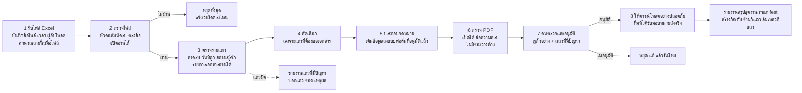
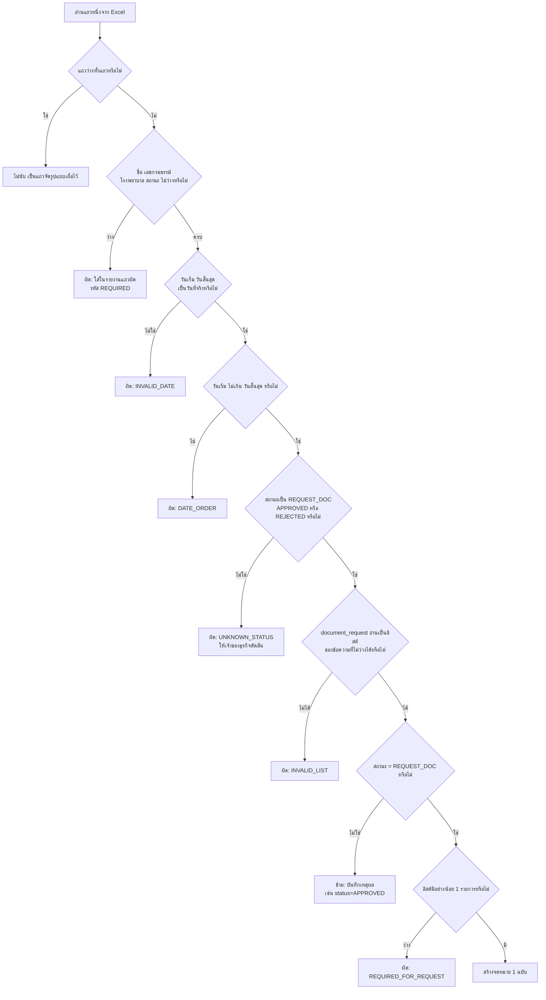
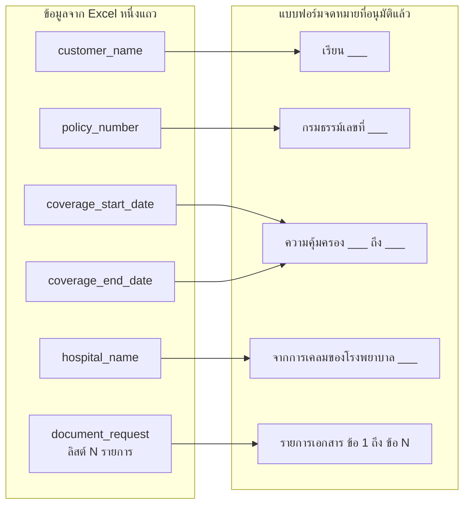
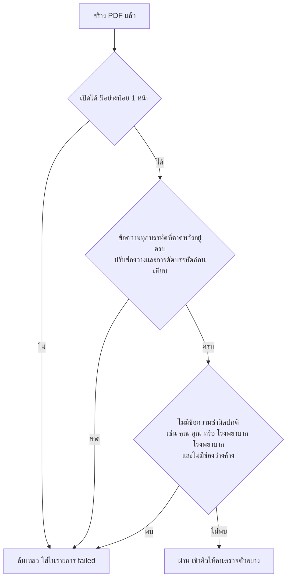
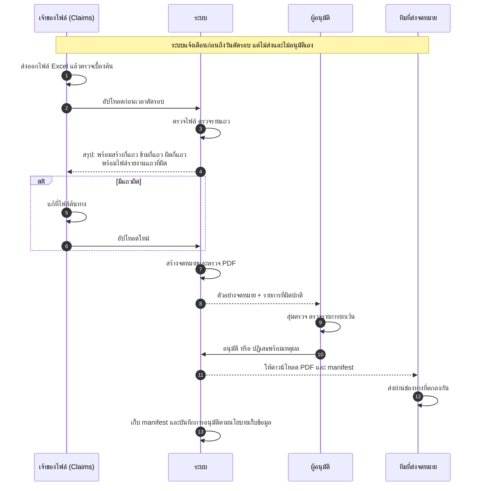
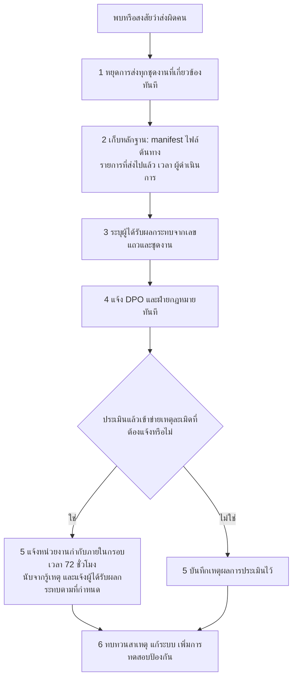
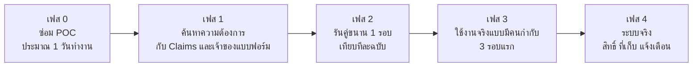

# ระบบสร้างจดหมายขอเอกสารเพิ่มเติม (Assignment 2) — วิธีคิด การออกแบบ และแผนการทำงาน

> **วันที่เอกสาร:** 2 ตุลาคม 2569 (2026-10-02)
> **ผู้อ่าน:** ทั้งทีมเทคนิคและทีมที่ไม่ใช่เทคนิค (Claims, ผู้อนุมัติ, ผู้บริหาร)
> **สถานะ:** เอกสารออกแบบ + บันทึกผลการตรวจ POC ณ วันที่เขียน
> **ที่มาของข้อเท็จจริง:** ไฟล์ `data/Example claim table.xlsx`, `data/template_test.pdf`, โค้ดใน `poc/` และผลที่รันจริงในวันที่เขียน

## วิธีอ่านเอกสารนี้

| คุณเป็น | อ่านส่วนไหน |
|---|---|
| ผู้บริหาร / ผู้ตัดสินใจ | ส่วน 1, 2, 8, 11, 12 |
| ทีม Claims / ผู้ใช้งานจริง | ส่วน 1–5, 7, 8, 12, 13 |
| ผู้อนุมัติ / ฝ่ายกฎหมาย / DPO | ส่วน 1, 8, 9, 12 |
| วิศวกร | ทุกส่วน โดยเฉพาะ 4, 5, 6, 10 |

**สัญลักษณ์ที่ใช้ตลอดเอกสาร**

- **[ข้อเท็จจริง]** ตรวจจากไฟล์หรือรันจริงแล้ว
- **[สมมติฐาน]** เป็นข้อเสนอ ต้องให้เจ้าของธุรกิจยืนยันก่อนใช้จริง
- **[POC]** สิ่งที่สร้างเป็นตัวอย่างเล็ก ๆ เพื่อพิสูจน์แนวคิด
- **[Production]** สิ่งที่ต้องทำเพิ่มก่อนใช้งานจริง ยังไม่ได้สร้าง

---

## 1. สรุปสำหรับผู้บริหาร (อ่านหน้านี้หน้าเดียวก็พอ)

**โจทย์:** ทีม Claims มีไฟล์ Excel รายการเคลม ต้องการให้ระบบออกจดหมาย PDF ภาษาไทยขอเอกสารเพิ่มเติมจากลูกค้าโดยอัตโนมัติ และต้องทำซ้ำทุก 2 สัปดาห์

**แนวคิดหลักในประโยคเดียว:** ให้ **โปรแกรมที่ทำงานแบบกำหนดผลได้** (กติกาเขียนชัดเจน ผลเหมือนเดิมทุกครั้ง) เป็นคนอ่านไฟล์และพิมพ์จดหมาย ให้ **คน** เป็นคนอนุมัติก่อนส่ง และ **ไม่ใช้ AI เขียนเนื้อหาจดหมาย** เพราะเป็นเอกสารทางการที่ต้องตรวจย้อนหลังได้

**ผลที่ทำเสร็จแล้ว [POC]:** อ่านไฟล์ตัวอย่าง 10 แถว สร้างจดหมาย 5 ฉบับ (เฉพาะแถวที่ต้องขอเอกสาร) ข้าม 5 แถว และทำรายงานสรุปการรัน

**สิ่งที่ยังไม่พร้อมใช้จริง:**

1. จดหมายที่ POC สร้างมีข้อความซ้ำ ("เรียน คุณ คุณสมชาย" และ "โรงพยาบาล โรงพยาบาล…") และยังไม่ใช่แบบฟอร์มจริงของบริษัท (ไม่มีโลโก้ ที่อยู่ ช่องทางติดต่อ)
2. กติกาธุรกิจหลายข้อยังเป็น **สมมติฐาน** รอยืนยัน เช่น "แถวที่ขอเอกสารคือสถานะ REQUEST_DOC เท่านั้นใช่หรือไม่"
3. ยังไม่มีระบบอนุมัติ การเก็บไฟล์อย่างปลอดภัย และการแจ้งเตือนเมื่อระบบไม่ทำงาน (ออกแบบไว้แล้ว แต่ยังไม่ได้สร้าง)

**ความเสี่ยงสูงสุดต่อลูกค้า:** จดหมายถูกส่งไปผิดคน เพราะเอกสารที่ขอบ่งบอกประวัติการรักษา (ข้อมูลสุขภาพ) เอกสารนี้จึงวางมาตรการป้องกันและแผนรับมือไว้ในส่วน 8

**ที่ต้องการจากผู้บริหาร:** ตัดสินใจ/มอบหมายเรื่องในส่วน 12 (กติกาธุรกิจ ผู้รับผิดชอบ แบบฟอร์มจริง)

---

## 2. โจทย์ และข้อเท็จจริงที่ตรวจแล้ว

### 2.1 สิ่งที่โจทย์ถาม

| ข้อ | คำถาม | ตอบในส่วน |
|---|---|---|
| 2.1 | ระบบทำงานอย่างไร | ส่วน 4–6 |
| 2.2 | ถ้าต้องทำซ้ำทุก 2 สัปดาห์ จะออกแบบและทำงานร่วมกับผู้ใช้อย่างไร | ส่วน 7 |
| 2.3 | ระบบพังได้ไหม เพราะอะไร ป้องกันและแก้อย่างไร | ส่วน 8 |

### 2.2 ข้อมูลนำเข้า [ข้อเท็จจริง]

- ไฟล์ Excel มี 7 คอลัมน์: `customer_name`, `policy_number`, `coverage_start_date`, `coverage_end_date`, `hospital_name`, `claim_status`, `document_request`
- มี **10 แถวที่มีข้อมูล** (แถว 2–11) แม้ชีตจะจัดรูปแบบเผื่อไว้ถึงแถว 220 แถวว่างไม่นับ
- สถานะ: `REQUEST_DOC` 5 แถว, `APPROVED` 3 แถว, `REJECTED` 2 แถว
- `document_request` เป็นข้อความรูปแบบรายการ เช่น `["สำเนาใบเสร็จค่ารักษาพยาบาล","รายงานผลการตรวจสุขภาพ"]` แถวที่ไม่ขอเอกสารเป็น `[]`
- **ไม่มีรหัสเคลม (claim ID)** ในไฟล์ ซึ่งมีผลต่อการป้องกันการส่งซ้ำ (ดูส่วน 7.4)
- ชื่อลูกค้าในไฟล์ขึ้นต้นด้วย "คุณ" อยู่แล้วทุกแถว
- เอกสารบางรายการเป็นภาษาอังกฤษ ("Medical Report" ในแถว 4 และ 10)

### 2.3 แบบฟอร์มจดหมาย [ข้อเท็จจริง]

`template_test.pdf` เป็นจดหมายภาษาไทยหน้าเดียว มีช่องว่างให้ใส่: ชื่อลูกค้า, เลขกรมธรรม์, วันเริ่มและสิ้นสุดความคุ้มครอง, ชื่อโรงพยาบาล, รายการเอกสาร (ตัวอย่างมี 2 ข้อ) นอกจากนี้มีโลโก้ ชื่อบริษัท การให้แนบเอกสารผ่านแอปพลิเคชัน ช่องทางติดต่อ และคำลงท้าย

**[สมมติฐาน]** ไฟล์นี้เป็นตัวอย่างหน้าตา ไม่ได้แปลว่าถ้อยคำผ่านการอนุมัติจากฝ่ายกฎหมายหรือฝ่ายธุรกิจแล้ว

---

## 3. วิธีคิด (หลักการออกแบบ)

### 3.1 สามคำถามที่ถามตัวเองก่อนออกแบบ

1. **ถ้าผิด ใครได้รับผลกระทบ และหนักแค่ไหน?** จดหมายนี้ไปถึงลูกค้าจริง และมีข้อมูลสุขภาพ ความผิดพลาดจึงเสียหายกว่างานรายงานภายใน
2. **อะไรที่ "รู้แน่" อะไรที่ "เดา"?** แยก [ข้อเท็จจริง] ออกจาก [สมมติฐาน] ให้ชัด จะได้ไม่เอาเรื่องที่เดาไปเป็นกติกาของระบบ
3. **ถ้าเดือนหน้ามีคนถามว่าทำไมลูกค้าคนนี้ได้จดหมายฉบับนี้ ตอบได้ไหม?** ทุกขั้นต้องมีหลักฐานย้อนดูได้

### 3.2 หลักการ 6 ข้อ

| หลักการ | ความหมายแบบไม่เทคนิค | เหตุผล |
|---|---|---|
| **ผลต้องเหมือนเดิมทุกครั้ง (deterministic)** | ไฟล์เดิม กติกาเดิม ได้จดหมายเหมือนเดิมทุกตัวอักษร | ตรวจสอบและทดสอบได้ ไม่มี "วันนี้เขียนไม่เหมือนเมื่อวาน" |
| **ไม่ใช้ AI เขียนจดหมาย** | ข้อความจดหมายมาจากแบบฟอร์มที่อนุมัติแล้ว เติมแค่ชื่อ เลขที่ วันที่ รายการเอกสาร | เอกสารทางการ AI อาจเปลี่ยนถ้อยคำหรือใส่ข้อมูลที่ไม่มีอยู่จริง ตรวจย้อนหลังยาก และข้อมูลสุขภาพไม่ควรส่งออกนอกโดยไม่จำเป็น |
| **หยุดเมื่อไม่แน่ใจ (fail closed)** | ถ้าข้อมูลแถวใดผิดปกติ ไม่เดา ไม่แก้เอง แต่แจ้งว่าผิดที่แถวไหน ช่องไหน | จดหมายที่ "ดูเหมือนถูก" แต่ผิด อันตรายกว่าจดหมายที่ไม่ถูกส่งแล้วมีคนแก้ |
| **คนอนุมัติก่อนส่ง** | ระบบสร้างไฟล์เพื่อให้ตรวจ ไม่ส่งเอง | การตัดสินใจที่กระทบลูกค้าต้องมีคนรับผิดชอบ |
| **แยก "สร้าง" ออกจาก "ส่ง"** | PDF ถูกต้อง ≠ ลูกค้าได้รับ สองขั้นนี้ล้มเหลวคนละแบบ | กันการสร้างใหม่โดยไม่ตั้งใจแล้วส่งซ้ำ |
| **ทำเล็กที่สุดที่พิสูจน์ได้ก่อน (POC)** | สร้างตัวอย่างเล็กพิสูจน์แนวคิด แล้วค่อยเพิ่มระบบใหญ่เมื่อมีหลักฐาน | ไม่ลงทุนระบบใหญ่ (คิวงาน, คลาวด์) ก่อนรู้ว่าจำเป็นจริง |

### 3.3 ทำไมไม่ใช้ AI — และ AI เหมาะตรงไหน

ข้อมูลเข้ามีโครงสร้างชัด (ตาราง) และผลลัพธ์คือเอกสารทางการ จึงเป็นงานที่ **กติกาทำได้ดีกว่า AI** AI อาจมีประโยชน์ภายหลังในงานที่ไม่กระทบลูกค้าโดยตรง เช่น **แนะนำ** ว่าหัวคอลัมน์ในไฟล์ของทีมใหม่ตรงกับช่องไหนของแบบฟอร์ม โดยคนต้องตรวจและอนุมัติก่อนบันทึกเป็นกติกาจริง (เป็นแนวคิดสำหรับข้อ 3 ไม่ใช่ส่วนของ POC นี้)

---

## 4. ภาพรวมระบบ

### 4.1 แผนภาพการไหลของงาน



### 4.2 อธิบายทีละขั้น

| ขั้น | ทำอะไร | ตัวอย่างในภาษาง่าย | ถ้าผิดปกติ |
|---|---|---|---|
| 1 รับไฟล์ | เก็บชื่อไฟล์ เวลา ผู้อัปโหลด และ "ลายนิ้วมือไฟล์" (SHA-256) | เหมือนประทับตรารับเอกสาร | – |
| 2 ตรวจไฟล์ | เปิดได้ไหม มีชีต `Sheet1` ไหม หัวคอลัมน์ตรง 7 ชื่อไหม | เช็คว่าเป็นแบบฟอร์มที่ถูกใบ | หยุดทั้งชุด บอกว่าขาด/เกินคอลัมน์ไหน |
| 3 ตรวจรายแถว | ชื่อ เลขกรมธรรม์ โรงพยาบาล สถานะ ต้องไม่ว่าง วันที่เป็นวันที่จริง วันเริ่ม ≤ วันสิ้นสุด สถานะอยู่ในรายการที่รู้จัก รายการเอกสารเป็นลิสต์ที่อ่านได้ | ครูตรวจข้อสอบทีละข้อ | แถวนั้นถูกกัน ใส่ในรายงานแถวผิด ไม่เดาแก้ให้ |
| 4 คัดเลือก | เอาเฉพาะ `REQUEST_DOC` ที่มีเอกสารอย่างน้อย 1 รายการ | คัดเฉพาะเคสที่ต้องส่งจดหมาย | แถวอื่นถูกบันทึกว่า "ข้าม" พร้อมเหตุผล |
| 5 ประกอบจดหมาย | เติมข้อมูลลงแบบฟอร์ม รายการเอกสารเรียงเลขตามจำนวนจริง | พิมพ์เมลล์เมิร์จ | – |
| 6 ตรวจ PDF | ไฟล์มีหน้า ข้อความสำคัญอยู่ครบ ไม่มีช่องว่างค้าง | อ่านทวนก่อนปิดซอง | ถูกกันไว้ ไม่ปล่อย |
| 7 อนุมัติ | คนดูตัวอย่างและรายการยกเว้น แล้วกดอนุมัติ | หัวหน้าเซ็นก่อนส่ง | ไม่อนุมัติ = หยุด |
| 8 ส่งมอบ | ให้ทีมที่ได้รับมอบหมายดาวน์โหลด การส่งถึงลูกค้าเป็นกระบวนการแยก | ส่งไปรษณีย์เป็นอีกงาน | – |

> **สถานะ [POC]:** ขั้น 1–6 ทำแล้วในโค้ด (ขั้น 1 ทำบางส่วน: มีชื่อไฟล์และลายนิ้วมือ ไม่มีผู้อัปโหลด) ขั้น 7–8 **ยังไม่ได้สร้าง** เป็นการออกแบบ [Production]

### 4.3 โครงสร้างโค้ด (สำหรับทีมเทคนิค) [POC]

| ไฟล์ | หน้าที่ |
|---|---|
| `poc/validation.py` | อ่าน Excel ตรวจไฟล์และรายแถว ใช้ `json.loads` อ่านรายการเอกสาร (ไม่ใช้ `eval`) แยกแถวที่ใช้สร้าง / ข้าม / ผิด |
| `poc/models.py` | โครงสร้างข้อมูล `LetterData` และ `RowIssue` (ข้อมูลที่ตรวจแล้ว ไม่แก้ไขได้) |
| `poc/renderer.py` | ประกอบข้อความและสร้าง PDF ด้วย ReportLab ฟอนต์ Tahoma (ฝังในไฟล์) เขียนเป็นไฟล์ชั่วคราวก่อนแล้วเปลี่ยนชื่อ (กันไฟล์ค้างครึ่งทาง) |
| `poc/generate_letters.py` | ตัวควบคุมหลัก: ตรวจ → สร้างทีละแถว (ถ้าแถวหนึ่งพังไม่ล้มทั้งชุด) → ตรวจ PDF → เขียน `rejected.csv` และ `manifest.json` |
| `poc/tests/` | ทดสอบอัตโนมัติ 6 รายการ (ผ่านทั้งหมดเมื่อรันในวันที่เขียน) |

ชื่อโฟลเดอร์ผลลัพธ์ = `batch_` + 12 ตัวแรกของลายนิ้วมือไฟล์ ชื่อ PDF = `row_<เลขแถว>_<แฮชเลขกรมธรรม์>.pdf` เพื่อไม่ให้ชื่อลูกค้าหรือเลขกรมธรรม์ปรากฏในชื่อไฟล์

---

## 5. ตรรกะการตัดสินใจรายแถว

### 5.1 แผนภาพ



> แถวที่ "ผิด" จะไม่ถูกสร้างจดหมายและไม่ถูกส่งต่อ ส่วนแถวที่ "ข้าม" ไม่ใช่ความผิด แค่ไม่เข้าเงื่อนไขต้องส่งจดหมาย ทั้งสองกลุ่มต้องไปอยู่ในรายงานเพื่อให้ยอดรวมกลับมาตรงกัน

### 5.2 ผลกับไฟล์ตัวอย่างทั้ง 10 แถว [ข้อเท็จจริง — ผลรันจริง]

| แถว | ลูกค้า | สถานะ | รายการเอกสาร | ผล |
|---|---|---|---|---|
| 2 | คุณสมชาย ใจดี | REQUEST_DOC | 2 | สร้างจดหมาย |
| 3 | คุณสมหญิง รักดี | APPROVED | – | ข้าม |
| 4 | คุณวิชัย พัฒนาดี | REQUEST_DOC | 2 (มี "Medical Report") | สร้างจดหมาย |
| 5 | คุณนภัสสร แสงทอง | REJECTED | – | ข้าม |
| 6 | คุณกิตติศักดิ์ มีสุข | REQUEST_DOC | 3 | สร้างจดหมาย |
| 7 | คุณพิมพ์ชนก สุขใจ | APPROVED | – | ข้าม |
| 8 | คุณธนกร รุ่งเรือง | REQUEST_DOC | 1 | สร้างจดหมาย |
| 9 | คุณอรทัย วัฒนดี | REJECTED | – | ข้าม |
| 10 | คุณภาคภูมิ ตั้งใจ | REQUEST_DOC | 2 (มี "Medical Report") | สร้างจดหมาย |
| 11 | คุณชลธิชา บุญมี | APPROVED | – | ข้าม |

**การกระทบยอด (reconciliation):** แถวมีข้อมูล 10 = สร้าง 5 + ข้าม 5 + ผิด 0 และสร้างสำเร็จ 5 ล้มเหลว 0 สูตรนี้ใช้เป็นตัวตรวจว่าไม่มีแถวหาย

### 5.3 ตรรกะที่คุยกับธุรกิจต่อ [สมมติฐาน]

- "ต้องส่งจดหมายเฉพาะ REQUEST_DOC" เป็นข้อสันนิษฐานจากข้อมูลตัวอย่าง ต้องให้ Claims ยืนยัน
- แถว `APPROVED` ที่ยังมีรายการเอกสารค้างอยู่ ปัจจุบัน POC **ข้ามเงียบ ๆ** ควรเปลี่ยนเป็นแจ้งเตือนเพราะข้อมูลต้นทางขัดแย้งกัน
- "แถวเดียว = คำขอ 1 รายการ" และกรมธรรม์เดียวมีหลายคำขอได้ ต้องกำหนดคีย์ที่ไม่ซ้ำ (ส่วน 7.4)

---

## 6. จดหมายถูกประกอบอย่างไร

### 6.1 การเชื่อมข้อมูลกับแบบฟอร์ม



รายการเอกสารเป็นลูปตามจำนวนจริง (ในไฟล์ตัวอย่างมี 1, 2 และ 3 รายการ) แบบฟอร์มตัวอย่างมีแค่ข้อ 1–2 จึงต้องออกแบบให้ขยายได้

### 6.2 กฎการประกอบข้อความที่ต้องมี

ข้อนี้คือจุดที่การตรวจพบว่า POC ปัจจุบัน **ยังไม่ผ่าน**

| ประเด็น | กฎที่ควรเป็น | POC ปัจจุบัน |
|---|---|---|
| **คำนำหน้า "คุณ"** | ข้อมูลมี "คุณ" นำหน้าอยู่แล้ว ต้องมี "คุณ" แค่ตัวเดียว | ❌ ได้ "เรียน คุณ คุณสมชาย ใจดี" (`renderer.py:40`) |
| **คำว่า "โรงพยาบาล"** | ข้อมูลมีคำนี้อยู่แล้ว ห้ามเติมซ้ำ | ❌ ได้ "โรงพยาบาล โรงพยาบาลกรุงเทพ" (`renderer.py:47`) |
| **รูปแบบวันที่** | ตามที่เจ้าของแบบฟอร์มกำหนด (จดหมายไทยทั่วไปใช้ พ.ศ.) ทำเป็นพารามิเตอร์ | ❌ พิมพ์ `dd/mm/ค.ศ.` ไม่ได้ถาม |
| **ชื่อเอกสารภาษาอังกฤษ** | ตกลงตารางแปลงชื่อกับ Claims ("Medical Report" → ชื่อไทยที่ตกลงกัน) ชื่อที่ไม่รู้จัก = แจ้งเตือนแทนการเดา | ❌ พิมพ์ "Medical Report" ตรง ๆ |
| **หน้าตาจดหมาย** | ตรงกับแบบฟอร์มจริง (โลโก้ ชื่อบริษัท ช่องทางส่งเอกสาร ช่องทางติดต่อ คำลงท้าย) | ❌ เป็นข้อความตัวอย่างย่อ มีแบนเนอร์ "ห้ามส่งลูกค้า" |
| **ไม่มีช่องว่างค้าง** | ตรวจข้อความทั้งฉบับ | ⚠️ ตรวจแค่สตริง `< >` |
| **ฟอนต์ไทย** | ฝังฟอนต์ในไฟล์ สระ วรรณยุกต์อยู่ที่ถูก | ✅ ฝังฟอนต์ Tahoma ภาพที่ตรวจ (แถว 4) สระ วรรณยุกต์ถูกตำแหน่ง ⚠️ path ฟอนต์ผูกกับ macOS และยังไม่ตรวจสิทธิ์การใช้ฟอนต์ |

### 6.3 ตัวอย่างโค้ดแนวทางแก้ (ยังไม่ได้รัน/ทดสอบ)

```python
def salutation(name: str) -> str:
    n = name.strip()
    return n if n.startswith("คุณ") else f"คุณ{n}"

def hospital(name: str) -> str:
    n = name.strip()
    return n if n.startswith("โรงพยาบาล") else f"โรงพยาบาล{n}"
```

(ต้องถามเจ้าของแบบฟอร์มว่าต้องรองรับ "รพ." หรือ "ศูนย์การแพทย์" ด้วยหรือไม่ และการตรวจ PDF ควรเทียบ **ทุกบรรทัดที่คาดหวัง** ไม่ใช่แค่ว่าค่ามีอยู่ในหน้า)

### 6.4 การตรวจ PDF ที่ควรเป็น



หมายเหตุ: การตรวจแบบ "ค่ามีอยู่ในข้อความไหม" ที่ใช้อยู่ปัจจุบัน ไม่เจอข้อความซ้ำ และยังตัดสินผิดเมื่อรายการเอกสารยาวจนตัดบรรทัด (ผมทดลองแล้ว ระบบรายงานเป็น `failed` ทั้งที่ PDF ถูกต้อง)

---

## 7. การทำงานร่วมกับผู้ใช้ทุก 2 สัปดาห์ (คำตอบข้อ 2.2)

หลักคิด: **การตั้งเวลาให้รันเองอย่างเดียวไม่ใช่คำตอบ** เพราะข้อมูลทุกรอบไม่เหมือนกัน และคนต้องตรวจก่อนส่ง งานต้องออกแบบร่วมกับคนที่ใช้จริง

### 7.1 ก่อนเริ่ม (ครั้งเดียว)

1. **คุยกับ Claims และเจ้าของแบบฟอร์ม** วาดขั้นตอนปัจจุบัน ใครทำอะไร ส่งต่อให้ใคร ใช้เวลาเท่าไร
2. **ขอสิ่งที่ยังไม่มี:** ถ้อยคำจดหมายที่อนุมัติแล้ว รูปแบบวันที่ ชื่อเอกสารมาตรฐาน ช่องทางส่ง เวลาตัดรอบไฟล์ ผู้รับผิดชอบเมื่อมีข้อผิดพลาด
3. **รันคู่ขนาน (parallel run) 1 รอบ:** ให้ทีมทำตามวิธีเดิม และให้ระบบทำพร้อมกัน แล้วเทียบจดหมายทีละฉบับก่อนยอมเปลี่ยนมาใช้ระบบ
4. **วัดก่อนอวดผล:** จดเวลาที่ใช้และจำนวนข้อผิดพลาดของวิธีเดิมไว้ เพื่อบอกได้จริงว่าระบบช่วยประหยัดเท่าไร อย่าอ้างตัวเลขที่ยังไม่ได้วัด

### 7.2 วงจรงานทุก 2 สัปดาห์



### 7.3 ใครรับผิดชอบอะไร (RACI) [สมมติฐาน — ให้องค์กรยืนยันชื่อจริง]

| งาน | Claims operator | เจ้าของแบบฟอร์ม | ผู้อนุมัติชุดงาน | ทีมส่ง | วิศวกร | ผู้สำรอง |
|---|---|---|---|---|---|---|
| ส่งออกและตรวจไฟล์ Excel | **R** | – | – | – | – | ต้องระบุ |
| แก้ข้อมูลที่ระบบแจ้งผิด | **R** | – | I | – | C | ต้องระบุ |
| อนุมัติถ้อยคำแบบฟอร์ม | C | **A/R** | – | – | C | ต้องระบุ |
| อนุมัติปล่อยชุดงาน | I | – | **A/R** | I | – | ต้องระบุ |
| ส่งถึงลูกค้า | – | – | I | **R** | – | ต้องระบุ |
| แก้ระบบเมื่อพัง | I | – | I | I | **A/R** | ต้องระบุ |

R = ทำ, A = รับผิดชอบสุดท้าย, C = ถูกปรึกษา, I = รับแจ้ง **ทุกบทบาทต้องมีผู้สำรอง** ไม่งั้นงานหยุดเมื่อคนลา

### 7.4 กันการส่งซ้ำ

- ไฟล์ตัวอย่าง **ไม่มีรหัสเคลม** ใช้ `policy_number` เป็นคีย์ไม่ได้ เพราะกรมธรรม์เดียวอาจมีหลายคำขอ
- **ข้อเสนอ:** ขอให้ระบบต้นทางส่งรหัสคำขอ/รหัสเคลมที่ไม่ซ้ำมาด้วย แล้วใช้เป็นคีย์ป้องกันซ้ำ
- **ระหว่างรอ:** ระบบทำได้แค่ **แจ้งเตือน** เมื่อเจอแถวเหมือนกันทุกช่อง หรือไฟล์ที่ลายนิ้วมือเหมือนเดิม ให้คนตัดสิน ไม่สามารถรับประกันว่าไม่มีคำขอซ้ำเชิงธุรกิจ
- **สถานะปัจจุบัน [POC]:** รันไฟล์เดิมซ้ำจะได้โฟลเดอร์และชื่อไฟล์เดิมและ **เขียนทับ** ไม่ได้บันทึกรอบก่อนหน้า แถวเหมือนกันสองแถวสร้างจดหมายสองฉบับโดยไม่แจ้งเตือน (ทดลองแล้ว) จึงยังไม่ตรงกับที่ออกแบบไว้
- กฎรอบรัน **ซ้ำ:** ต้องแสดงรอบก่อนหน้า แล้วให้คนเลือก "ใช้ของเดิม / แทนที่ / ออกเวอร์ชันใหม่" พร้อมเหตุผล ห้ามสร้างงานส่งซ้ำแบบเงียบ ๆ

### 7.5 การเปลี่ยนแปลงแบบฟอร์ม และการติดตามระบบ

- **แบบฟอร์มมีเวอร์ชัน:** ทุกชุดงานบันทึกว่าใช้เวอร์ชันไหน (POC ใช้ `poc-th-v1`) แก้ถ้อยคำ = ออกเวอร์ชันใหม่ ทดสอบกับข้อมูลตัวอย่าง (UAT) ให้เจ้าของแบบฟอร์มเซ็นก่อนใช้
- **ทบทวนร่วมกัน:** 3 รอบแรกประชุมสั้น ๆ หลังจบรอบ ต่อจากนั้นใช้บันทึกปัญหา (issue log) และทบทวนเป็นระยะ
- **เฝ้าระวัง [ออกแบบ ยังไม่ได้สร้าง]:** แจ้งเตือนเมื่อถึงเวลาตัดรอบแล้วยังไม่มีไฟล์ / ชุดงานไม่เริ่ม / ชุดงานค้าง / มีแถวล้มเหลว

### 7.6 สิ่งที่ผู้ใช้ต้องเตรียม

- ไฟล์ `.xlsx` หัวคอลัมน์ 7 ชื่อเดิม ไม่เปลี่ยนชื่อ ไม่รวมเซลล์
- **[ควรทำ] แจก Excel แม่แบบ** ที่มีรายการให้เลือกสำหรับ `claim_status` เพื่อลดการพิมพ์ผิด
- ถ้าเห็นอะไรผิดปกติ ห้ามส่ง ให้หยุดและแจ้งเลขชุดงานกับเลขแถวให้เจ้าของระบบ ไม่ส่งข้อมูลลูกค้าทางอีเมลที่ไม่ได้รับอนุมัติ

---

## 8. ระบบพังได้อย่างไร (คำตอบข้อ 2.3)

**คำตอบสั้น:** พังได้ และอันตรายที่สุดคือ **"ไม่พัง แต่ผิดเงียบ ๆ"** (จดหมายถูกสร้างและดูปกติ แต่เนื้อหาหรือผู้รับผิด) ระบบที่พังดัง ๆ คนเห็นและแก้ได้ ระบบที่ผิดเงียบ ๆ ลูกค้าเป็นคนเจอ

### 8.1 จัดลำดับตามความเสียหายต่อลูกค้า

| ลำดับ | ความเสี่ยง | ความเสียหาย | ป้องกัน | ตรวจพบ | แก้ไข / รับมือ |
|---|---|---|---|---|---|
| **1 (สูงสุด)** | **จดหมายส่งผิดคน** ข้อมูลสุขภาพรั่ว | ข้อมูลอ่อนไหวถึงผู้ไม่เกี่ยวข้อง ผลทางกฎหมายและความเชื่อมั่น | สร้างทีละแถวแยกจากกัน ผูกไฟล์กับแถวต้นทาง กระทบยอดจำนวน ผู้อนุมัติสุ่มเทียบชื่อกับเลขกรมธรรม์ แยกขั้นสร้างออกจากขั้นส่ง สิทธิ์เข้าถึงจำกัด | ผลต่างจากการกระทบยอด ลูกค้าแจ้ง | **หยุดส่งทันที** รวบรวมรายชื่อผู้ได้รับผลกระทบจาก manifest แจ้ง DPO/ฝ่ายกฎหมาย ประเมินการแจ้งหน่วยงานและลูกค้า (ดูส่วน 9) |
| 2 | ข้อมูลหรือกติกาธุรกิจผิด เช่น ขอเอกสารผิดชนิด / ตกหล่น / ส่งให้ลูกค้าที่ไม่ควรได้รับ | ลูกค้าเสียเวลา เคลมล่าช้า ร้องเรียน | ให้ผู้เชี่ยวชาญ Claims อนุมัติกติกาและแบบฟอร์ม ตารางแปลงชื่อเอกสาร ผู้อนุมัติสุ่มตรวจ | ผลต่างตอนรันคู่ขนาน ข้อร้องเรียน | หยุดปล่อย แก้กติกา ออกเวอร์ชันใหม่ ประเมินจดหมายที่ส่งไปแล้ว |
| 3 | **ส่งซ้ำ** (อัปโหลดซ้ำ / รันซ้ำ) | ลูกค้าสับสน ภาพลักษณ์เสีย | คีย์คำขอที่ไม่ซ้ำ ลายนิ้วมือไฟล์ สถานะการส่ง ต้องมีเหตุผลเมื่อสั่งซ้ำ | ระบบแสดงรอบก่อนหน้า | แจ้งลูกค้าที่ได้รับซ้ำ |
| 4 | **วันที่ผิด** (รูปแบบ / พ.ศ.-ค.ศ. / วันที่ผิดในไฟล์ / ก่อนเริ่มคุ้มครอง) | ลูกค้าเข้าใจช่วงความคุ้มครองผิด | ตรวจ วันเริ่ม ≤ วันสิ้นสุด กำหนดรูปแบบวันที่ในแบบฟอร์ม กฎ SME เรื่องวันที่ | การตรวจรายแถว ผู้อนุมัติ | แก้ข้อมูล รันใหม่ |
| 5 | ข้อความผิดรูป: ช่องว่างค้าง ข้อความซ้ำ ฟอนต์ไทยหาย ไฟล์เสีย | จดหมายอ่านไม่ได้ ดูไม่เป็นทางการ | ตรวจ PDF เทียบทุกบรรทัด ฝังฟอนต์ ตรวจด้วยสายตาก่อนปล่อย | ตรวจ PDF อัตโนมัติ ผู้อนุมัติ | บล็อกการปล่อย แก้แบบฟอร์ม/ฟอนต์ รันเฉพาะแถวที่พัง |
| 6 | ไฟล์ Excel ผิดรูป / หัวคอลัมน์เปลี่ยน (schema drift) | งานหยุด / ถ้าไม่ตรวจอาจอ่านผิดช่อง | ตรวจโครงสร้างก่อนทำอะไร แจก Excel แม่แบบ | ตรวจไฟล์ | ปฏิเสธทั้งชุด บอกคอลัมน์ที่ขาดหรือเกิน |
| 7 | ระบบล้มกลางชุด / พื้นที่เต็ม | งานค้าง | เขียนไฟล์แบบอะตอมมิก (เขียนชั่วคราวแล้วเปลี่ยนชื่อ) จัดการข้อผิดพลาดต่อแถว manifest | ตัวตรวจสุขภาพระบบ แจ้งเตือน | ทำต่อจากจุดที่ค้างโดยไม่ส่งซ้ำ |
| 8 | **ตัวตั้งเวลา/การรันไม่ทำงาน** หรือไม่มีใครอัปโหลดไฟล์ | จดหมายถึงลูกค้าช้ากว่ากำหนดโดยไม่มีใครรู้ | แจ้งเตือนก่อนตัดรอบ | แจ้งเตือนเมื่อเลยเวลาแล้วไม่มีไฟล์/ไม่มีชุดงาน | ผู้สำรองรันด้วยมือ |
| 9 | เข้าถึงโดยไม่ได้รับอนุญาต / ข้อมูลส่วนบุคคลรั่ว | ผลทางกฎหมายและความเชื่อมั่น | จำกัดสิทธิ์ตามบทบาท เข้ารหัส เก็บแบบส่วนตัว ล็อกเท่าที่จำเป็น | บันทึกการเข้าถึง | เพิกถอนสิทธิ์ สืบสวน ทำตามแผนเหตุการณ์ |

### 8.2 สถานะ ณ วันนี้ [POC]

- ✅ ทำแล้วในโค้ด: ตรวจโครงสร้างไฟล์ ตรวจรายแถว จัดการข้อผิดพลาดต่อแถว manifest ที่กระทบยอดได้ เขียนไฟล์แบบอะตอมมิก
- ⚠️ ทำบางส่วน: ตรวจ PDF (อ่อน) ไม่มีการตรวจจับข้อความซ้ำ
- ❌ ยังไม่ได้ทำ: ตรวจแถวซ้ำ, ตรวจสถานะกับรายการเอกสารขัดแย้ง, การอนุมัติ, สิทธิ์เข้าถึง, การแจ้งเตือน, การเฝ้าระวังตัวตั้งเวลา

### 8.3 แผนรับมือเมื่อจดหมายส่งผิดคน (ร่าง ต้องให้ DPO/ฝ่ายกฎหมายรับรอง)



> **ข้อควรระวัง:** ผมกล่าวถึงกรอบเวลา 72 ชั่วโมงและมาตราที่เกี่ยวข้องตามความเข้าใจทั่วไป **ยังไม่ได้ตรวจกับตัวบทกฎหมายหรือแนวปฏิบัติทางการ** ก่อนนำไปใช้ต้องให้ฝ่ายกฎหมาย/DPO ตรวจเลขมาตราและขั้นตอนจริง

---

## 9. ข้อมูลส่วนบุคคลและความปลอดภัย (PDPA)

**ข้อเท็จจริงที่ต้องตระหนัก:** รายการเอกสารที่ขอ (เช่น "ผลตรวจทางห้องปฏิบัติการ", "ประวัติการรักษา") รวมกับชื่อโรงพยาบาลและตัวตนลูกค้า เท่ากับ **ข้อมูลสุขภาพ** ซึ่งปกติถือเป็นข้อมูลอ่อนไหว (โดยทั่วไปอ้างถึงมาตรา 26 ของ พ.ร.บ.คุ้มครองข้อมูลส่วนบุคคล — ให้ฝ่ายกฎหมายยืนยันก่อนอ้างอิง) จึงต้องระวังกว่าข้อมูลทั่วไป

| ประเด็น | แนวทาง | สถานะ |
|---|---|---|
| ส่งข้อมูลออกไปบริการภายนอก | **ไม่ส่ง** ระบบไม่เรียก AI หรือ API ภายนอก ทำงานภายในเครื่อง/เครือข่ายองค์กร | ✅ POC ไม่มีการเรียกภายนอก |
| ชื่อไฟล์และ log | ไม่ใส่ชื่อลูกค้าหรือเลขกรมธรรม์จริง (ใช้เลขแถว + แฮช) manifest ไม่เก็บชื่อ | ✅ POC |
| ที่เก็บไฟล์ | พื้นที่ส่วนตัว จำกัดสิทธิ์ตามบทบาท เข้ารหัส | [Production] |
| ระยะเวลาเก็บ (retention) | ตกลงกับเจ้าของข้อมูลและฝ่ายกฎหมาย แล้วลบอัตโนมัติ | [Production] ยังไม่กำหนดตัวเลข |
| สิทธิ์ดูตัวอย่างและดาวน์โหลด | เฉพาะผู้อนุมัติและทีมส่งที่ได้รับมอบหมาย | [Production] |
| บันทึกการตรวจสอบ (audit) | ใครอัปโหลด ใครอนุมัติ เมื่อไร ใช้แบบฟอร์มเวอร์ชันไหน | [Production] |
| ข้อมูลทดสอบ | ใช้ข้อมูลสมมติเท่านั้น ไม่ใช้ข้อมูลลูกค้าจริงในการพัฒนา | ข้อกำหนด |

ห้ามกล่าวว่าระบบ "ผ่าน PDPA" จากการออกแบบนี้เพียงอย่างเดียว ต้องผ่านการประเมินจากผู้รับผิดชอบด้านกฎหมายและความปลอดภัยก่อน

---

## 10. สิ่งที่ POC ทำแล้ว ผลที่ได้ และข้อค้นพบจากการตรวจ

### 10.1 ผลการรัน [ข้อเท็จจริง — รันเมื่อ 2 ต.ค. 2569]

- กับไฟล์ตัวอย่าง: แถวที่มีข้อมูล 10 → สร้าง 5, ข้าม 5, ผิด 0, สร้างสำเร็จ 5, ล้มเหลว 0
- ทดสอบอัตโนมัติ 6 รายการผ่านทั้งหมด (ต้องติดตั้งแพ็กเกจ `pymupdf`, `reportlab`, `openpyxl`, `pytest` เอง เพราะโปรเจกต์ยังไม่มี `requirements.txt`)
- ข้อมูลทุกช่องในจดหมายทั้ง 5 ฉบับตรงกับ Excel ต้นทาง (ชื่อ เลขกรมธรรม์ ช่วงวันที่ โรงพยาบาล รายการเอกสาร)

**ตัวเลขเหล่านี้คือผลการรันตัวอย่างในเครื่อง ไม่ใช่ประสิทธิภาพในการใช้งานจริง และไม่ได้ยืนยันว่ากติกาธุรกิจถูกต้อง**

### 10.2 ข้อค้นพบที่ต้องแก้ (เรียงตามความรุนแรง)

| # | ปัญหา | ระดับ | ผลต่อลูกค้า/บริษัท |
|---|---|---|---|
| 1 | "คุณ" ซ้ำ และ "โรงพยาบาล" ซ้ำ ในจดหมายทั้ง 5 ฉบับ | วิกฤต | จดหมายทางการดูไม่เป็นมืออาชีพ ส่งไม่ได้ |
| 2 | การตรวจ PDF ไม่เจอข้อ 1 และอาจตัดสินผิดกับข้อความยาว | สูง | ความมั่นใจว่า "ตรวจแล้ว" เป็นความมั่นใจปลอม |
| 3 | จดหมาย POC ไม่ใช่แบบฟอร์มจริง | สูง | ยังไม่ได้พิสูจน์ว่าทำตามแบบฟอร์มได้ |
| 4 | รูปแบบวันที่ (ค.ศ.) ไม่ได้ถามเจ้าของแบบฟอร์ม | สูง | ลูกค้าอ่านช่วงความคุ้มครองสับสน |
| 5 | ชื่อเอกสารภาษาอังกฤษไม่มีการจัดการ | สูง | ลูกค้าไม่เข้าใจว่าต้องส่งอะไร เคลมช้า |
| 6 | สถานะไม่ใช่ REQUEST_DOC แต่มีรายการเอกสาร ถูกข้ามเงียบ | สูง | ข้อมูลขัดแย้งไม่มีใครรู้ |
| 7 | แถวซ้ำสร้างจดหมายซ้ำ และการรันซ้ำเขียนทับ | สูง | เสี่ยงส่งซ้ำ / ตรวจสอบย้อนหลังไม่ได้ |
| 8 | ไม่มี `requirements.txt` ฟอนต์ผูกกับ macOS | กลาง | คนอื่นรันไม่ได้ สิทธิ์ฟอนต์ยังไม่ชัด |
| 9 | ไม่รองรับวันที่แบบตัวเลข serial ในเซลล์ที่ไม่ใช่รูปแบบวันที่ (ถูกปฏิเสธ ไม่ได้แปลง) | กลาง | แถวถูกกัน ต้องแก้มือ |
| 10 | เอกสารคำตอบ (PDF) เป็นเวอร์ชันเก่ากว่า `ANSWER.md` | กลาง | เอกสารที่ส่งไม่ตรงกับงานล่าสุด |

---

## 11. แผนการทำงาน

### 11.1 เฟสและเกณฑ์ผ่าน



| เฟส | งานหลัก | ผู้ร่วมงาน | ผลลัพธ์ | เกณฑ์ผ่าน |
|---|---|---|---|---|
| **0 ซ่อม POC** (ประมาณ 1 วัน ค่าประมาณ ไม่ใช่การรับประกัน) | แก้ "คุณ"/"โรงพยาบาล" ซ้ำ, ปรับการตรวจ PDF เป็นเทียบทุกบรรทัด, เพิ่มตรวจแถวซ้ำและสถานะขัดแย้ง, ตารางแปลงชื่อเอกสาร, `requirements.txt` และตั้งค่าฟอนต์, เขียนทดสอบ | วิศวกร | POC ที่ผ่านทดสอบ + จดหมายที่ถูกต้องตามข้อความ | จดหมาย 5 ฉบับไม่มีข้อความซ้ำ ทดสอบใหม่ผ่านทั้งหมด |
| **1 ค้นหาความต้องการ** | ขอแบบฟอร์มจริง ถ้อยคำที่อนุมัติ ตกลงรูปแบบวันที่ ตารางชื่อเอกสาร กติกาสถานะ ผู้รับผิดชอบและผู้สำรอง ช่องทางส่ง เวลาตัดรอบ นโยบายเก็บข้อมูล | Claims, เจ้าของแบบฟอร์ม, ฝ่ายกฎหมาย/DPO | เอกสารข้อตกลง (data contract) ที่ลงนามแล้ว | ทุกข้อใน "คำถามที่ต้องตัดสินใจ" (ส่วน 12) มีเจ้าของและคำตอบ |
| **2 รันคู่ขนาน** | ทำวิธีเดิมและวิธีระบบพร้อมกัน เทียบทุกฉบับ จดเวลาและข้อผิดพลาด | Claims, ผู้อนุมัติ | ตารางเทียบผล | ไม่มีความผิดเพี้ยนที่ไม่ได้อธิบาย ผู้อนุมัติยืนยัน |
| **3 ใช้งานจริงแบบกำกับ** | ใช้ระบบจริง 3 รอบ ทบทวนหลังจบรอบ | ทุกฝ่าย | บันทึกปัญหา การปรับปรุง | 3 รอบติดกันไม่มีเหตุผิดพลาดที่ถึงลูกค้า |
| **4 ระบบจริง** | อัปโหลดมีการยืนยันตัวตน ที่เก็บส่วนตัว สิทธิ์ตามบทบาท บันทึกการตรวจสอบ การแจ้งเตือน คิวงานเมื่อปริมาณจำเป็น | วิศวกร, ความปลอดภัย, DPO | ระบบพร้อม production | ผ่านการประเมินความปลอดภัยและ PDPA โดยผู้รับผิดชอบ |

### 11.2 งานของเฟส 0 แบบรายการตรวจ (สำหรับวิศวกร)

- [ ] แยกฟังก์ชันประกอบ "คุณ" และ "โรงพยาบาล" ไม่ให้ซ้ำ + ทดสอบหน่วยกับชื่อมีและไม่มีคำนำหน้า
- [ ] เปลี่ยน `verify_pdf` ให้เทียบทุกบรรทัดที่คาดหวัง (ปรับช่องว่าง/ตัดบรรทัด) และตรวจข้อความซ้ำ
- [ ] เพิ่ม warning เมื่อสถานะ ≠ REQUEST_DOC แต่มีรายการเอกสาร
- [ ] เพิ่มตรวจแถวซ้ำ (ทุกช่องเหมือนกัน) แล้วแจ้งเตือนแทนการสร้างซ้ำ
- [ ] บันทึกรอบก่อนหน้าใน manifest เมื่อรันไฟล์เดิม แทนการเขียนทับเงียบ ๆ
- [ ] ตารางแปลงชื่อเอกสาร (ไฟล์ตั้งค่า) + แจ้งเตือนชื่อที่ไม่รู้จัก
- [ ] ฟังก์ชันวันที่ที่ตั้งค่ารูปแบบได้ (ค.ศ./พ.ศ.) รอการยืนยันจากเจ้าของแบบฟอร์ม
- [ ] `requirements.txt`, path ฟอนต์ตั้งค่าได้, ตรวจสิทธิ์การใช้ฟอนต์
- [ ] เก็บภาพตัวอย่าง PDF ที่ตรวจด้วยสายตาไว้เป็นหลักฐาน
- [ ] สร้างไฟล์ PDF คำตอบรวมใหม่ให้ตรงกับเอกสารล่าสุด

---

## 12. คำถามที่ต้องตัดสินใจกับฝ่ายธุรกิจ

| # | คำถาม | ใครตอบ | ทำไมสำคัญ |
|---|---|---|---|
| 1 | แถวที่ต้องส่งจดหมายคือ `REQUEST_DOC` เท่านั้นใช่ไหม | Claims | นิยามว่าใครได้จดหมาย |
| 2 | ถ้อยคำ ชื่อนิติบุคคล ผู้ลงนาม ช่องทางติดต่อ แบบสุดท้ายคืออะไร | เจ้าของแบบฟอร์ม/ฝ่ายกฎหมาย | จดหมายทางการ |
| 3 | วันที่ใช้ พ.ศ. หรือ ค.ศ. รูปแบบใด | เจ้าของแบบฟอร์ม | ลูกค้าอ่านถูกต้อง |
| 4 | ชื่อเอกสารมาตรฐานและวิธีจัดการชื่อภาษาอังกฤษ | Claims | ลูกค้าเข้าใจตรงกัน |
| 5 | ระบบต้นทางส่งรหัสคำขอ/เคลมที่ไม่ซ้ำให้ได้ไหม | เจ้าของระบบต้นทาง | กันส่งซ้ำอย่างแท้จริง |
| 6 | ถ้ามีแถวผิดบางแถว จะปล่อยส่วนที่ถูกก่อน หรือหยุดทั้งชุด | Claims + ผู้อนุมัติ | นโยบายชุดงานบางส่วน |
| 7 | ใครอนุมัติ ใครส่ง ผู้สำรองคือใคร เมื่อไรคือเวลาตัดรอบ | ผู้บริหารทีม | งานไม่หยุดเมื่อมีคนลา |
| 8 | ส่งถึงลูกค้าช่องทางไหน และเวลาเก็บข้อมูลกี่ปี | ธุรกิจ + DPO | ความปลอดภัยและกฎหมาย |
| 9 | เป้าหมายเวลา/ปริมาณ และจะวัดความสำเร็จอย่างไร | ผู้บริหาร | วัดผลก่อนอ้างผลลัพธ์ |

---

## 13. คำศัพท์ (สำหรับผู้ไม่ใช่สายเทคนิค)

| คำ | ความหมายง่าย ๆ |
|---|---|
| **POC** | ตัวอย่างเล็ก ๆ ที่สร้างเพื่อพิสูจน์ว่าแนวคิดใช้ได้ ยังไม่ใช่ระบบจริง |
| **Production** | ระบบที่ใช้งานจริงกับลูกค้าจริง ต้องปลอดภัยและเสถียรกว่า POC |
| **Deterministic** | ข้อมูลเดิม กติกาเดิม ได้ผลเหมือนเดิมทุกครั้ง |
| **Fail closed** | เมื่อไม่แน่ใจ ให้หยุดและแจ้ง ไม่เดาแล้วทำต่อ |
| **Validation (การตรวจสอบ)** | ตรวจว่าข้อมูลครบและถูกต้องตามกติกาก่อนนำไปใช้ |
| **Manifest** | รายงานสรุปชุดงาน: สร้างกี่ฉบับ ข้ามกี่แถว ล้มเหลวกี่แถว ใช้ไฟล์ไหน แบบฟอร์มเวอร์ชันไหน |
| **ลายนิ้วมือไฟล์ (SHA-256)** | รหัสที่คำนวณจากเนื้อไฟล์ ถ้าเนื้อหาเปลี่ยนแม้นิดเดียว รหัสจะเปลี่ยน ใช้ตรวจว่าเป็นไฟล์เดิมหรือไม่ |
| **Idempotency** | ทำซ้ำกี่ครั้งก็ได้ผลเท่ากับทำครั้งเดียว ไม่เกิดการส่งซ้ำ |
| **Schema drift** | โครงสร้างไฟล์เปลี่ยนไปจากที่ตกลง เช่น หัวคอลัมน์ถูกเปลี่ยนชื่อ |
| **Reconciliation (กระทบยอด)** | เช็คว่าตัวเลขรวมตรงกัน เช่น แถวทั้งหมด = สร้าง + ข้าม + ผิด |
| **UAT** | ผู้ใช้จริงลองใช้และยืนยันก่อนใช้งานจริง |
| **Parallel run** | ทำงานด้วยวิธีเดิมและวิธีใหม่พร้อมกัน แล้วเทียบผล |
| **RACI** | ตารางบอกว่าใครทำ ใครรับผิดชอบ ใครถูกปรึกษา ใครรับแจ้ง |
| **DPO** | เจ้าหน้าที่คุ้มครองข้อมูลส่วนบุคคลขององค์กร |

---

## ภาคผนวก: วิธีรัน POC และสิ่งที่ยังไม่ได้ตรวจ

**วิธีรัน (ต้องติดตั้งแพ็กเกจที่ใช้เองก่อน เพราะยังไม่มี `requirements.txt`):**

```bash
cd poc
python3 generate_letters.py "../data/Example claim table.xlsx" --output output
python3 -m pytest -q
```

ผลลัพธ์: โฟลเดอร์ `output/batch_<ลายนิ้วมือ>/` มี `letters/`, `manifest.json`, `rejected.csv`

**สิ่งที่ยังไม่ได้ตรวจ (unverified):**

- ไฟล์ Excel ใน Google Drive ตามโจทย์ว่าเหมือนกับไฟล์ในเครื่องหรือไม่
- ความถูกต้องของเลขมาตราและกรอบเวลาตามกฎหมาย PDPA (ต้องให้ฝ่ายกฎหมายยืนยัน)
- การแสดงผล PDF ครบทั้ง 5 ฉบับด้วยสายตา (ตรวจด้วยภาพเฉพาะฉบับแถว 4 ฉบับที่เหลือตรวจจากข้อความ)
- ประสิทธิภาพ ขนาดงานจริง และข้อตกลงระดับบริการ (ยังไม่ได้วัด)
- ผลกระทบด้านเวลาและค่าใช้จ่ายของแผนงาน (เป็นค่าประมาณ ต้องปรับตามทีมจริง)
